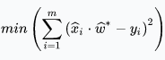

# VOT中的相关滤波

@(CV Learning)[CV, Summary, Video, Tracking]

>**作者：[huuuuusy](https://github.com/huuuuusy)**
>**修改日期：2019-09-05**

相关滤波是VOT中常用的系列方法，在2015年KCF推出后，相关滤波方法的发展达到了一个高峰。虽然近两年随着深度学习的崛起，相关滤波的发展趋于缓慢，但仍在速度上有领先优势。

#### 参考
[【知乎】计算机视觉中，目前有哪些经典的目标跟踪算法？](https://www.zhihu.com/question/26493945/answer/156025576)
[【CSDN】近几年目标跟踪算法发展综述](https://blog.csdn.net/crazyice521/article/details/70242701)
[【知乎】基于相关滤波的目标跟踪算法](https://zhuanlan.zhihu.com/p/59624151)

## 1 原理
相关滤波跟踪的基本思想就是，设计一个滤波模板，利用该模板与目标候选区域做相关运算，最大输出响应的位置即为当前帧的目标位置。

$$y=x\otimes{w}$$

其中$y$表示响应输出，$x$表示输入图像，$w$表示滤波模板。利用相关定理，将相关转换为计算量更小的点积。

$$\hat{y}=\hat{x}\cdot\hat{w}^*$$

$\hat{y}$，$\hat{x}$，$\hat{w}$分别是$y$，$x$，$w$的傅里叶变换。相关滤波的任务，就是寻找最优的滤波模板$w$。

## 2 【2010】开篇

### 2.1 MOSSE

- [【CVPR'10】Bolme D S, Beveridge J R, Draper B A, et al. Visual object tracking using adaptive correlation filters [C]](http://www.cs.colostate.edu/~draper/papers/bolme_cvpr10.pdf)

MOSSE (Minimum Output Sum of Squared Error filter)算法是相关滤波跟踪的开篇之作。
- 为提高滤波器模板的鲁棒性，MOSSE利用目标的多个样本作为训练样本，以生成更优的滤波器。MOSSE 以最小化平方和误差为目标函数，用$m$个样本求最小二乘解：

得到$\hat{w}$为：

- MOSSE还设计了一种滤波模板的在线更新方法,$\eta$为学习率：

- 此外，MOSSE还提出了使用峰值旁瓣比(Peak to Sidelobe Ratio, PSR)评估跟踪置信度。

## 3 【2012】循环移位

### 3.1 CSK

- [【ECCV'12】Henriques J F, Caseiro R, Martins P, et al. Exploiting the circulant structure of tracking-by-detection with kernels [C]](http://www.robots.ox.ac.uk/~joao/publications/henriques_eccv2012.pdf)

CSK针对MOSSE算法中采用稀疏采样造成样本冗余的问题，扩展了岭回归、基于循环移位的近似密集采样方法、以及核方法。

#### 岭回归(正则化最小二乘法)

CSK为求解滤波模板的目标函数增加了正则项:

或者说用岭回归（又称正则化最小二乘法）来求解滤波模板:

其中$x_i$是训练样本，$X$是$x_i$构成的样本矩阵，$y_i$是样本的响应值，$w$是待求的滤波模板。
增加正则项的目的是为了防止过拟合，可以使求得的滤波器在下一帧图像中的泛化能力更强。

#### 循环移位

CSK的训练样本是通过循环移位产生的。密集采样得到的样本与循环移位产生的样本很像，可以用循环移位来近似。循环矩阵原理如图，第一行是实际采集的目标特征，其他行周期性地把最后的矢量依次往前移产生的虚拟目标特征。

对图像进行循环移位的效果实例如图:

此外，循环矩阵具有傅里叶变换对角化特性，利用该性质，可以进一步减小计算量。
循环移位的样本集是隐性的，并没有真正产生过，只是在推导过程中用到，所以也不需要真正的内存空间去存储这些样本。
循环移位生成的近似样本集结合FFT极大地减少了计算量，但这种近似引入边界效应。

#### 核方法

利用核方法，引入核函数：

目标函数转换为：

得到：

预测阶段的响应图：

## 4 【2014】多通道特征

MOSSE与CSK处理的都是单通道灰度图像,引入多通道特征扩展只需要对频域通道响应求和即可。HoG+CN在近年来的跟踪算法中常用的特征搭配，HoG是梯度特征，而CN（color names）是颜色特征，两者可以互补。

### 4.1 CN

- [【CVPR'14】Danelljan M, Shahbaz Khan F, Felsberg M, et al. Adaptive color attributes for real-time visual tracking [C]](https://www.cv-foundation.org/openaccess/content_cvpr_2014/papers/Danelljan_Adaptive_Color_Attributes_2014_CVPR_paper.pdf)
    - [Project Page](http://www.cvl.isy.liu.se/research/objrec/visualtracking/colvistrack/index.html)

Martin Danelljan用多通道颜色特征Color Names(CN)去扩展CSK得到了不错的效果，算法也简称CN。
CN其实是一种颜色命名方式，与RGB、HSV同属一类。
CN在CSK的基础上扩展了多通道颜色,将RGB的3通道图像投影到11个颜色通道，分别是black, blue, brown, grey, green, orange, pink, purple, red, white, yellow，并归一化得到10通道颜色特征。
也可以利用PCA方法，将CN降维到2维。
 
### 4.2 KCF/DCF

- [【TPAMI'15】Henriques J F, Rui C, Martins P, et al. High-Speed Tracking with Kernelized Correlation Filters [J]](https://arxiv.org/abs/1404.7584)
    - [GitHub](https://github.com/foolwood/KCF)
    - [Blog(Chinese)](https://blog.csdn.net/carrierlxksuper/article/details/46461245)

上图是KCF/DCF算法在OTB50上的实验结果，Precision和FPS碾压了OTB50上经典的判别类方法Struck和TLD。
CSK和KCF是[João F. Henriques](http://www.robots.ox.ac.uk/~joao/index.html#)先后两篇论文，KCF/DCF是CSK的多通道特征改进版本，论文中对岭回归、循环矩阵、核技巧、快速检测等做了完整的数学推导。
KCF在CSK的基础上扩展了多通道特征。KCF采用的HoG特征，核函数有三种高斯核、线性核和多项式核，高斯核的精确度最高，线性核略低于高斯核，但速度上远快于高斯核。

### 小结

- MOSSE是单通道灰度特征的相关滤波
- CSK在MOSSE的基础上扩展了密集采样(加padding)和kernel-trick
    - KCF在CSK的基础上扩展了多通道梯度的HOG特征
    - CN在CSK的基础上扩展了多通道颜色的Color Names

HOG是梯度特征，而CN是颜色特征，两者可以互补，所以HOG+CN在近两年的跟踪算法中成为了hand-craft特征标配。

## 5 【2014】多尺度跟踪

尺度变化是跟踪中比较基础和常见的问题，前面介绍的KCF/DCF和CN都没有尺度更新。如果目标缩小，滤波器就会学习到大量背景信息，如果目标扩大，滤波器可能会跟踪到目标局部纹理。这两种情况都可能出现非预期的结果，导致跟踪漂移和失败。

### 5.1 SAMF

- [【ECCV'14】Li Y, Zhu J. A scale adaptive kernel correlation filter tracker with feature integration](http://github.com/ihpdep/ihpdep.github.io/raw/master/papers/eccvw14_samf.pdf)
    - [GitHub](https://github.com/ihpdep/samf)

SAMF基于KCF，特征是HoG+CN。
SAMF实现多尺度目标跟踪的方法比较直接，类似检测算法里的多尺度检测方法。由平移滤波器在多尺度缩放的图像块上进行目标检测，取响应最大的那个平移位置及所在尺度。
因此这种方法可以同时检测目标中心变化和尺度变化。

### 5.2 DSST

- [【BMVC'14】Danelljan M, Häger G, Khan F, et al. Accurate scale estimation for robust visual tracking [C]](http://www.bmva.org/bmvc/2014/files/paper038.pdf)
- [【TPAMI'17】Danelljan M, Hager G, Khan F S, et al. Discriminative Scale Space Tracking [J]](https://arxiv.org/abs/1609.06141v1)
    - [Project Page](http://www.cvl.isy.liu.se/research/objrec/visualtracking/scalvistrack/index.html)

DSST将目标跟踪看成目标中心平移和目标尺度变化两个独立问题。首先用HoG特征的DCF训练平移相关滤波，负责检测目标中心平移。然后用HoG特征的MOSSE(这里与DCF的区别是不加padding)训练另一个尺度相关滤波，负责检测目标尺度变化。
2017年发表的文章又提出了加速版本fDSST。

DSST尺度滤波器仅需要检测出最佳匹配尺度而无须关心平移情况，其计算原理如图。

DSST将尺度检测图像块全部缩小到同一个尺寸计算特征（CN+HoG），再将特征表示成一维(没有循环移位)，尺度检测的响应图也是一维的高斯函数。

### 小结

- 虽然SAMF和DSST都可以跟上普通的目标尺度变化，但SAMF只有7个尺度比较粗，而DSST有33个尺度比较精细准确
- DSST先检测最佳平移再检测最佳尺度，是分步最优，而SAMF是平移尺度一起检测，是平移和尺度同时最优，而往往局部最优和全局最优是不一样的
- DSST将跟踪划分为平移跟踪和尺度跟踪两个问题，可以采用不同的方法和特征，更加灵活，但需要额外训练一个滤波器，每帧尺度检测需要采样33个图像块，之后分别计算特征、加窗、FFT等，尺度滤波器比平移滤波器慢很多;SAMF只需要一个滤波器，不需要额外训练和存储，每个尺度检测就一次提特征和FFT，但在图像块较大时计算量比DSST高

总的来说，DSST做法非常新颖，速度更快，SAMF同样优秀也更加准确。

## 6 【2015】 边界效应与更大的搜索区域

相关滤波的缺点：对**快速变形和快速运动**情况的跟踪效果不好。

- 快速变形：
    - 相关滤波是模板类方法，如果目标快速变形，那基于HOG的梯度模板就无法跟踪；如果快速变色，那基于CN的颜色模板就无法跟踪。
    - 此外，也和模型更新策略与更新速度有关。固定学习率的线性加权更新，如果学习率太大，部分或短暂遮挡和任何检测不准确，模型就会学习到背景信息，积累到一定程度模型就会只跟踪背景而非目标；如果学习率太小，目标已经变形了而模板还是那个模板，就会变得不认识目标。
- 快速运动:
    - 主要是**边界效应(Boundary Effets)**，而且边界效应产生的错误样本会造成分类器判别力不够强。

针对边界效应，有2个典型处理方法：
- 在图像上叠加余弦窗调制
    - CSK采用了加余弦窗的方法，使搜索区域边界的像素值接近0，消除边界的不连续性。但是余弦窗的引入也带来了缺陷: 减小了有效搜索区域。例如在检测阶段，如果目标不在搜索区域中心，部分目标像素会被过滤掉。如果目标的一部分已经移出了这个区域，很可能就过滤掉仅存的目标像素。其作用表现为算法难以跟踪快速运动的目标。
- 增加搜索区域的面积
    - 扩大搜索区域能缓解边界效应，并提高跟踪快速移动目标的能力。但缺陷是会引入更多的背景信息，可能造成跟踪漂移。

SRDCF与CFLB的思路都是扩大搜索区域，同时约束滤波模板的有效作用域。其中SRDCF速度比较慢，并不适合实时场合。

### 6.1 SRDCF 

- [【ICCV'15】Danelljan M, Hager G, Shahbaz Khan F, et al. Learning spatially regularized correlation filters for visual tracking [C]](https://www.cv-foundation.org/openaccess/content_iccv_2015/papers/Danelljan_Learning_Spatially_Regularized_ICCV_2015_paper.pdf)
    - [Project Page](http://www.cvl.isy.liu.se/research/objrec/visualtracking/regvistrack/index.html)

SRDCF(Spatially Regularized Correlation Filters)的思路是，给滤波模板增加一个约束，对接近边界的区域惩罚更大，或者说让边界附近滤波模板系数接近0。
SRDCF基于DCF，同时加入空域正则化，惩罚边界区域的滤波器系数:

其中惩罚权重满足负Gauss分布，目的是接近边界的区域惩罚更大。
当$\gamma(m,n)=\sqrt{\lambda}$时，则变为标准DCF。SRDCF与加余弦窗的区别是，余弦窗是加在原始图像块上，之后再进行移位产生样本集；而空域正则化是加在样本集中每个移位样本上的。

正则项的引入破坏了DCF的闭合解。所以SRDCF采用高斯-塞德尔方法迭代优化，这也导致SRDCF速度比较慢。SRDCF与DCF得到的滤波模板对比如图。

### 6.2 CFLB/BACF

- [【CVPR'15】Kiani Galoogahi H, Sim T, Lucey S. Correlation filters with limited boundaries [C]](https://www.cv-foundation.org/openaccess/content_cvpr_2015/papers/Galoogahi_Correlation_Filters_With_2015_CVPR_paper.pdf)
- [【ICCV'17】Kiani Galoogahi H, Fagg A, Lucey S. Learning Background-Aware Correlation Filters for Visual Tracking [C]](http://openaccess.thecvf.com/content_ICCV_2017/papers/Galoogahi_Learning_Background-Aware_Correlation_ICCV_2017_paper.pdf)

基于灰度特征的CFLB和基于HOG特征的BACF的思路是使搜索区域内、目标区域以外的像素为0。
CFLB仅单通道灰度特征，虽然速度比较快167FPS，但性能远不如KCF；最新BACF将特征扩展为多通道HOG特征，性能超过了SRDCF，而且速度为35FPS，基本满足性能和速度的平衡。
CFLB和BACF采用Alternating Direction Method of Multipliers(ADMM)快速求解。

##  7 【2016】颜色特征与深度特征

### 7.1 DAT(不是相关滤波的方法，而是统计颜色特征方法)

- [【CVPR'15】Possegger H, Mauthner T, Bischof H. In defense of color-based model-free tracking [C]](https://www.cv-foundation.org/openaccess/content_cvpr_2015/papers/Possegger_In_Defense_of_2015_CVPR_paper.pdf)

DAT统计前景目标和背景区域的颜色直方图，这就是前景和背景的颜色概率模型，检测阶段，利用贝叶斯方法判别每个像素属于前景的概率，得到像素级颜色概率图，如上图(a)。
DAT在跟踪过程中预先探测出与目标相似的干扰区域，图(b)，与正确的目标区域结合表示（加权均值），图(c)。这样的做法能够有效降低传统颜色特征方法常出现的“漂移”现象。

### 7.2 STAPLE

- [【CVPR'16】Bertinetto L, Valmadre J, Golodetz S, et al. Staple: Complementary Learners for Real-Time Tracking [C]](https://www.cv-foundation.org/openaccess/content_cvpr_2016/papers/Bertinetto_Staple_Complementary_Learners_CVPR_2016_paper.pdf)

相关滤波模板类特征(HOG)对快速变形和快速运动效果不好，但对运动模糊光照变化等情况比较好；而颜色统计特征(DAT)对变形不敏感、而且没有边界效应(不属于相关滤波框架)，但对光照变化和背景相似颜色不好。因此，这两类方法可以互补。

DSST把跟踪划分为两个问题，即平移检测和尺度检测。DAT就加在平移检测部分。相关滤波有一个响应图，DAT得到的像素级前景概率也有一个响应图，两个响应图线性加权得到最终响应图。

### 7.3 C-COT

图像特征的表达能力在目标跟踪中起着至关重要的作用:
- 以HoG+CN为代表的图像特征，性能优秀而且速度优势非常突出，但也成为性能进一步提升的瓶颈。
- 以卷积神经网络（CNN）为代表的深度特征，具有更强大特征表达能力、泛化能力和迁移能力。
将深度特征引入相关滤波也就水到渠成。

- [【ICCVW'15】Danelljan M, Hager G, Shahbaz Khan F, et al. Convolutional features for correlation filter based visual tracking [C]](https://www.researchgate.net/publication/304407698_Convolutional_Features_for_Correlation_Filter_Based_Visual_Tracking)
- [【ICCV'15】Ma C, Huang J B, Yang X, et al. Hierarchical convolutional features for visual tracking [C]](https://www.cv-foundation.org/openaccess/content_iccv_2015/papers/Ma_Hierarchical_Convolutional_Features_ICCV_2015_paper.pdf)

C-COT综合了SRDCF的空域正则化和SRDCFdecon的自适应样本权重方法，并采用了多层深度特征（VGG第1和5层）。为了应对不同卷积层分辨率不同的问题，C-COT提出了连续空间域插值方法，在训练之前通过频域隐式插值将特征图插值到连续空域，方便集成多分辨率特征图，并且保持定位的高精度。目标函数通过共轭梯度下降方法迭代优化。

- [【ECCV'16】Danelljan M, Robinson A, Khan F S, et al. Beyond correlation filters: Learning continuous convolution operators for visual tracking [C]](https://link.springer.com/chapter/10.1007/978-3-319-46454-1_29)

SRDCFdecon的主要贡献是提出了一种样本权重更新方法,解决样本污染问题。

- [【CVPR'16】Danelljan M, Hager G, Shahbaz Khan F, et al. Adaptive decontamination of the training set: A unified formulation for discriminative visual tracking [C]](https://www.cv-foundation.org/openaccess/content_cvpr_2016/papers/Danelljan_Adaptive_Decontamination_of_CVPR_2016_paper.pdf)

## 8 【2017】方法组合应用

### 8.1 LMCF

- [【CVPR'17】Wang M, Liu Y, Huang Z. Large Margin Object Tracking with Circulant Feature Maps [C]](https://arxiv.org/pdf/1703.05020.pdf)

LMCF提出了两个方法，多峰目标检测和高置信度更新：
- 多峰目标检测对平移检测的响应图做多峰检测，如果其他峰峰值与主峰峰值的比例大于某个阈值，说明响应图是多峰模式，以这些多峰为中心重新检测，并取这些响应图的最大值作为最终目标位置。
- 高置信度更新：只有在跟踪置信度比较高的时候才更新跟踪模型，避免目标模型被污染。一个置信度指标是最大响应。另一个置信度指标是平均峰值相关能量(average peak-to correlation energy, APCE)，反应响应图的波动程度和检测目标的置信水平:

$$APEC=\frac{|g_{max}-g_{min}|}{mean(g-g_{min})}$$

其中$g$为响应图， $g_{max}$和$g_{min}$分别为最大和最小响应。

### 8.2 CSR-DCF

- [【CVPR'17】Lukežič A, Vojíř T, Čehovin L, et al. Discriminative Correlation Filter with Channel and Spatial Reliability [C]](http://data.votchallenge.net/vot2017/presentations/csr-dcf.pdf)

CSR-DCF，提出了空域可靠性和通道可靠性方法:
- 空域可靠性利用图像分割方法，通过前背景颜色直方图概率和中心先验计算空域二值约束掩膜。
- 通道可靠性用于区分检测时每个通道的权重。
在训练阶段，利用空域二值约束掩膜优化得到滤波模板，同时计算每个通道的最大响应作为权重w1 。在定位阶段，计算通道权重w2。最终利用通道权重w1*w2 ，计算加权平均的滤波响应。

由于引入了二值约束掩膜，采用ADMM迭代优化。

### 8.3 ECO

- [【CVPR'17】Danelljan M, Bhat G, Khan F S, et al. ECO: Efficient Convolution Operators for Tracking [C]](http://openaccess.thecvf.com/content_cvpr_2017/papers/Danelljan_ECO_Efficient_Convolution_CVPR_2017_paper.pdf)

ECO可以看做是C-COT的升级加速版，从模型大小、样本集大小和更新策略三个方面加速。

#### 模型降维
ECO采用分解卷积方法(factorized convolution operator)在特征提取上做了简化。定义一个矩阵P，将原有的D维特征降低到C维。利用最优化方法同时训练得到滤波模板和矩阵P。在实际计算中可以在第一帧图像将P计算出来，后续帧都直接使用这个矩阵P，减少计算量。当然，此方法也可用于其他高维特征，例如HoG。

#### 样本集更新和生成模型
ECO借鉴了SRDCFdecon的训练样本权重更新方法，以应对训练样本受污染问题。

因为目标跟踪过程中的训练样本并不是手工标定而是由跟踪算法得到的，难免出现样本受损的情况，例如:
- 错误的跟踪预测。由于旋转、形变而导致的跟踪失败。
- 局部或者全遮挡造成的正样本受损。
- 扰动。运动模糊可能导致目标的误识。

自MOSSE，一般的相关滤波都是固定学习率的线性加权更新模型，不需要显式保存训练样本，每帧样本训练的模型与已有目标模型，以固定权值加权来更新目标模型，这样以往的样本信息都会逐渐失效，而最近几帧的样本信息占模型的比重很大。如果出现目标定位不准确、遮挡、背景扰动等情况，固定学习率方式会平等对待这些“有问题”的样本，目标模型就会被污染导致跟踪失败。

另一种比较常见的方式也是固定学习率，如果当前帧在目标检测阶段置信度比较低，则说明这个样本不可靠，选择丢弃这个样本不更新或仅在置信度比较高的时候更新，LMCF就采用了这种做法。但这种做法依然不够灵活，可能会排除少量遮挡或背景扰动的样本，但这些样本中也有非常重要的目标信息。

SRDCFdecon提出的方式是同时优化模型参数和样本权重，得到连续的样本权重值。这样可以降低污染样本的影响而增加正确样本的影响。此外，SRDCFdecon可以在线地在每一帧中重新决定样本的权重，进而纠正错误。

SRDCFdecon有三个优势:
- 连续权重值。连续权重值更准确地描述的样本的重要性。比如对轻微遮挡或者轻微扰动的样本，依然可以获取有价值的信息。
- 权重重新评估。可以在线地在每一帧时，利用历史帧图像，重新决定样本的权重，纠正之前的错误权重。
- 动态先验权重。引入了样本的先验权重以结合样本的先验知识。

图中示例了权重结算的结果。蓝色曲线表示优化得到的权重，红色曲线表示时间相关的先验权重。

ECO在SRDCFdecon的基础上提出了紧凑生成模型(compact generative model)，以减少样本数量。如图，ECO采用高斯混合模型(Gaussian Mixture Model)合并相似样本，分成不同的样本分组，每一个样本分组内样本一致性较高，不同分组之间差异性较大，这样就使得训练样本集同时具有了多样性和代表性。

#### 稀疏更新策略
ECO每隔5帧做一次优化训练更新模型参数，不但提高了算法速度，而且提高了对突变，遮挡等情况的稳定性。但是ECO的样本集是每帧都更新的，稀疏更新并不会错过间隔期的样本变化信息。
