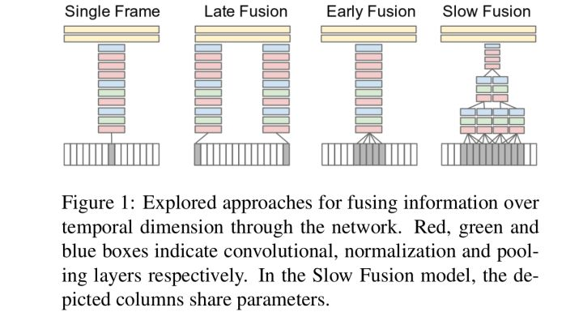
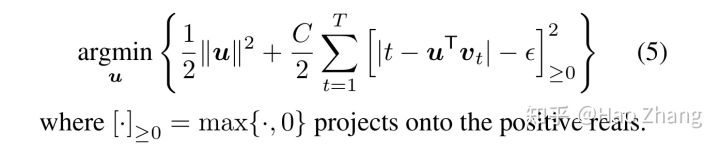
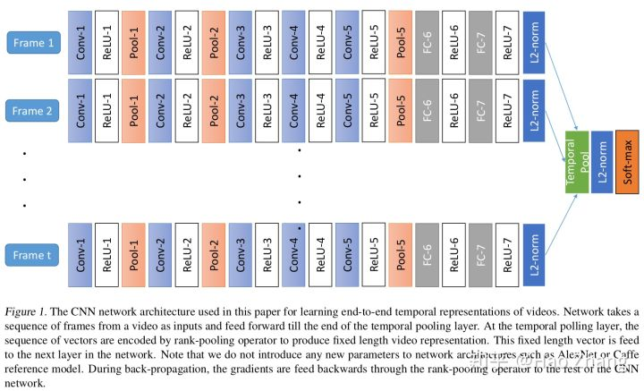
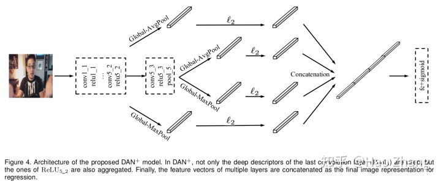
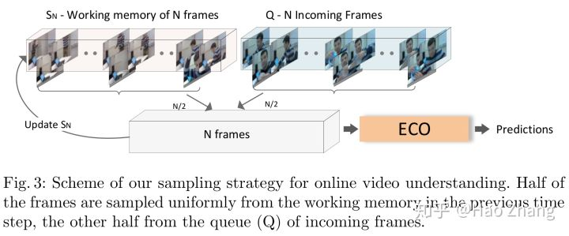

# 逐帧处理融合

这类方法把视频看作一系列图像的集合，每帧图像单独提取特征，再融合它们的深度特征。

[A. Karpathy, et al. Large-scale video classification with convolutional neural networks. CVPR'14.](http://lear.inrialpes.fr/people/wang/download/iccv13_poster_final.pdf)

Karpathy等人把视频划分成很多固定长度的片段(clip)，并设计了多种融合方法:

Single frame. 逐帧单独前馈网络。

Late fusion. 两帧相距15帧的图像分别前馈网络，并融合它们的深度卷积特征。

Early fusion. 连续10帧图像前馈网络，因此网络第一层的卷积核由11×11×3变为11×11×3×10。Early fusion的思路最早由Le等人提出。

[Le, et al. Learning hierarchical invariant spatio-temporal features for action recognition with independent subspace analysis. CVPR'11.](http://ai.stanford.edu/~quocle/LeZouYeungNg11.pdf)

Slow fusion. 即使用3D卷积。连续10帧图像前馈网络，第一层卷积核时间方向大小为4，第二、三层卷积核时间方向大小为2。

此外，为了加速训练，由于目标通常位于图像中心，Karpathy等人使用了一个两分支网络：一个分支输入空间大小下采样减半的图像，另一个分支输入原图中心裁剪后的图像。这样，总体的输入图像维数只有原图的一半。这两个分支的深度卷积特征拼接(concatenate)起来给全连接层进行分类。

实验发现，3D卷积的融合效果最好，而不考虑运动信息的single frame策略已经是十分强的baseline。Early fusion策略效果最差的原因可能是直接从输入图像上捕获运动信息难度太大。

[J. Y.-H. Ng, et al. Beyond short snippets: Deep networks for video classification. CVPR'15.](https://arxiv.org/abs/1503.08909)

Ng等人先提取每一帧的深度卷积特征，再设计特征融合方法得到最终输出。其中，紫色代表沿时间方向进行最大汇合(max-pooling)，黄色代表全连接层，绿色代表3X3X10，stride 5的3D卷积，红色代表softmax输出。相比Karpathy等人，Ng等人的输入视频片段的长度更长(每秒采样1帧，一个片段由120帧构成)，包含了更多的时序信息。实践中发现(a)的效果最好。

[B. Fernando and S. Gould. Learning end-to-end video classification with rank-pooling. ICML'16.](https://users.cecs.anu.edu.au/~sgould/papers/icml16-vidClassification.pdf)

在得到每帧图像的深度卷积特征$v_t$之后，Fernando和Gould通过解如下的优化问题来对特征进行排序汇合(rank-pooling)。其动机是靠前的帧$u^Tv_t$要小一些，而靠后的帧大一些。

[X.-S. Wei, et al. Deep bimodal regression of apparent personality traits from short video sequences. TAC'17.](https://www.researchgate.net/publication/320366199_Deep_Bimodal_Regression_of_Apparent_Personality_Traits_from_Short_Video_Sequences)

由于相邻帧信息冗余度很高，Wei等人从视频(450帧)中采样100帧，每帧交由DAN分别进行预测。在得到relu5-2/pool5深度特征之后，DAN将其全局最大/平均汇合以得到深度特征。

[A. Kar, et al. AdaScan: Adaptive scan pooling in deep convolutional neural networks for human action recognition in videos. CVPR'17.](https://arxiv.org/pdf/1611.08240.pdf)

由于不同帧的重要性不同，Kar等人提出AdaScan汇合方法。其逐帧提取特征，之后判断不同帧的重要程度，并据此进行特征汇合.

[M. Zolfaghari, et al. ECO: Efficient Convolutional network for Online video understanding. arXiv:1804.09066.](http://openaccess.thecvf.com/content_ECCV_2018/papers/Mohammadreza_Zolfaghari_ECO_Efficient_Convolutional_ECCV_2018_paper.pdf)

Zolfaghari等人提出ECO。由于相邻帧有信息冗余，ECO从视频中采样若干帧，每帧单独用2D卷积提取特征，之后沿时间方向拼接特征，再用3D卷积捕获它们的时序关系。ECO和state-of-the-art方法性能相似，但速度上快了10-80倍。在测试时，为了捕获长距离依赖，输入视频片段由已看过的和未看过的视频中采样得到。