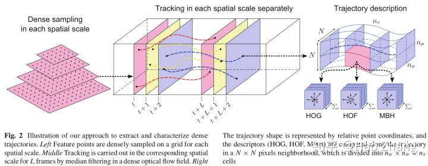

# 经典方法

**[H. Wang, et al. Dense trajectories and motion boundary descriptors for action recognition. IJCV'13.](https://hal.inria.fr/hal-00803241/PDF/IJCV.pdf)**

**[H. Wang and C. Schmid. Action recognition with improved trajectories. ICCV'13.](http://lear.inrialpes.fr/people/wang/download/iccv13_poster_final.pdf)**

Wang等人提出DT和iDT方法。DT利用光流得到视频中的运动轨迹，再沿着轨迹提取特征。iDT对相机运动进行了补偿，同时由于人的运动比较显著，iDT用额外的检测器检测人，以去除人对相邻帧之间投影矩阵估计的影响。这是深度学习方法成熟之前效果最好的经典方法，该方法的弊端是特征维度高(特征比原始视频还要大)、速度慢。实践中，早期的深度学习方法在和iDT结合之后仍能取得一定的效果提升，现在深度学习方法的性能已较iDT有大幅提升，因此iDT渐渐淡出视线。

