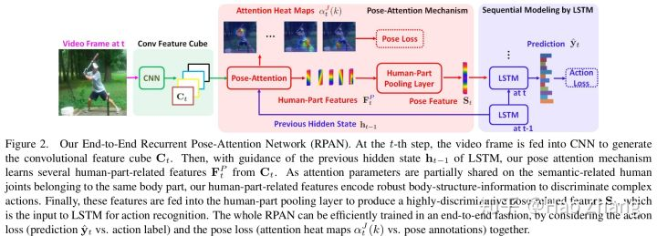

# ConvLSTM

这类方法是用CNN提取每帧图像的特征，之后用LSTM挖掘它们之间的时序关系。

[J. Y.-H. Ng, et al. Beyond short snippets: Deep networks for video classification. CVPR'15.](https://arxiv.org/abs/1503.08909)

[J. Donahue, et al. Long-term recurrent convolutional networks for visual recognition and description. CVPR'15.](https://arxiv.org/abs/1411.4389)

Ng等人在深度特征上，用5层隐层结点数512的LSTM来提取深度特征，每个时刻都进行输出。训练时，一个片段从第1帧到最后一帧输出层获得的梯度分别乘以0.0-1.0的权重，用以强调后面帧的重要性。测试时，计算这些帧输出的加权和。Donahue等人也提出了类似的工作。此外，Ng等人和Donahue等人还利用了光流输入。把x、y两个方向的光流缩放到[0, 255]作为光流图像前两个通道，把光流的大小作为第三个通道。

[W. Du, et al. RPAN: An end-to-end recurrent pose-attention network for action recognition in videos. ICCV'17.](https://www.sciencedirect.com/science/article/pii/S0031320319301098)

Du等人利用人体姿态估计辅助动作识别。
