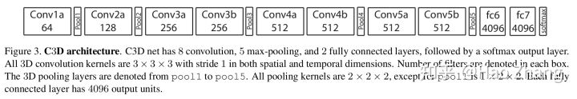
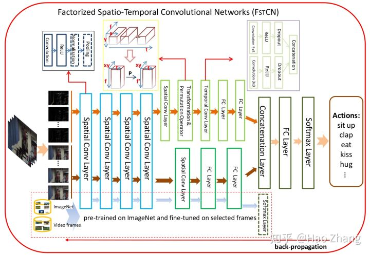
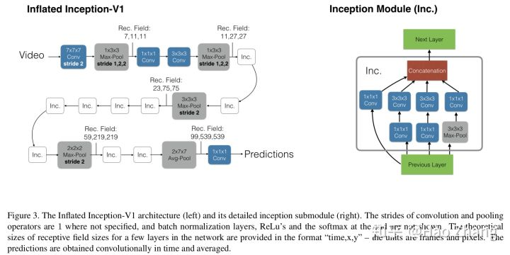
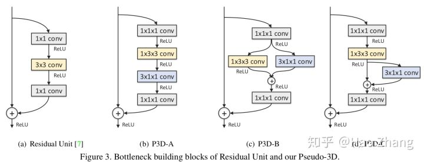
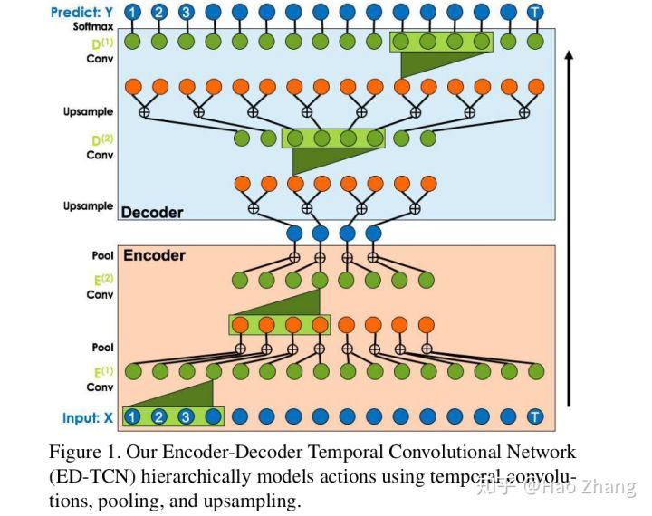
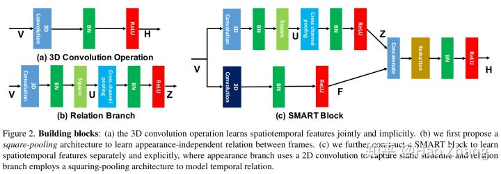

# 3D卷积

把视频划分成很多固定长度的片段(clip)，相比2D卷积，3D卷积可以提取连续帧之间的运动信息。

在视频动作识别中最早提出3D卷积的是:

**[M. Baccouche, et al. Sequential deep learning for human action recognition. HBU Workshop'11.](https://liris.cnrs.fr/Documents/Liris-5228.pdf)**

**[S. Ji, et al. 3D convolutional neural networks for human action recognition. TPAMI'13.](https://ieeexplore.ieee.org/document/6165309/)**

Baccouche等人使用第一层卷积核时间方向大小为5。Ji等人使用第一、二层卷积核时间方向大小为3，第三层卷积时由于时间维度大小很小，所以采用2D卷积。

此外，为使网络获得更多先验信息，Ji等人使用了两个技巧：(1). 同时使用原始图像、图像梯度、和相邻帧光流作为输入。(2). 让网络额外地学习运动信息接近手工运动特征。

**[D. Tran, et al. Learning spatio-temporal features with 3D convolutional networks. ICCV'15.](https://www.cv-foundation.org/openaccess/content_iccv_2015/papers/Tran_Learning_Spatiotemporal_Features_ICCV_2015_paper.pdf)**

Tran等人提出C3D，其将3×3卷积扩展到3×3×3卷积，2×2汇合扩展到2×2×2汇合。输入片段16帧。实验中发现，时域方向卷积核大小为3效果最好。相比2D CNN，3D CNN的参数量很大，训练变得更困难，且需要更多的训练数据。相比其他类型的方法，C3D一次处理多帧，所以计算效率很高。

**[L. Sun, et al. Human action recognition using factorized spatio-temporal convolutional networks. ICCV'15.](https://www.cv-foundation.org/openaccess/content_iccv_2015/papers/Sun_Human_Action_Recognition_ICCV_2015_paper.pdf)**

Sun等人把3D卷积分解为空间方向2D卷积和时间方向1D卷积。

**[J. Carreira and A. Zisserman. Quo vadis, action recognition? A new model and the Kinetics dataset. CVPR'17.](https://arxiv.org/pdf/1705.07750.pdf)**

Carreira和Zisserman提出I3D，把two-stream结构中的2D卷积扩展为3D卷积。由于时间维度不能缩减过快，前两个汇合层的卷积核大小是1×2×2，最后的汇合层的卷积核大小是2*7*7。和之前文章不同的是，two-tream的两个分支是单独训练的，测试时融合它们的预测结果。

**[Z. Qiu, et al. Learning spatio-temporal representation with pseudo-3D residual networks. ICCV'17.](http://openaccess.thecvf.com/content_ICCV_2017/papers/Qiu_Learning_Spatio-Temporal_Representation_ICCV_2017_paper.pdf)**

Qiu等人提出P3D，用一个1×3×3的空间方向卷积和一个3×1×1的时间方向卷积近似原3×3×3卷积。通过组合三种不同的模块结构，进而得到P3D ResNet。P3D ResNet在参数数量、运行速度等方面对C3D作出了优化。

**[D. Tran, et al. A closer look at spatio-temporal convolutions for action recognition. CVPR'18.](https://arxiv.org/pdf/1711.11248.pdf)**

Tran等人提出ResNet (2+1)D，把一个3D卷积分解成为一个2D卷积空间卷积和一个1D时间卷积，注意这里的参数量和原3D卷积相同。相比P3D有三种形式，(2+1)D和P3D-A最接近。

**[C. Lea, et al. Temporal convolutional networks for action segmentation and detection. CVPR'17.](http://openaccess.thecvf.com/content_cvpr_2017/papers/Lea_Temporal_Convolutional_Networks_CVPR_2017_paper.pdf)**

受WaveNet启发，Lea等人提出一个编码-解码网络，并使用空洞卷积和短路连接，以捕获长距离依赖。实验中发现，这种结构效果优于RNN。

**[L. Wang, et al. Appearance-and-relation networks for video classfication. CVPR'18.](http://openaccess.thecvf.com/content_cvpr_2018/papers/Wang_Appearance-and-Relation_Networks_for_CVPR_2018_paper.pdf)**

Wang等人希望利用3D卷积显式地学习类似two-stream的结构。Wang等人通过不同帧之间的乘性关系度量不同帧之间的关系。

**[K. Hara, et al. Can spatio-temporal 3D CNNs retrace the history of 2D CNNs and ImageNet? CVPR'18.](http://openaccess.thecvf.com/content_cvpr_2018/papers/Hara_Can_Spatiotemporal_3D_CVPR_2018_paper.pdf)**

ImageNet预训练的2D CNN在多种视觉任务上取得了成功，Hara等人尝试了多种Kinetics预训练的3D CNN模型迁移到其他数据集上的表现。发现直接用3D ResNet-18训练UCF-101，HMDB-51，和ActivityNet会过拟合，而Kinetics不会。利用Kinetics预训练模型会提升其他数据集的性能。

**[X. Wang, et al. Non-local neural networks. CVPR'18.](http://openaccess.thecvf.com/content_cvpr_2018/papers/Wang_Non-Local_Neural_Networks_CVPR_2018_paper.pdf)**

可以看作是3D卷积的一个扩展。3D卷积的感受野是有限区域，而non-local旨在解决长距离依赖问题。Non-local的响应是所有空间和时间位置特征的加权平均。实验中发现non-local block加在底层比加在高层效果要好，加多个non-local blocks会有效果提升但不是很明显。

这类方法的弊端是只能考虑比较短的时间片段的运动信息。
