# Two-stream

**[K. Simonyan and A. Zisserman. Two-stream convolutional networks for action recognition in videos. NIPS'14.](https://arxiv.org/abs/1406.2199)**

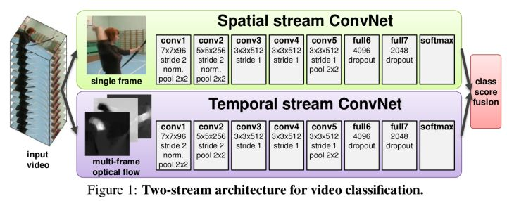

采用两个分支。一个分支输入单帧图像，用于提取图像信息，即在做图像分类。另一个分支输入连续10帧的光流(optical flow)运动场，用于提取帧之间的运动信息。由于一个视频片段中的光流可能会沿某个特别方向位移的支配，所以在训练时光流减去所有光流向量的平均值。两个分支网络结构相同，分别用softmax进行预测，最后用直接平均或SVM两种方式融合两分支结果。

此外，为了加速训练，Simonyan和Zisserman预先计算出光流并保存到硬盘中。为了减小存储大小，他们将光流缩放到[0, 255]后用JPEG压缩，这会使UCF101的光流数据大小由1.5TB减小到27GB。

**[L. Wang, et al. Action recognition with trajectory-pooled deep-convolutional descriptors. CVPR'15.](https://www.cv-foundation.org/openaccess/content_cvpr_2015/papers/Wang_Action_Recognition_With_2015_CVPR_paper.pdf)**

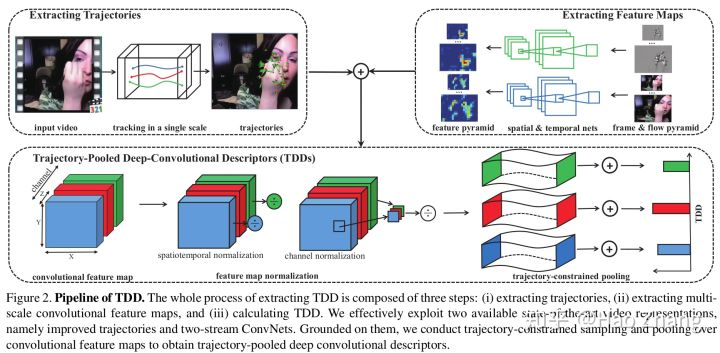

Wang等人结合了经典iDT手工特征和two-stream深度特征，提出TDD。经典手工特征计算时通常分两步：检测图像中显著和有信息量的区域，并在运动显著的区域提取特征。TDD将预训练的two-stream网络当作固定的特征提取器。得到两者特征之后，TDD使用时空规范化以保证每个通道的数值范围近似一致，使用通道规范化以保证每个时空位置的描述向量的数值范围近似一致，之后用trajectory pooling并用Fisher向量构建TDD特征，最后用SVM分类。

**[C. Feichtenhofer, et al. Convolutional two-stream network fusion for video action recognition. CVPR'16.](https://arxiv.org/pdf/1604.06573.pdf)**

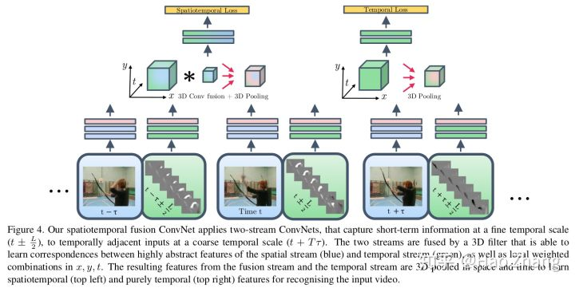

Feichtenhofer等人研究如何融合两分支的深度卷积特征。他们发现级联两个特征到2D维再用1×1卷积到D维的融合方法效果最好，之后再经过3D卷积和3D汇合后输出。

**[Spatiotemporal Residual Networks for Video Action Recognition](https://arxiv.org/abs/1611.02155)**

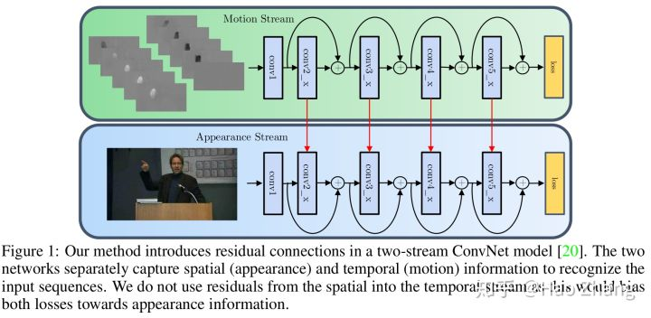

Feichtenhofer将ResNet作为two-stream的基础网络架构，用预训练网络的权重初始化新的3D网络：w(d, t, i, j) = w(d, i, j) / T。此外，有从光流分支到图像分支的信息传递。此外，网络输入不是连续的，而是步长5到15帧。

**[C. Feichtenhofer, et al. Spatio-temporal multiplier networks for video action recognition. CVPR'17.](http://openaccess.thecvf.com/content_cvpr_2017/papers/Feichtenhofer_Spatiotemporal_Multiplier_Networks_CVPR_2017_paper.pdf)**

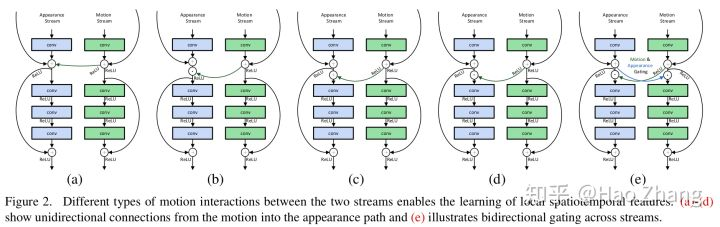

Feichtenhofer等人发现，two-stream网络在外观分支容易过拟合。Feichtenhofer等人加入了两个分支之间的信息交互，并发现乘性的信息交互效果最好。

**[L. Wang, et al. Temporal segment networks: Towards good practices for deep action recognition. ECCV'16.](https://wanglimin.github.io/papers/WangXWQLTV_ECCV16.pdf)**

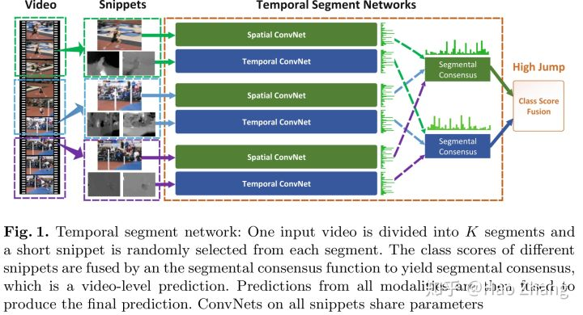

由于相邻的帧有信息冗余，所以对视频密采样是不需要的。Wang等人提出TSN，采用稀疏采样的策略利用整个视频的信息。具体来说，TSN把视频分成3段，每个片段均匀地随机采样一个视频片段，并使用双流网络得到视频片段属于各类得分(softmax之前的值)，之后把不同片段得分取平均，最后通过softmax输出。训练时，TSN可以根据整个视频的信息而不只是一个视频片段的信息对网络参数进行学习，这是TSN最大的优点(个人认为)。TSN获得了ActivityNet 2016竞赛的冠军(93.2% mAP)。

此外，除经典的RGB图像和光流外，TSN还尝试了RGB difference和warped光流。其中，RGB difference可以认为是对图像运动信息的一个粗略估计，而warped光流借鉴经典iDT的思路，试图对相机位移作一估计并对光流进行补偿，使得光流代表的运动信息更集中在前景目标上。实验发现，RGB+光流+warped optical flow输入的效果最好。

**[Z. Lan, et al. Deep local video feature for action recognition. CVPR'17.](http://openaccess.thecvf.com/content_cvpr_2017_workshops/w14/papers/Lan_Deep_Local_Video_CVPR_2017_paper.pdf)**

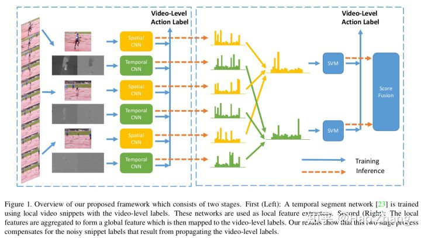

由于不是视频中每帧都包含有用信息，Lan等人首先用TSN提取局部特征，之后再进行聚合。

**[R. Girdhar, et al. ActionVLAD: Learning spatio-temporal aggregation for action recognition. CVPR'17.](http://openaccess.thecvf.com/content_cvpr_2017/papers/Girdhar_ActionVLAD_Learning_Spatio-Temporal_CVPR_2017_paper.pdf)**

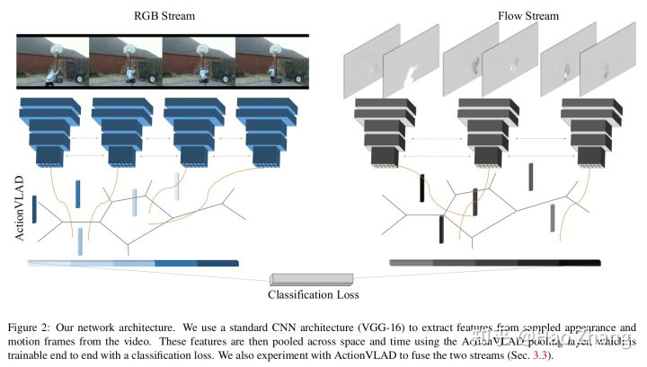

类似于NetVLAD，Girdhar等人用two-stream提取特征，之后用VLAD得到视频的表示。实验中发现，图像和光流两个分支单独处理效果最好。

**[G. A. Sigurdsson, et al. Asynchronous temporal fields for action recognition. CVPR'17.](http://openaccess.thecvf.com/content_cvpr_2017/papers/Sigurdsson_Asynchronous_Temporal_Fields_CVPR_2017_paper.pdf)**

Sigurdsson等人利用全连接时序CRF对视频的时序关系进行推断。

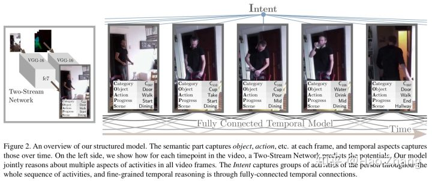

**[W. Zhu, et al. A key volume mining deep framework for action recognition. CVPR'16.](https://www.cv-foundation.org/openaccess/content_cvpr_2016/papers/Zhu_A_Key_Volume_CVPR_2016_paper.pdf)**

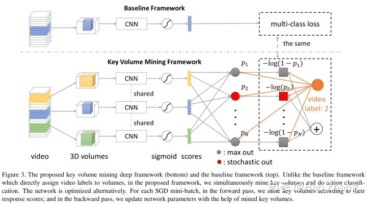

一段视频中并非所有的帧都对识别任务同等重要，如果把它们同等看待，有价值的帧信息会淹没在其他无关的帧中。借助多示例学习思路，Zhu等人交替优化关键帧挖掘和分类两个目标。网络输入N个视频片段，输出每个片段对应每个类别的分数。如果该类别对应真实标记，采用随机汇合，否则是maxout汇合，其中响应最强的视频片段即为得到的关键帧。

**[Y. Wang, et al. Spatio-temporal pyramid network for video action recognition. CVPR'16.](http://openaccess.thecvf.com/content_cvpr_2017/papers/Wang_Spatiotemporal_Pyramid_Network_CVPR_2017_paper.pdf)**

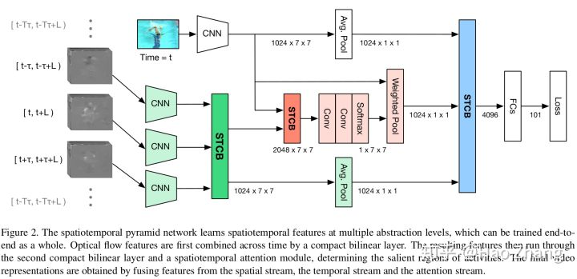

Wang等人利用双线性汇合融合两个分支的特征。

**[A. Diba, et al. Deep temporal linear encoding networks. CVPR'17.](http://openaccess.thecvf.com/content_cvpr_2017/papers/Diba_Deep_Temporal_Linear_CVPR_2017_paper.pdf)**

Diba等人对不同帧/片段的深度卷积特征逐元素相乘，再通过精简双线性汇合得到最终的特征表示。

**[R. Girdhar and D. Ramanan. Attentional pooling for action recognition. NIPS'17.](https://rohitgirdhar.github.io/AttentionalPoolingAction/)**

实验中， Girdhar和Ramanan将224大小的HMDB-51缩放到450大小，以确保最后的深度卷积特征大小不会太小(14×14)。当特征大小太小时，效果不显著。另一方面，Girdhar和Ramanan只用了图像分支来处理视频，总体性能和state-of-the-art还有很大差距。

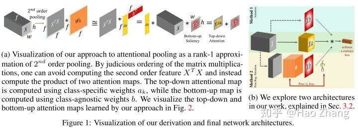

**[I. C. Duta, et al. Spatio-temporal vector of locally max-pooled features for action recognition in videos. CVPR'17.](https://www.researchgate.net/publication/315841539_Spatio-Temporal_Vector_of_Locally_Max_Pooled_Features_for_Action_Recognition_in_Videos)**

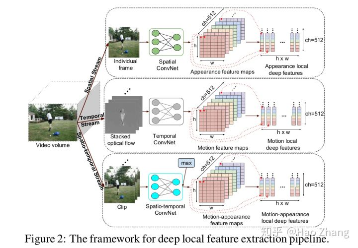

Duta等人研究如何聚合不同特征。

**[C.-Y. Wu, et al. Compressed video action recognition. CVPR'18.](http://openaccess.thecvf.com/content_cvpr_2018/papers/Wu_Compressed_Video_Action_CVPR_2018_paper.pdf)**

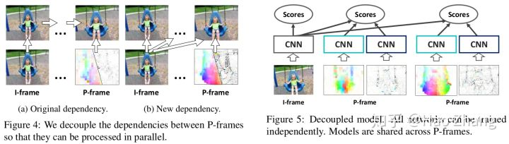

Wu等人发现：(1). 视频中有很多的冗余信息，这会网络难以提取有用的特征。(2). 相比只利用RGB信息，使用光流总是能提升性能。相比之前工作将视频解码为RGB图像帧，如果直接输入压缩视频(如MPEG，H.264等)，可以“免费”地利用这些编码格式中得到的运动信息。视频在压缩时会把帧分为I帧(保存原始图像)和P帧(保存和参考帧之间的相对运动信息和残差，参考帧可能是I帧也可能是P帧)。I帧可以直接用深度神经网络架构进行处理，而如何对P帧信息进行处理是这类方法的难点所在。

Wu等人通过将运动向量追溯到I帧来去除P帧对P帧的依赖，之后对I帧、P帧的运动信息和残差分别前馈网络。在特征融合部分，Wu等人发现直接相加效果最好。实际中，为降低计算开销，Wu等人使用一个大网络(preResNet-152)处理I帧，用一个小网络(preResNet-18)处理P帧。

**[P. Weinzaepfel, et al. DeepFlow: Large displacement optical flow with deep matching. ICCV'13.](https://hal.inria.fr/hal-00873592/document/)**

**[A. Dosovitskiy, et al. FlowNet: Learning optical flow with convolutional networks. ICCV'15.](http://openaccess.thecvf.com/content_iccv_2015/papers/Dosovitskiy_FlowNet_Learning_Optical_ICCV_2015_paper.pdf)**

**[E. Ilg, et al. FlowNet 2.0: Evolution of optical flow estimation with deep networks. CVPR'17.](http://openaccess.thecvf.com/content_cvpr_2017/papers/Ilg_FlowNet_2.0_Evolution_CVPR_2017_paper.pdf)**

由于经典光流算法很慢，因此有工作致力于使用深度神经网络计算光流。DeepFlow在不同粒度上进行聚合和匹配，FlowNet基于类似于视觉跟踪的思路使用互相关滤波综合两张图的深度特征最终生成光流。由于标记数据不足，FlowNet使用人工合成Chairs数据集进行训练。FlowNet 2.0的贡献有三点。(1). 发现如何进行训练对结果影响至关重要，先在简单的Chairs数据集上训练、再在更真实的Things3D上训练会比混合两个数据集一起训练效果更好。(2). 多个子网络堆叠，并用中间光流结果对图像进行扭曲输入中间子网络。(3). 有一个子网络专注于微小运动。
