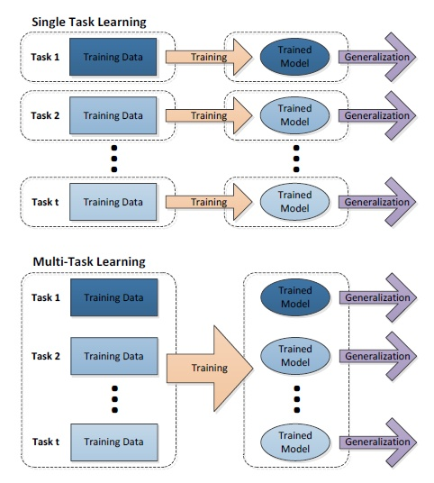
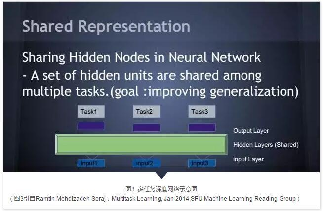
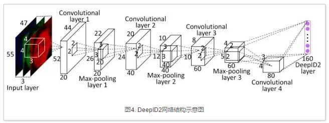
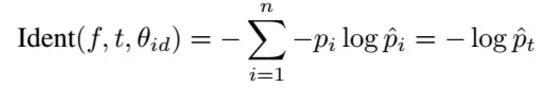
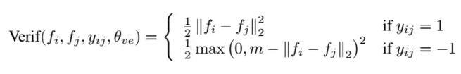
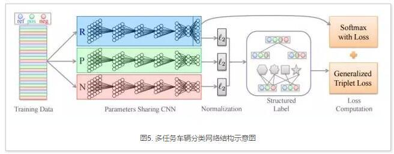
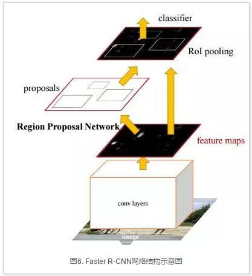
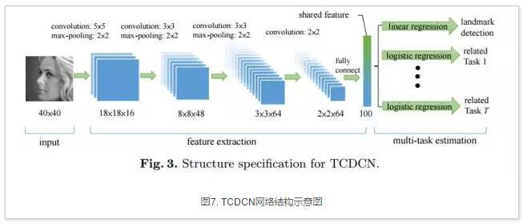

# Multitask Learning

## 介绍

多任务学习是机器学习中的一个分支，按1997年综述论文Multi-task Learning一文的定义：Multitask Learning (MTL) is an inductive transfer mechanism whose principle goal is to improve generalization performance. MTL improves generalization by leveraging the domain-specific information contained in the training signals of related tasks. It does this by training tasks in parallel while using a shared representation。翻译成中文：多任务学习是一种归纳迁移机制，基本目标是提高泛化性能。多任务学习通过相关任务训练信号中的领域特定信息来提高泛化能力，利用共享表示采用并行训练的方法学习多个任务。

顾名思义，多任务学习是一种同时学习多个任务的机器学习方法。在单任务学习中，每个任务采用单独的数据源，分别学习每个任务单独的模型。而多任务学习中，多个数据源采用共享表示同时学习多个子任务模型。

多任务学习的基本假设是多个任务之间具有相关性，因此能够利用任务之间的相关性互相促进。例如，属性分类中，抹口红和戴耳环有一定的相关性，单独训练的时候是无法利用这些信息，多任务学习则可以利用任务相关性联合提高多个属性分类的精度，详情可参考文章Maryland大学Hand等人的论文[Attributes for Improved Attributes: A Multi-Task Network for Attribute Classification](https://arxiv.org/abs/1604.07360)。

近年来，在深度学习技术的推动下计算机视觉领域取得了突飞猛进的进展。本质上说，深度学习是多层的神经网络，对输入进行了层级的非线性表示，来自网络可视化的证据表明，深度网络的层级表示从语义上从底层到高层不断递进。

上图为多任务深度网络结构示意图。Input x表示不同任务的输入数据，绿色部分表示不同任务之间共享的层，紫色表示每个任务特定的层，Task x表示不同任务对应的损失函数层。在多任务深度网络中，低层次语义信息的共享有助于减少计算量，同时共享表示层可以使得几个有共性的任务更好的结合相关性信息，任务特定层则可以单独建模任务特定的信息，实现共享信息和任务特定信息的统一。

在深度网络中，多任务的语义信息还可以从不同的层次输出，例如GoogLeNet中的两个辅助损失层。另外一个例子比如衣服图像检索系统，颜色这类的信息可以从较浅层的时候就进行输出判断，而衣服的样式风格这类的信息，更接近高层语义，需要从更高的层次进行输出，这里的输出指的是每个任务对应的损失层的前一层。

## 应用

目前，多任务深度学习已经广泛应用于人脸识别、细粒度车辆分类、面部关键点定位与属性分类等多个领域。

**人脸识别网络 DeepID2**

香港中文大学汤晓鸥组发表在NIPS14的论文[Deep Learning Face Representation by Joint Identification-Verification](https://arxiv.org/abs/1406.4773)，提出了一种联合训练人脸确认损失和人脸分类损失的多任务人脸识别网络DeepID2，网络结构如下图所示：

DeepID2中共有两个损失函数，分别为人脸分类损失函数，对应于Caffe中的SoftmaxLoss：

另外一个是人脸确认损失函数，对应于Caffe中的Contrastive Loss：

**细粒度车辆分类网络**

将SoftmaxLoss和TripletLoss结合在一个网络中进行多任务训练的方法[Embedding Label Structures for Fine-Grained Feature Representation,CVPR'2016](https://arxiv.org/pdf/1512.02895)。作者将这个网络用于细粒度车辆分类上，提醒注意的是为了计算Tiplet Loss，特征进行了L2范数归一操作，网络结构如下图所示：

**物体检测网络Faster R-CNN**

Faster R-CNN的网络结构如下图所示，包含两个任务，分别为窗口回归和窗口分类，其中RPN模块的卷积层在两个任务之间共享。Faster R-CNN的最新版本支持整体端到端训练，可以同时检测多类物体，是多任务深度学习的一个典型应用。

**面部关键点定位与属性分类网络TCDCN**

面部关键点估计和头部姿态以及人脸属性（是否戴眼镜、是否微笑和性别）之间有着紧密的联系，香港中文大学汤晓鸥组发表于ECCV14的工作[Facial Landmark Detection by Deep Multi-task Learning](http://personal.ie.cuhk.edu.hk/~ccloy/files/eccv_2014_deepfacealign.pdf)利用多任务学习方法联合进行人脸面部关键点定位和属性预测，网络结构如下图所示。

## 论文

[Visual to Sound: Generating Natural Sound for Videos in the Wild, CVPR'18](https://arxiv.org/abs/1712.01393)

**Abstract**

As two of the five traditional human senses (sight, hearing, taste, smell, and touch), vision and sound are basic sources through which humans understand the world. Often correlated during natural events, these two modalities combine to jointly affect human perception. In this paper, we pose the task of generating sound given visual input. Such capabilities could help enable applications in virtual reality (generating sound for virtual scenes automatically) or provide additional accessibility to images or videos for people with visual impairments. As a first step in this direction, we apply learning-based methods to generate raw waveform samples given input video frames. We evaluate our models on a dataset of videos containing a variety of sounds (such as ambient sounds and sounds from people/animals). Our experiments show that the generated sounds are fairly realistic and have good temporal synchronization with the visual inputs.

提出在给定视觉输入的情况下生成声音的任务。应用基于学习的方法，在给定输入视频帧的情况下生成原始波形样本；在包含各种声音的视频数据集上评估表明，生成的声音是相当逼真的，并且与视觉输入具有良好的时间同步。

[项目地址](http://bvision11.cs.unc.edu/bigpen/yipin/visual2sound_webpage/visual2sound.html)

[参考博客](http://www.sohu.com/a/209593882_610300)

## 参考

[【知乎】模型汇总-14 多任务学习-Multitask Learning概述](https://zhuanlan.zhihu.com/p/27421983)

[【知乎】一箭N雕：多任务深度学习实战](https://zhuanlan.zhihu.com/p/22190532)

[【机器之心】共享相关任务表征，一文读懂深度神经网络多任务学习](https://www.jiqizhixin.com/articles/2017-06-23-5)