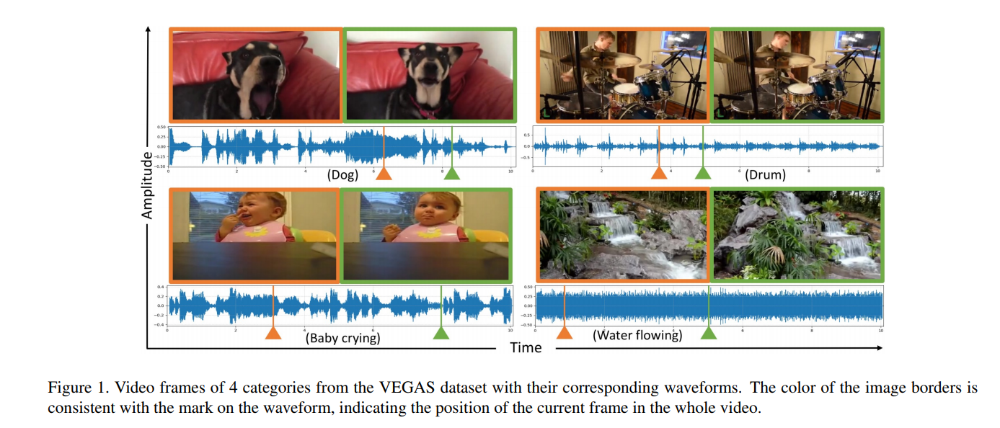

# Multitask Learning

[Visual to Sound: Generating Natural Sound for Videos in the Wild, CVPR'18](https://arxiv.org/abs/1712.01393)

**Abstract**

As two of the five traditional human senses (sight, hearing, taste, smell, and touch), vision and sound are basic sources through which humans understand the world. Often correlated during natural events, these two modalities combine to jointly affect human perception. In this paper, we pose the task of generating sound given visual input. Such capabilities could help enable applications in virtual reality (generating sound for virtual scenes automatically) or provide additional accessibility to images or videos for people with visual impairments. As a first step in this direction, we apply learning-based methods to generate raw waveform samples given input video frames. We evaluate our models on a dataset of videos containing a variety of sounds (such as ambient sounds and sounds from people/animals). Our experiments show that the generated sounds are fairly realistic and have good temporal synchronization with the visual inputs.

提出在给定视觉输入的情况下生成声音的任务。应用基于学习的方法，在给定输入视频帧的情况下生成原始波形样本；在包含各种声音的视频数据集上评估表明，生成的声音是相当逼真的，并且与视觉输入具有良好的时间同步。

[项目地址](http://bvision11.cs.unc.edu/bigpen/yipin/visual2sound_webpage/visual2sound.html)

[参考博客](http://www.sohu.com/a/209593882_610300)

## 参考

[【知乎】模型汇总-14 多任务学习-Multitask Learning概述](https://zhuanlan.zhihu.com/p/27421983)
