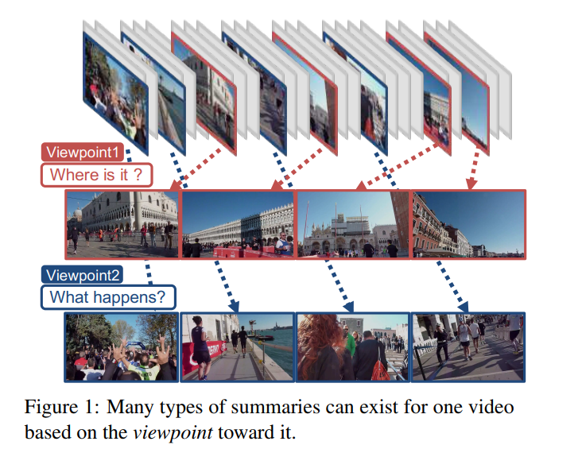
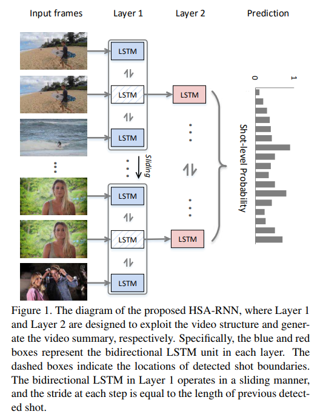
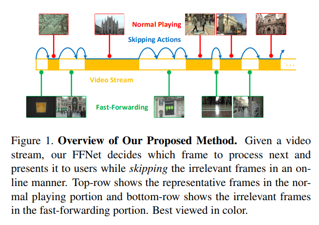
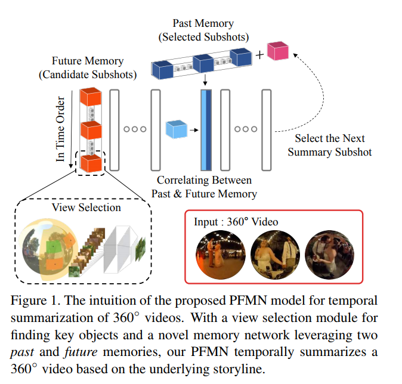

# Video summarization

## 介绍

视频摘要，就是以自动或半自动的方式，通过分析视频的结构和内容存在的时空冗余，从原始视频中提取有意义的片段/帧。从摘要的技术处理过程来讲，视频摘要一般可以分成两种，静态视频摘要和动态视频摘要。

**视频概要**为静态视频摘要模式，即通过一系列关键帧（对象）组成相应的语义单元，概括表示镜头内容，并支持视频快速导航。

特点：静态视频摘要只考虑其关键帧（对象），忽略了音频信息，生成摘要的速度比动态的快。

**缩略视频**为动态视频摘要模式，即保持了视频内容随时间动态变化的视频固有特征，一般是智能选择能够刻画原视频内容的小片段加以编辑合成。

特点：动态视频摘要表现的内容比静态视频摘要丰富，通常以镜头的方式表示，融合了图像、声音和文字等信息。

## 论文

视频摘要任务是从原始视频中提取有意义的片段(shot)或者帧。

[Viewpoint-aware Video Summarization, CVPR'18](https://arxiv.org/abs/1804.02843)

**Abstract**

This paper introduces a novel variant of video summarization, namely building a summary that depends on the particular aspect of a video the viewer focuses on. We refer to this as viewpoint. To infer what the desired viewpoint may be, we assume that several other videos are available, especially groups of videos, e.g., as folders on a person's phone or laptop. The semantic similarity between videos in a group vs. the dissimilarity between groups is used to produce viewpoint-specific summaries. For considering similarity as well as avoiding redundancy, output summary should be (A) diverse, (B) representative of videos in the same group, and (C) discriminative against videos in the different groups. To satisfy these requirements (A)-(C) simultaneously, we proposed a novel video summarization method from multiple groups of videos. Inspired by Fisher's discriminant criteria, it selects summary by optimizing the combination of three terms (a) inner-summary, (b) inner-group, and (c) between-group variances defined on the feature representation of summary, which can simply represent (A)-(C). Moreover, we developed a novel dataset to investigate how well the generated summary reflects the underlying viewpoint. Quantitative and qualitative experiments conducted on the dataset demonstrate the effectiveness of proposed method.

本文介绍一种新的视频摘要变体--视点：即构建一个摘要，该摘要取决于观众关注的视频的特定方面。为了推断所需的视点，假设还有其他几个视频或者视频组可用。组中视频之间的语义相似性与组之间的不相似性用于产生特定于视点的摘要。为了考虑相似性以及避免冗余，输出摘要应该是（A）多样的，（B）代表同一组中的视频，以及（C）区分不同组中的视频。为了同时满足这些要求（A） - （C），我们从多组视频中提出了一种新颖的视频摘要方法。

受Fisher的判别标准的启发，它通过优化三个术语的组合来选择摘要（a）内部摘要，（b）内部组和（c）在摘要的特征表示上定义的组间差异，这可以简单地表示（A） - （C）。

此外，作者开发了一个新的数据集来研究生成的摘要如何反映潜在的观点。在数据集上进行的定量和定性实验证明了所提方法的有效性。

[HSA-RNN: Hierarchical Structure-Adaptive RNN for Video Summarization, CVPR'18](http://openaccess.thecvf.com/content_cvpr_2018/papers/Zhao_HSA-RNN_Hierarchical_Structure-Adaptive_CVPR_2018_paper.pdf)

**Abstract**

Although video summarization has achieved great success in recent years, few approaches have realized the influence of video structure on the summarization results. As we know, the video data follow a hierarchical structure, i.e., a video is composed of shots, and a shot is composed of several frames. Generally, shots provide the activity-level information for people to understand the video content. While few existing summarization approaches pay attention to the shot segmentation procedure. They generate shots by some trivial strategies, such as fixed length segmentation, which may destroy the underlying hierarchical structure of video data and further reduce the quality of generated summaries. To address this problem, we propose a structure adaptive video summarization approach that integrates shot segmentation and video summarization into a Hierarchical Structure-Adaptive RNN, denoted as HSA-RNN. We evaluate the proposed approach on four popular datasets, i.e., SumMe, TVsum, CoSum and VTW. The experimental results have demonstrated the effectiveness of HSA-RNN in the video summarization task.

近年来视频摘要取得了巨大成功，但很少有方法能够实现视频结构对摘要结果的影响。

视频数据遵循分层结构，即视频由镜头组成，镜头由若干帧组成。通常，镜头提供人们理解视频内容的活动级信息。现有的摘要方法很少关注镜头分割程序,它们通过一些如固定长度分段的简单策略生成镜头，这可能破坏视频数据的底层分层结构并降低生成的摘要质量。

为了解决这个问题，文章提出一种结构自适应视频摘要方法，该方法将镜头分割和视频摘要集成到分层结构自适应RNN中，表示为HSA-RNN。文章在四种数据集SumMe，TVum，CoSum和VTW上评估，实验结果证明HSA-RNN在视频摘要任务中有效。

[参考博客](https://zhuanlan.zhihu.com/p/67510393)

[FFNet: Video Fast-Forwarding via Reinforcement Learning, CVPR'18](https://arxiv.org/abs/1805.02792)

**Abstract**

For many applications with limited computation, communication, storage and energy resources, there is an imperative need of computer vision methods that could select an informative subset of the input video for efficient processing at or near real time. In the literature, there are two relevant groups of approaches: generating a trailer for a video or fast-forwarding while watching/processing the video. The first group is supported by video summarization techniques, which require processing of the entire video to select an important subset for showing to users. In the second group, current fast-forwarding methods depend on either manual control or automatic adaptation of playback speed, which often do not present an accurate representation and may still require processing of every frame. In this paper, we introduce FastForwardNet (FFNet), a reinforcement learning agent that gets inspiration from video summarization and does fast-forwarding differently. It is an online framework that automatically fast-forwards a video and presents a representative subset of frames to users on the fly. It does not require processing the entire video, but just the portion that is selected by the fast-forward agent, which makes the process very computationally efficient. The online nature of our proposed method also enables the users to begin fast-forwarding at any point of the video. Experiments on two real-world datasets demonstrate that our method can provide better representation of the input video with much less processing requirement.

许多应用需要选择输入视频的信息子集同时达到实时或接近实时的有效处理。有两组相关的方法：在观看/处理视频时为视频生成预告片或快进。第一组由视频摘要技术处理整个视频以选择用于向用户显示的重要子集。在第二组中，当前的快进方法取决于手动控制或自动调整回放速度，其通常无法呈现精确的表示结果并可能仍需处理每个帧。

文章提出的FastForwardNet（FFNet）是一种强化学习代理从视频摘要中获得灵感，并以不同的方式快速转发。作为一个在线框架，FFNet可以自动快速转发视频并在运行中向用户呈现代表性的帧子集。它不需要处理整个视频，而只需要处理由快进代理选择的部分，这使得该过程在计算上非常有效。

FFNet的在线性质还使用户能够在视频的任何点开始快进，在两个数据集的实验表明可以提供更好的输入视频表示，而且处理要求更低。

[A Memory Network Approach for Story-based Temporal Summarization of 360° Videos, CVPR'18](https://arxiv.org/abs/1805.02838)

**Abstract**

We address the problem of story-based temporal summarization of long 360° videos. We propose a novel memory network model named Past-Future Memory Network (PFMN), in which we first compute the scores of 81 normal field of view (NFOV) region proposals cropped from the input 360° video, and then recover a latent, collective summary using the network with two external memories that store the embeddings of previously selected subshots and future candidate subshots. Our major contributions are two-fold. First, our work is the first to address story-based temporal summarization of 360° videos. Second, our model is the first attempt to leverage memory networks for video summarization tasks. For evaluation, we perform three sets of experiments. First, we investigate the view selection capability of our model on the Pano2Vid dataset. Second, we evaluate the temporal summarization with a newly collected 360° video dataset. Finally, we experiment our model's performance in another domain, with image-based storytelling VIST dataset. We verify that our model achieves state-of-the-art performance on all the tasks.

文章解决了360°长视频的基于故事的时间摘要问题。文章提出一种名为过去 - 未来记忆网络（PFMN）的模型，首先计算从输入的360°视频中裁剪的81个正常视野（NFOV）区域建议的分数，然后用具有两个外部存储器的网络来存储先前选择的子镜头和未来候选子镜头的嵌入，从而恢复摘要。

主要贡献：第一个解决基于故事的360°视频的时间摘要。第一次利用内存网络进行视频摘要任务的尝试。

实验：首先，测试模型在Pano2Vid数据集上的视图选择能力。其次，使用新收集的360°视频数据集评估时间摘要。最后，使用VIST数据集在另一个域中测试模型的性能。实验验证模型在所有任务上实现最先进的性能。

## 参考

[【机器之心】深度学习之视频摘要简述](https://blog.csdn.net/Uwr44UOuQcNsUQb60zk2/article/details/78869193)

