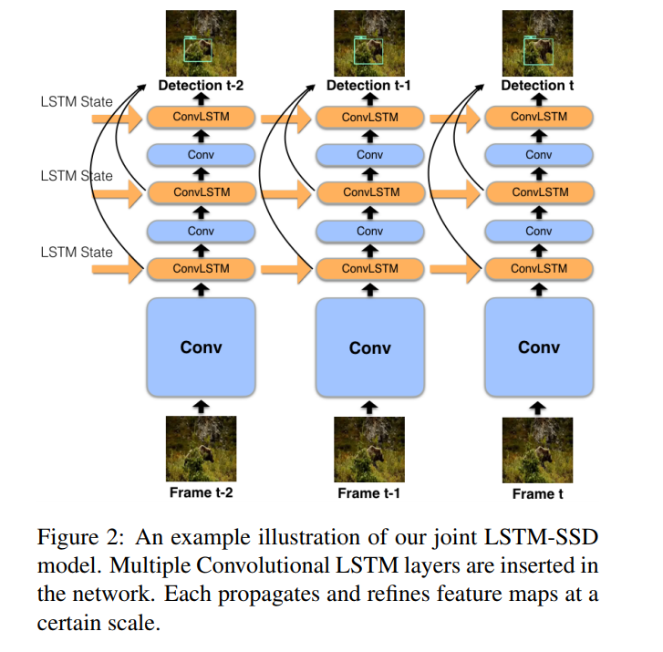
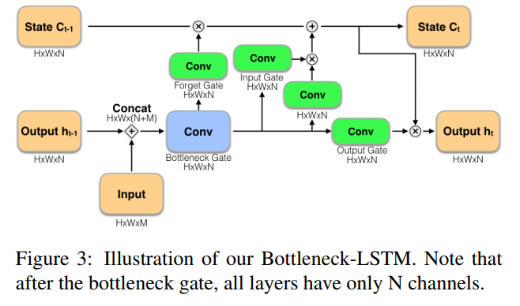
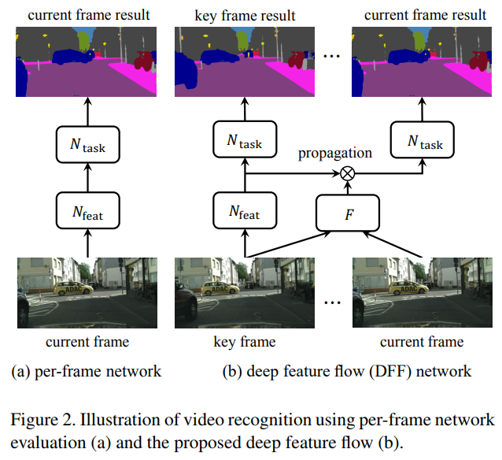
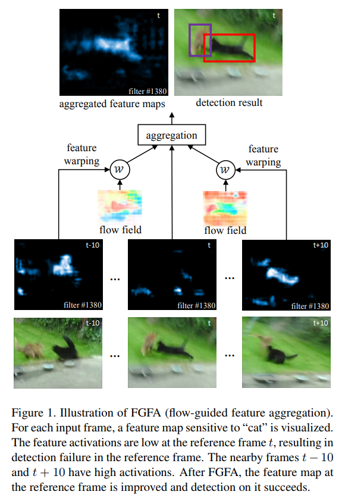
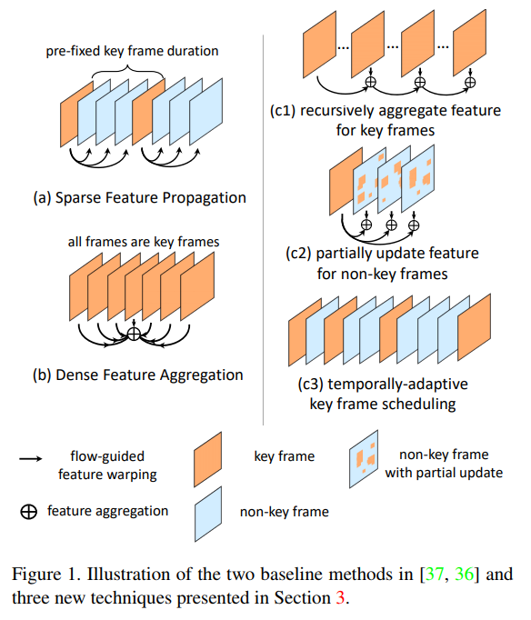

# Video object detection

**[Mobile Video Object Detection with Temporally-Aware Feature Maps, CVPR'18](https://arxiv.org/abs/1711.06368)**

**Abstract**
This paper introduces an online model for object detection in videos designed to run in real-time on low-powered mobile and embedded devices. Our approach combines fast single-image object detection with convolutional long short term memory (LSTM) layers to create an interweaved recurrent-convolutional architecture. Additionally, we propose an efficient Bottleneck-LSTM layer that significantly reduces computational cost compared to regular LSTMs. Our network achieves temporal awareness by using Bottleneck-LSTMs to refine and propagate feature maps across frames. This approach is substantially faster than existing detection methods in video, outperforming the fastest single-frame models in model size and computational cost while attaining accuracy comparable to much more expensive single-frame models on the Imagenet VID 2015 dataset. Our model reaches a real-time inference speed of up to 15 FPS on a mobile CPU.

文章介绍了一种用于视频中对象检测的在线模型，实现在低功耗移动和嵌入式设备上实时运行。 文中方法将快速单图像对象检测与LSTM层相结合，以创建交织的循环卷积体系结构。 此外，文中提出了Bottleneck-LSTM层，与常规LSTM相比可显着降低计算成本。 网络通过使用Bottleneck-LSTM进行跨帧精化和传播特征映射来实现时间感知，这种方法比现有视频检测方法快，在模型尺寸和计算成本方面也优于最快的单帧模型，同时获得与Imagenet VID 2015数据集上昂贵的单帧模型相当的精度。 本文模型移动CPU上实现高达15 FPS的实时推断速度。

**[Deep Feature Flow for Video Recognition, CVPR'17](https://arxiv.org/abs/1611.07715)**

**[Flow-Guided Feature Aggregation for Video Object Detection, ICCV'17](https://arxiv.org/abs/1703.10025)**

**[Towards High Performance Video Object Detection, CVPR'18](https://arxiv.org/abs/1711.11577)**

同一个作者的系列作品：

**Deep Feature Flow for Video Recognition：**

**Abstract**

Deep convolutional neutral networks have achieved great success on image recognition tasks. Yet, it is non-trivial to transfer the state-of-the-art image recognition networks to videos as per-frame evaluation is too slow and unaffordable. We present deep feature flow, a fast and accurate framework for video recognition. It runs the expensive convolutional sub-network only on sparse key frames and propagates their deep feature maps to other frames via a flow field. It achieves significant speedup as flow computation is relatively fast. The end-to-end training of the whole architecture significantly boosts the recognition accuracy. Deep feature flow is flexible and general. It is validated on two recent large scale video datasets. It makes a large step towards practical video recognition.

文章提出深度特征流用于构建快速准确的视频识别框架。 模型仅在稀疏关键帧上运行卷积子网络，并通过流场将其深度特征映射传播到其他帧；由于流量计算相对较快，因此可实现显着的加速。 整个架构的端到端训练显着提高了识别准确性，所用的深度特征流程灵活且通用。

Deep feature flow 用了deep feature （appearance 信息）和 光流（motion 信息）来对视频中的每一帧做建模，它的核心思想是利用指定的关键帧（key frame）和其他帧（current frame）得到关键帧的光流信息。把关键帧送入到deep CNN中得到deep feature，而对于其他帧算出与关键帧的光流，再用光流把关键帧的deep feature propagate （相加，在做双线性差值）到当前帧，这时候就可大大减少计算量，因为非关键帧不用通过CNN计算。对于新得到的特征，接下来就可对其进行不同任务处理，比如分割或者检测。

[项目地址](https://github.com/msracver/Deep-Feature-Flow)

[参考博客](https://blog.csdn.net/lxt1994/article/details/79952310)

**Flow-Guided Feature Aggregation for Video Object Detection：**

**Abstract**

Extending state-of-the-art object detectors from image to video is challenging. The accuracy of detection suffers from degenerated object appearances in videos, e.g., motion blur, video defocus, rare poses, etc. Existing work attempts to exploit temporal information on box level, but such methods are not trained end-to-end. We present flow-guided feature aggregation, an accurate and end-to-end learning framework for video object detection. It leverages temporal coherence on feature level instead. It improves the per-frame features by aggregation of nearby features along the motion paths, and thus improves the video recognition accuracy. Our method significantly improves upon strong single-frame baselines in ImageNet VID, especially for more challenging fast moving objects. Our framework is principled, and on par with the best engineered systems winning the ImageNet VID challenges 2016, without additional bells-and-whistles. The proposed method, together with Deep Feature Flow, powered the winning entry of ImageNet VID challenges 2017.

文章在之前的DFF（deep feature flow）工作的基础上，作者进一步地对视频的每一帧特征做了aggregation的操作，用于提高特征的表征能力。

将最先进的物体检测器从图像扩展到视频时，检测的准确性会受到视频中退化对象的影响，例如，运动模糊，视频散焦，罕见姿势等。现有工作试图在box level上利用时间信息，但是这种方法不是端对端训练的。文章提供了流量引导的特征聚合，这是一种用于视频对象检测的精确的端到端学习框架，它利用了特征级别的时间一致性。它通过沿运动路径聚合附近特征来改善每帧特征，从而提高视频识别精度。

文中的方法对于快速移动的物体具有较好的识别效果。

[项目地址](https://github.com/msracver/Flow-Guided-Feature-Aggregation)

[参考博客](https://blog.csdn.net/lxt1994/article/details/79953401)

**Towards High Performance Video Object Detection:**

**Abstract**

There has been significant progresses for image object detection in recent years. Nevertheless, video object detection has received little attention, although it is more challenging and more important in practical scenarios.

Built upon the recent works, this work proposes a unified approach based on the principle of multi-frame end-to-end learning of features and cross-frame motion. Our approach extends prior works with three new techniques and steadily pushes forward the performance envelope (speed-accuracy tradeoff), towards high performance video object detection.

文章在前两项工作的基础上，提出了一种基于多帧端到端特征和跨框架运动学习原理的统一方法。

其中a代表DFF（deep feature flow），b 代表FGFA（flow guided feature aggregation) 。右侧代表他们提出的3种不同的方法。
