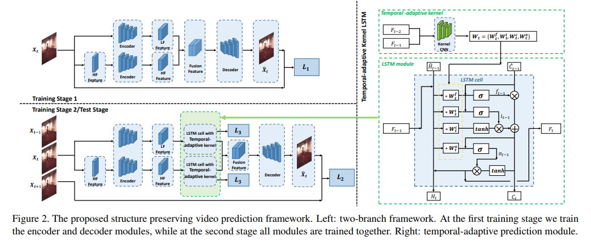

# Video prediction

**[Structure Preserving Video Prediction, CVPR'18](http://openaccess.thecvf.com/content_cvpr_2018/papers/Xu_Structure_Preserving_Video_CVPR_2018_paper.pdf)**

**Abstract**

Despite recent emergence of adversarial based methods for video prediction, existing algorithms often produce unsatisfied results in image regions with rich structural information (i.e., object boundary) and detailed motion (i.e., articulated body movement). To this end, we present a structure preserving video prediction framework to explicitly address above issues and enhance video prediction quality. On one hand, our framework contains a two-stream generation architecture which deals with high frequency video content (i.e., detailed object or articulated motion structure) and low frequency video content (i.e., location or moving directions) in two separate streams. On the other hand, we propose a RNN structure for video prediction, which employs temporal-adaptive convolutional kernels to capture time-varying motion patterns as well as tiny objects within a scene. Extensive experiments on diverse scenes, ranging from human motion to semantic layout prediction, demonstrate the effectiveness of the proposed video prediction approach.

现有基于对抗的视频预测方法通常在具有丰富结构信息（即，对象边界）和详细运动（即，关节运动的身体运动）的图像区域中产生不满意的结果。为此，文章提出了一种保留视频预测框架的结构，以解决上述问题并提高视频预测质量。

一方面，框架包含two-stream生成架构，其在两个单独的流中处理高频视频内容（即，详细对象或关节运动结构）和低频视频内容（即，位置或移动方向）。另一方面，提出了一种用于视频预测的RNN结构，其采用时间自适应卷积核来捕获时变运动模式以及场景内的微小对象。从人类运动到语义布局预测的各种场景的实验证明了所提出的视频预测方法的有效性。

文章采用了encoder-LSTM-decoder的结构。创新：

1. 将高频和低频分离处理，用两个encoder通道和两个LSTM进行预测

2. 根据临近帧信息动态改变LSTM中参数的权重，实现时间自适应预测模型（temeporal adaptive prediction module）

网络结构：

1. 编码模块分为两部分，一部分直接将图片送入Encoder，另一部分先过一个滤波器(LoG)，再送入Encoder，之后将二者编码的特征送给LSTM进行预测，将预测的特征融合后送入decoder

2. LSTM：各个权重通过一个卷积网络得到，随着时间动态更新，以实现时间自适应。采用seq-to-seq进行预测

训练：

1. 第一步只训练encoder和decoder

2. 第二步同时训练encoder、decoder、prediction module，不过encoder和decoder的学习率设置的比较低

[PPT](http://www.icst.pku.edu.cn/struct/Seminar/YuzhangHu_181209/YuzhangHu_181209.pdf)

**[Learning to Extract a Video Sequence from a Single Motion-Blurred Image](http://openaccess.thecvf.com/content_cvpr_2018/papers/Jin_Learning_to_Extract_CVPR_2018_paper.pdf)**

**Abstract**

We present a method to extract a video sequence from a single motion-blurred image. Motion-blurred images are the result of an averaging process, where instant frames are accumulated over time during the exposure of the sensor. Unfortunately, reversing this process is nontrivial. Firstly, averaging destroys the temporal ordering of the frames. Secondly, the recovery of a single frame is a blind deconvolution task, which is highly ill-posed. We present a deep learning scheme that gradually reconstructs a temporal ordering by sequentially extracting pairs of frames. Our main contribution is to introduce loss functions invariant to the temporal order. This lets a neural network choose during training what frame to output among the possible combinations. We also address the ill-posedness of deblurring by designing a network with a large receptive field and implemented via resampling to achieve a higher computational efficiency. Our proposed method can successfully retrieve sharp image sequences from a single motion blurred image and can generalize well on synthetic and real datasets captured with different cameras.

文章提出了一种从单个运动模糊图像中提取视频序列的方法。运动模糊图像是平均过程的结果，其中在传感器曝光期间随时间累积即时帧。恢复模糊图像非常困难，首先因为平均破坏了帧的时间顺序；其次，单帧的恢复是盲目的反卷积任务，不适合处理运动模糊图像。

文章通过顺序提取帧对来逐步重建时间排序，主要贡献是引入对时间顺序不变的损失函数，其允许神经网络在训练期间在可能的组合中选择输出帧。文章还通过设计具有大感受野的网络并通过重采样提升计算效率来解决去模糊的不适定问题。

文章提出的方法可以成功地从单个运动模糊图像中检索清晰图像序列，并且可以很好地适应用不同相机捕获的合成和真实数据集。

[项目地址](https://github.com/MeiguangJin/Learning-to-Extract-a-Video-Sequence-from-a-Single-Motion-Blurred-Image)
