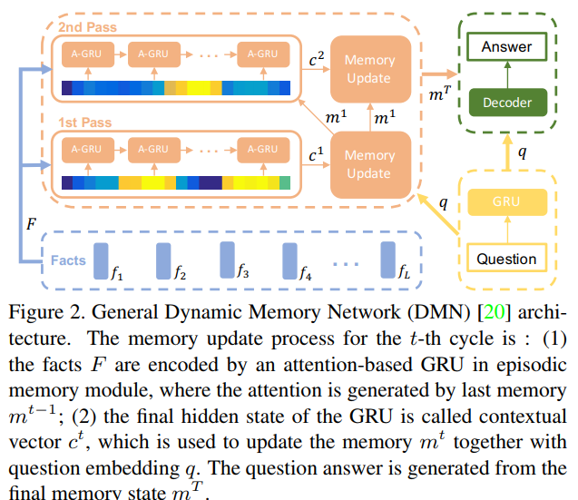
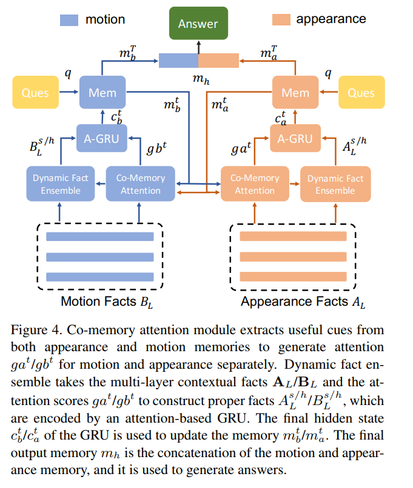
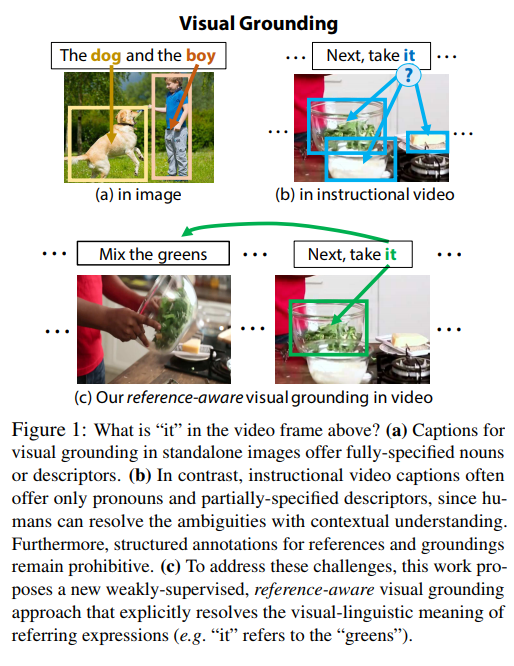
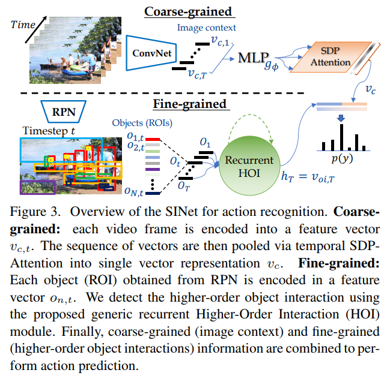
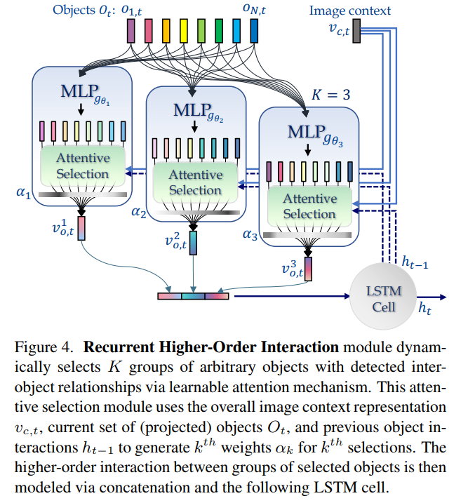
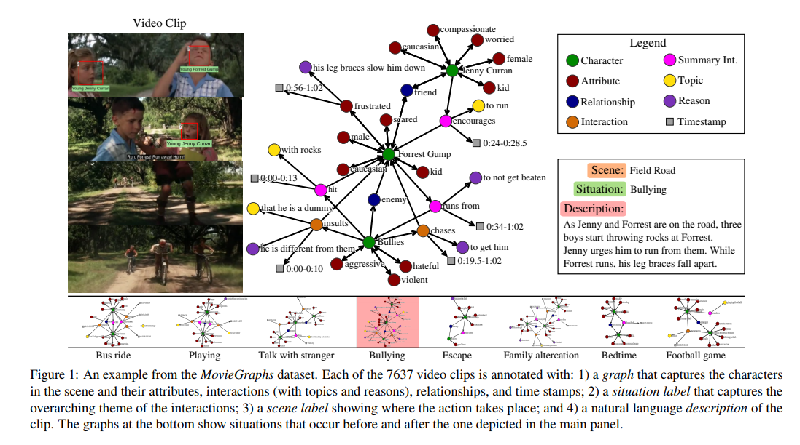

# Video question answer & retrieval & search & reasoning

## 介绍

在视频问答任务中，对给定的问题和图片，视频问答的目的是学习一个模型对问题进行回答。目前用来解决视频问答任务的方法可以分为：分类和序列生成两种。在分类模型中，视频问答任务把答案当作一个个类别，从而将答案生成的任务转换成分类任务。在序列生成模型中，视频问答的输出一般由LSTM来生成。

## 论文

**[Motion-Appearance Co-Memory Networks for Video Question Answering, CVPR'18](https://arxiv.org/abs/1803.10906)**

**Abstract**

Video Question Answering (QA) is an important task in understanding video temporal structure. We observe that there are three unique attributes of video QA compared with image QA: (1) it deals with long sequences of images containing richer information not only in quantity but also in variety; (2) motion and appearance information are usually correlated with each other and able to provide useful attention cues to the other; (3) different questions require different number of frames to infer the answer. Based these observations, we propose a motion-appearance comemory network for video QA. Our networks are built on concepts from Dynamic Memory Network (DMN) and introduces new mechanisms for video QA. Specifically, there are three salient aspects: (1) a co-memory attention mechanism that utilizes cues from both motion and appearance to generate attention; (2) a temporal conv-deconv network to generate multi-level contextual facts; (3) a dynamic fact ensemble method to construct temporal representation dynamically for different questions. We evaluate our method on TGIF-QA dataset, and the results outperform state-of-the-art significantly on all four tasks of TGIF-QA.

视频问答（QA）是理解视频时间结构的重要任务。视频QA与图像QA相比有三个独特的属性：（1）它处理的是包含更多信息的长序列图像，不仅数量多，而且种类多; （2）运动和外观信息通常相互关联，能够为对方提供有用的注意线索; （3）不同的问题需要不同数量的帧来推断答案。

基于这些观察，文章提出了用于视频QA的运动外观存储网络。网络基于动态内存网络（DMN）并引入视频质量保证的新机制。具体来说，有三个突出的方面：（1）共同记忆注意机制，利用运动和外观的提示来产生注意力; （2）生成多层上下文事实的时间conv-deconv网络; （3）动态事实集合方法，动态地构造不同问题的时间表示。文章在TGIF-QA数据集所有四个任务上都优于现有技术。

**[Finding "It": Weakly-Supervised Reference-Aware Visual Grounding in Instructional Videos, CVPR'18 Oral](http://openaccess.thecvf.com/content_cvpr_2018/papers/Huang_Finding_It_Weakly-Supervised_CVPR_2018_paper.pdf)**

[【项目地址】](https://finding-it.github.io/)
[【参考博客】](https://zhuanlan.zhihu.com/p/36374060)

**Abstract**

Grounding textual phrases in visual content with standalone image-sentence pairs is a challenging task. When we consider grounding in instructional videos, this problem becomes profoundly more complex: the latent temporal structure of instructional videos breaks independence assumptions and necessitates contextual understanding for resolving ambiguous visual-linguistic cues. Furthermore, dense annotations and video data scale mean supervised approaches are prohibitively costly. In this work, we propose to tackle this new task with a weakly-supervised framework for reference-aware visual grounding in instructional videos, where only the temporal alignment between the transcription and the video segment are available for supervision. We introduce the visually grounded action graph, a structured representation capturing the latent dependency between grounding and references in video. For optimization, we propose a new reference-aware multiple instance learning (RA-MIL) objective for weak supervision of grounding in videos. We evaluate our approach over unconstrained videos from YouCookII and RoboWatch, augmented with new reference-grounding test set annotations. We demonstrate that our jointly optimized, reference-aware approach simultaneously improves visual grounding, reference-resolution, and generalization to unseen instructional video categories.

使用独立的图像-句子将可视内容中的文本短语grounding是一项具有挑战性的任务。在教学视频中进行visual grounding时，问题变得非常复杂：教学视频的潜在时间结构打破了独立性假设，并且需要用于解决模糊视觉语言线索的语境理解。此外，密集注释和视频数据规模意味着监督方法成本过高。

文章建议用一个弱监督的参考感知视觉基础框架来解决这个任务，其中只有录音和视频片段时间对齐后才可用于监督。文章介绍了visual grounding的action graph，这是一种结构化表示，捕捉了视频中grounding和references之间的潜在依赖关系。为了优化，文章提出了一种新的参考感知多实例学习（RA-MIL）用于弱监督。

文章评估来自YouCookII和RoboWatch的无约束视频的方法，并增加了新的reference-grounding测试集标注；证明了文章的联合优化的参考感知方法同时改善了visual grounding，参考分辨率和对看不见的教学视频类别的概括。

**[Attend and Interact: Higher-Order Object Interactions for Video Understanding, CVPR'18](https://arxiv.org/abs/1711.06330)**

[【参考博客】](https://blog.csdn.net/u014230646/article/details/80878109)

**Abstract**

Human actions often involve complex interactions across several inter-related objects in the scene. However, existing approaches to fine-grained video understanding or visual relationship detection often rely on single object representation or pairwise object relationships. Furthermore, learning interactions across multiple objects in hundreds of frames for video is computationally infeasible and performance may suffer since a large combinatorial space has to be modeled. In this paper, we propose to efficiently learn higher-order interactions between arbitrary subgroups of objects for fine-grained video understanding. We demonstrate that modeling object interactions significantly improves accuracy for both action recognition and video captioning, while saving more than 3-times the computation over traditional pairwise relationships. The proposed method is validated on two large-scale datasets: Kinetics and ActivityNet Captions. Our SINet and SINet-Caption achieve state-of-the-art performances on both datasets even though the videos are sampled at a maximum of 1 FPS. To the best of our knowledge, this is the first work modeling object interactions on open domain large-scale video datasets, and we additionally model higher-order object interactions which improves the performance with low computational costs.

人类行为通常涉及场景中几个相互关联的对象之间的复杂交互。然而，现有的细粒度视频理解或视觉关系检测方法通常依赖于单个对象表示或成对对象关系。此外，在用于视频中数百帧的多个对象之间的学习交互在计算上是不可行的；并且因为必须对大的组合空间进行建模，性能可能受到影响。在本文中，为了细粒度的视频理解，作者建议有效地学习任意子组之间的高阶交互。文章证明，建模对象交互可以显着提高动作识别和视频字幕的准确性，同时比传统的成对关系节省3倍以上的计算量。所提出的方法在Kinetics和ActivityNet Caption两个大规模数据集上得到验证。即使视频以最大1 FPS采样，文章的SINet和SINet-Caption也能在两个数据集上实现先进的性能。这是开放域大规模视频数据集上第一个建模对象交互的工作，文章还模拟了高阶对象交互，以低计算成本提高性能。

Coarse-grained:

这部分提取多帧视频的特征。首先对T帧图像分别提取特征，接着把这T个特征向量映射到另一个维度。最后通过SDP Attention提取出T帧图像的整体表达，即全局特征。其中SDP Attention参考了谷歌的All you need is attention这篇论文中的attention模块的设计。其思想是，把每一帧图像表达成T帧图像的线性和，系数由每一帧图像与其他帧图像的相似性计算得到。最后再把这重表达之后的T个特征向量取个平均池化得到整体的特征$v_c$。

Fine-grained:

对于某一帧图像，首先用Region Proposal网络生成N个物体候选，对每个生成的物体提取特征，把这N个特征向量映射到另一个维度。这里用了一个LSTM来学习时序关系。LSTM的隐藏层表示物体之间的关系信息。把T帧图像全局特征$v_c$与物体之间的关系信息以及object特征concate到一起，再经过SDP Attention，输入LSTM得到下一帧的隐藏层表达。 
最终用第T帧时刻的隐藏层以及T帧图像的全局特征来预测视频类别。

**[MovieGraphs: Towards Understanding Human-Centric Situations from Videos, CVPR'18](http://www.cs.toronto.edu/~makarand/papers/CVPR2018_MovieGraphs.pdf)**

[【项目地址】](http://moviegraphs.cs.toronto.edu/)

**Abstract**

There is growing interest in artificial intelligence to build socially intelligent robots. This requires machines to have the ability to "read" people's emotions, motivations, and other factors that affect behavior. Towards this goal, we introduce a novel dataset called MovieGraphs which provides detailed, graph-based annotations of social situations depicted in movie clips. Each graph consists of several types of nodes, to capture who is present in the clip, their emotional and physical attributes, their relationships (i.e., parent/child), and the interactions between them. Most interactions are associated with topics that provide additional details, and reasons that give motivations for actions. In addition, most interactions and many attributes are grounded in the video with time stamps. We provide a thorough analysis of our dataset, showing interesting common-sense correlations between different social aspects of scenes, as well as across scenes over time. We propose a method for querying videos and text with graphs, and show that: 1) our graphs contain rich and sufficient information to summarize and localize each scene; and 2) subgraphs allow us to describe situations at an abstract level and retrieve multiple semantically relevant situations. We also propose methods for interaction understanding via ordering, and reason understanding. MovieGraphs is the first benchmark to focus on inferred properties of human-centric situations, and opens up an exciting avenue towards socially-intelligent AI agents.

社交智能机器人要求机器能够“阅读”人们的情绪、动机以及影响行为的其他因素。为实现这一目标，文章引入MovieGraphs新数据集，它提供了电影剪辑中描述的社交情境的基于图形的详细标注。每个图形由若干类型的节点组成，以捕获剪辑中存在的人、他们的情感和身体属性、他们的关系（即父母/孩子）以及他们之间的交互。大多数交互都与提供其他详细信息的主题相关联，并以带有时间戳的视频为基础。文章数据集进行全面分析，展示场景的不同社交方面之间以及随着时间推移的场景之间的相关性。

文章提出了一种用图查询视频和文本的方法，并表明：1）图包含丰富而充分的信息，用于汇总和定位每个场景; 2）子图允许模型在抽象层面描述情境并检索多个语义相关的情况。

## 参考

[【专知】【论文推荐】最新7篇视觉问答（VQA）相关论文—解释、读写记忆网络、逆视觉问答、视觉推理、可解释性、注意力机制、计数](https://cloud.tencent.com/developer/article/1086325)