# Video semantic segmentation

## 介绍

语义分割任务要求给图像上的每一个像素赋予一个带有语义的标签，视频语义分割任务是要求给视频中的每一帧图像上的每一个像素赋予一个带有语义的标签。

相比于单张图像，文章更容易获取视频数据，而视频数据本身有很强的帧冗余性和不确定性。如果文章把视频直接一帧一帧地送入图像分割的模型中，必然会带来很大的计算开销，并且由于场景中运动物体的变化，也会导致分割结果不稳定性，比如一个物体前一帧是类别Ａ，而到中间的几帧的时候突然变成的类别Ｂ，或者物体的内部出现语义类别不一致的现象。所以目前视频语义分割主要研究的重点大致有两个方向：第一个是如何利用视频帧之间的时序信息来提高图像分割的精度，第二个是如何利用帧之间的相似性来减少模型计算量，提高模型的运行速度和吞吐量。

任务的评估指标和图像语义分割相同均为mIOU(mean Intersection-over-Union)，由于是video数据，同时会测试模型的FPS作为video加速方向的一个平衡。

### 图像语义分割

目前的大多数state-of-the-art的模型都是采用特征网络（backbone）加上下文模块(context modeling)。其中特征网络一般是较深的分类网络，比如resnet系列，这一部分的主要目标为了获取更好的特征表示。而上下文模块的目标是让每个像素的特征之间建立关系，进而获取整个图像的场景信息，让分割的结果的语义一致性更强，这个也是目前研究的一个热点。

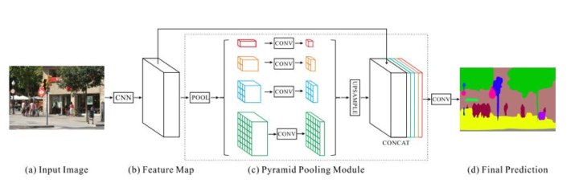

PSP-net使用了resnet101作为网络的backbone, 提出了使用pyramid pooling module即特征网络金字塔结构作为context modeling来获取不同尺度的信息，具体操作为把resnet的最后一个block的输出做了4种不同尺度的average pooling操作再上采样回原来尺度，最终再把这些不同的尺度的信息进行融合，这样可以更好地捕获不同尺度的context信息。

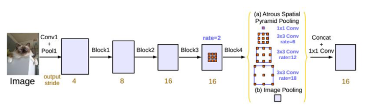

Deeplabv3同样使用resnet101作为网络的backbone, 提出了ASPP的结构， 通过不同dilation rate的卷积操作来获取不同尺度的context的信息以及结合全局的context(图中Image Pooling)的融合进一步地提高特征的表征能力。

### 视频语义分割

视频语义分割的很多基本模型都是源自图像的语义分割模型，其工作的重点是在于如何有效地建模时间维的信息。

#### 利用时序信息提高精度方向

这个方向主要工作是利用视频的时序信息进而获得语义信息一致性更强的特征来做分割。

#### 降低视频冗余计算量方向

由于在视频中帧和帧之间的相似度极高，如果让图像一帧一阵地送入神经网络中势必会带来很多冗余的计算量，而在一些具体的应用中，比如自动驾驶任务上，模型运行的速度也是一个重要因素，因此近些年来有很多工作在研究视频分割加速。

## 论文

**[Blazingly Fast Video Object Segmentation with Pixel-Wise Metric Learning, CVPR'18](http://openaccess.thecvf.com/content_cvpr_2018/papers/Chen_Blazingly_Fast_Video_CVPR_2018_paper.pdf)**

[【Blog(Chinese)】](https://blog.csdn.net/qq_16761599/article/details/80821007)

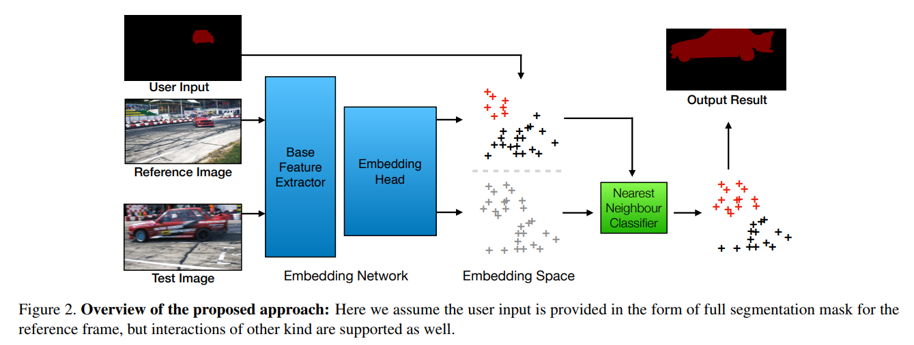

**Abstract**

This paper tackles the problem of video object segmentation, given some user annotation which indicates the object of interest. The problem is formulated as pixel-wise　etrieval in a learned embedding space: we embed pixels of the same object instance into the vicinity of each other, using a fully convolutional network trained by a modified triplet loss as the embedding model. Then the annotated pixels are set as reference and the rest of the pixels are classified using a nearest-neighbor approach. The proposed method supports different kinds of user input such as segmentation mask in the first frame (semi-supervised scenario), or a sparse set of clicked points (interactive scenario). In the semi-supervised scenario, we achieve results competitive with the state of the art but at a fraction of computation cost (275 milliseconds per frame). In the interactive scenario where the user is able to refine their input iteratively, the proposed method provides instant response to each input, and reaches comparable quality to competing methods with much less interaction.

这项工作为视频对象分割提供了一个概念上简单但非常有效的方法。通过修改专门为视频对象分割而设计的三元组损失,来学习嵌入空间中的像素方式检索。这样，视频上的注释像素（通过涂鸦，第一个掩模上的分割，点击等）就是参考样本，其余像素通过简单且快速的最近邻近方法进行分类。

**[MoNet: Deep Motion Exploitation for Video Object Segmentation, CVPR'18](http://openaccess.thecvf.com/content_cvpr_2018/papers/Xiao_MoNet_Deep_Motion_CVPR_2018_paper.pdf)**

[【Blog(Chinese)】](https://blog.csdn.net/zxx827407369/article/details/84950833)

**Abstract**

In this paper, we propose a novel MoNet model to deeply exploit motion cues for boosting video object segmentation performance from two aspects, i.e., frame representation learning and segmentation refinement. Concretely, MoNet exploits computed motion cue (i.e., optical flow) to reinforce the representation of the target frame by aligning and integrating representations from its neighbors. The new representation provides valuable temporal contexts for segmentation and improves robustness to various common contaminating factors, e.g., motion blur, appearance variation and deformation of video objects. Moreover, MoNet exploits motion inconsistency and transforms such motion cue into foreground/background prior to eliminate distraction from confusing instances and noisy regions. By introducing a distance transform layer, MoNet can effectively separate motion-inconstant instances/regions and thoroughly refine segmentation results. Integrating the proposed two motion exploitation components with a standard segmentation network, MoNet provides new state-of-the-art performance on three competitive benchmark datasets.

本文提出一个新的MoNet模型，从帧表示学习和分割细化两个方面深入挖掘运动信息来提高视频目标分割的准确性。MoNet利用计算的运动信息（即光流）通过对齐和整合来自相邻帧的特征来增强目标帧的特征表示。新的特征表示为分割提供了有价值的时间上下文，并提高了对各种常见干扰因素的鲁棒性。通过引入距离转换层（DT），MoNet可以有效地分割运动不一致的区域，并提高分割的准确性。

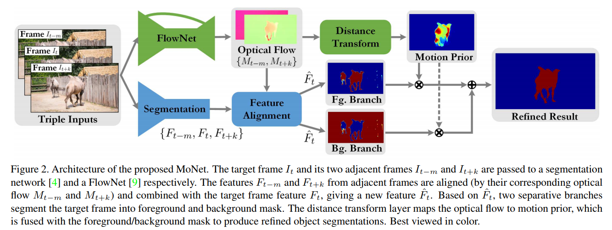

**[Motion-Guided Cascaded Refinement Network for Video Object Segmentation, CVPR'18](http://openaccess.thecvf.com/content_cvpr_2018/papers/Hu_Motion-Guided_Cascaded_Refinement_CVPR_2018_paper.pdf)**

[【Project Page】](https://github.com/feinanshan/Motion-Guided-CRN)
[【Blog(Chinese)】](https://blog.csdn.net/qq_34914551/article/details/88096247)

**Abstract**

Deep CNNs have achieved superior performance in many tasks of computer vision and image understanding. However, it is still difficult to effectively apply deep CNNs to video object segmentation(VOS) since treating video frames as separate and static will lose the information hidden in motion. To tackle this problem, we propose a Motionguided Cascaded Refinement Network for VOS. By assuming the object motion is normally different from the background motion, for a video frame we first apply an active contour model on optical flow to coarsely segment objects of interest. Then, the proposed Cascaded Refinement Network(CRN) takes the coarse segmentation as guidance to generate an accurate segmentation of full resolution. In this way, the motion information and the deep CNNs can well complement each other to accurately segment objects from video frames. Furthermore, in CRN we introduce a Single-channel Residual Attention Module to incorporate the coarse segmentation map as attention, making our network effective and efficient in both training and testing. We perform experiments on the popular benchmarks and the results show that our method achieves state-of-the-art performance at a much faster speed.

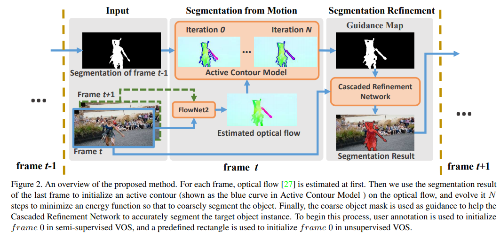

CNNs已经在很多计算机视觉和图像理解的任务中获得了超越性的性能。然而，CNNs仍然未能有效应用在视频目标分割中（简称VOS），因为将视频帧当做单独和静态的图像处理，将丢失隐藏在动作中的信息。为了解决这个问题，文章为VOS任务提出一个运动指引式的级联的细粒度网络。通过设想目标的运动异于背景的运动，对每一个视频帧首先应用active contour（level Set）在光流上，来粗略分割出感兴趣的目标。然后，文章提出的Cascaded Refinement Network（CRN）将这个粗粒度分割作为指引（guidance）来产生精确的并且是保留分辨率的分割。通过这种方式，运动信息和CNN可以互相帮助，以此来精确地分割视频帧。而且，在CRN中文章介绍了一种单通道的残差注意力模块（Residual Attention Module）来联合粗分割的map作为guidance，使网络在训练和测试中都更加有效和高效。

**[Dynamic Video Segmentation Network, CVPR'18](https://arxiv.org/abs/1804.00931)**

[【Project Page】](https://github.com/XUSean0118/DVSNet)

**Abstract**

In this paper, we present a detailed design of dynamic video segmentation network (DVSNet) for fast and efficient semantic video segmentation. DVSNet consists of two convolutional neural networks: a segmentation network and a flow network. The former generates highly accurate semantic segmentations, but is deeper and slower. The latter is much faster than the former, but its output requires further processing to generate less accurate semantic segmentations. We explore the use of a decision network to adaptively assign different frame regions to different networks based on a metric called expected confidence score. Frame regions with a higher expected confidence score traverse the flow network. Frame regions with a lower expected confidence score have to pass through the segmentation network. We have extensively performed experiments on various configurations of DVSNet, and investigated a number of variants for the proposed decision network. The experimental results show that our DVSNet is able to achieve up to 70.4% mIoU at 19.8 fps on the Cityscape dataset. A high speed version of DVSNet is able to deliver an fps of 30.4 with 63.2% mIoU on the same dataset. DVSNet is also able to reduce up to 95% of the computational workloads.

动态视频分段网络（DVSNet）框架的出现是为了在语义视频分割的质量和效率之间取得平衡。DVSNet框架由两个卷积神经网络组成：分割网络（例如DeepLabv2）和流动网络（例如FlowNet2）。前者产生高度准确的语义分割，但更深入和更慢。后者比前者快得多，但其输出需要进一步处理以产生较不准确的语义分段。DVSNet利用决策网络（DN）来确定哪些帧区域应根据称为预期置信度得分的度量转发到哪些路径。DN的使用提出了自适应关键帧调度策略，以在运行时自适应调整关键帧的更新周期。

**[Efficient Video Object Segmentation via Network Modulation, CVPR'18](http://openaccess.thecvf.com/content_cvpr_2018/papers_backup/Yang_Efficient_Video_Object_CVPR_2018_paper.pdf)**

[【Project Page】](https://github.com/linjieyangsc/video_seg)
[【Blog(Chinese)1】](https://www.jianshu.com/p/a7def2b306ff)
[【Blog(Chinese)2】](https://zhuanlan.zhihu.com/p/36139460)

**Abstract**

Video object segmentation targets at segmenting a specific object throughout a video sequence, given only an annotated first frame. Recent deep learning based approaches find it effective by fine-tuning a general-purpose segmentation model on the annotated frame using hundreds of iterations of gradient descent. Despite the high accuracy these methods achieve, the fine-tuning process is inefficient and fail to meet the requirements of real world applications. We propose a novel approach that uses a single forward pass to adapt the segmentation model to the appearance of a specific object. Specifically, a second meta neural network named modulator is learned to manipulate the intermediate layers of the segmentation network given limited visual and spatial information of the target object. The experiments show that our approach is 70times faster than fine-tuning approaches while achieving similar accuracy.

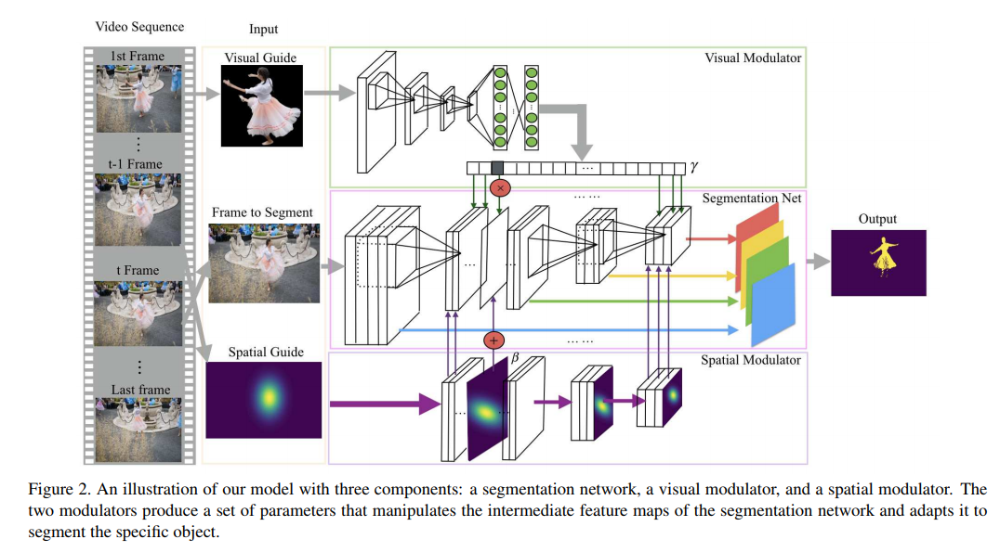

基于深度学习的方法实现了高精度，但是微调过程效率低并且不能满足现实世界应用的要求。本文提出了一种新方法，该方法使用单个前向传递来使分割模型适应特定对象的外观。 具体地，在给定目标对象的有限视觉和空间信息的情况下，学习称为调制器的第二元神经网络来操纵分割网络的中间层。在保持和其他方法精确度相似下，速度快70倍。

**[Low-Latency Video Semantic Segmentation, CVPR'18 Spotlight](https://arxiv.org/abs/1804.00389)**

[【Blog(Chinese)】](https://zhuanlan.zhihu.com/p/36549785)

**Abstract**

Recent years have seen remarkable progress in semantic segmentation. Yet, it remains a challenging task to apply segmentation techniques to video-based applications. Specifically, the high throughput of video streams, the sheer cost of running fully convolutional networks, together with the low-latency requirements in many real-world applications, e.g. autonomous driving, present a significant challenge to the design of the video segmentation framework. To tackle this combined challenge, we develop a framework for video semantic segmentation, which incorporates two novel components: (1) a feature propagation module that adaptively fuses features over time via spatially variant convolution, thus reducing the cost of per-frame computation; and (2) an adaptive scheduler that dynamically allocate computation based on accuracy prediction. Both components work together to ensure low latency while maintaining high segmentation quality. On both Cityscapes and CamVid, the proposed framework obtained competitive performance compared to the state of the art, while substantially reducing the latency, from 360 ms to 119 ms.

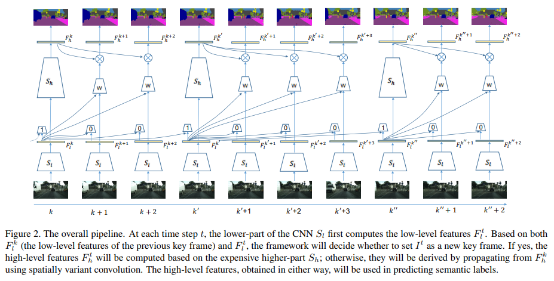

近年来语义分割取得了显着进展,但是将分割技术应用于基于视频的应用程序仍然是一项具有挑战性的任务。视频流的高吞吐量使得运行完全卷积网络的成本增大，并且难以满足现实应用中的低延迟要求。为了解决这一综合挑战，文章开发了视频语义分割框架，其中包含两个新颖的组件：（1）特征传播模块，通过空间变异卷积自适应地融合特征，从而降低每帧计算的成本; （2）自适应调度器，其基于精度预测动态地分配计算。两个组件协同工作以确保低延迟，同时保持高分段质量。在Cityscapes和CamVid上，所提出的框架具有竞争性，同时将延迟从360毫秒减少到119毫秒。

**[CNN in MRF: Video Object Segmentation via Inference in A CNN-Based Higher-Order Spatio-Temporal MRF, CVPR'18](https://arxiv.org/abs/1803.09453)**

**Abstract**

This paper addresses the problem of video object segmentation, where the initial object mask is given in the first frame of an input video. We propose a novel spatio-temporal Markov Random Field (MRF) model defined over pixels to handle this problem. Unlike conventional MRF models, the spatial dependencies among pixels in our model are encoded by a Convolutional Neural Network (CNN). Specifically, for a given object, the probability of a labeling to a set of spatially neighboring pixels can be predicted by a CNN trained for this specific object. As a result, higher-order, richer dependencies among pixels in the set can be implicitly modeled by the CNN. With temporal dependencies established by optical flow, the resulting MRF model combines both spatial and temporal cues for tackling video object segmentation. However, performing inference in the MRF model is very difficult due to the very high-order dependencies. To this end, we propose a novel CNN-embedded algorithm to perform approximate inference in the MRF. This algorithm proceeds by alternating between a temporal fusion step and a feed-forward CNN step. When initialized with an appearance-based one-shot segmentation CNN, our model outperforms the winning entries of the DAVIS 2017 Challenge, without resorting to model ensembling or any dedicated detectors.

本文讨论了视频对象分割的问题，其中在输入视频的第一帧中给出初始对象掩模。文章提出一种在像素上定义的时空马尔可夫随机场（MRF）模型来处理这个问题。与传统的MRF模型不同，模型中像素之间的空间依赖性由卷积神经网络（CNN）编码。具体地，对于给定对象，可以通过针对该特定对象训练的CNN来预测标记到一组空间相邻像素的概率。因此像素中更高阶、更丰富的依赖性可以被CNN隐式地建模。由于非常高阶的依赖关系，在MRF模型中执行推理非常困难。为此，文章们提出了一种新颖的CNN嵌入算法来执行MRF中的近似推理。该算法通过在时间融合步骤和前馈CNN步骤之间交替进行。

**[Actor and Action Video Segmentation from a Sentence, CVPR'18 Oral](http://openaccess.thecvf.com/content_cvpr_2018/papers/Gavrilyuk_Actor_and_Action_CVPR_2018_paper.pdf)**

[【Project Page】](https://kgavrilyuk.github.io/publication/actor_action/)
[【Blog(Chinese)】](https://blog.csdn.net/fuxin607/article/details/79955912)

**Abstract**

This paper strives for pixel-level segmentation of actors and their actions in video content. Different from existing works, which all learn to segment from a fixed vocabulary of actor and action pairs, we infer the segmentation from a natural language input sentence. This allows to distinguish between fine-grained actors in the same super-category, identify actor and action instances, and segment pairs that are outside of the actor and action vocabulary. We propose a fully-convolutional model for pixel-level actor and action segmentation using an encoder-decoder architecture optimized for video. To show the potential of actor and action video segmentation from a sentence, we extend two popular actor and action datasets with more than 7,500 natural language descriptions. Experiments demonstrate the quality of the sentence-guided segmentations, the generalization ability of our model, and its advantage for traditional actor and action segmentation compared to the state-of-the-art.

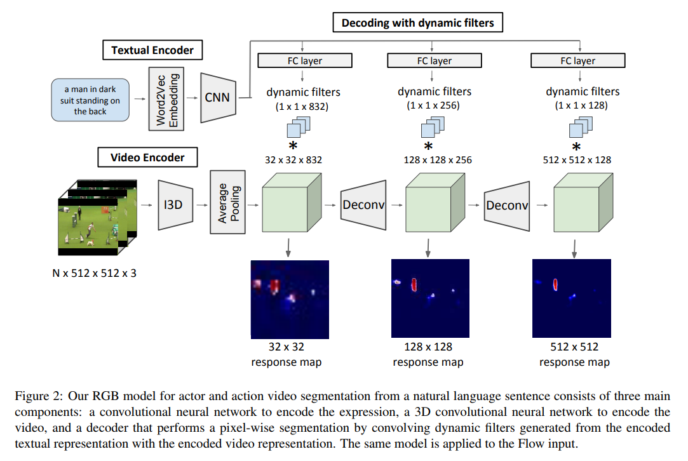

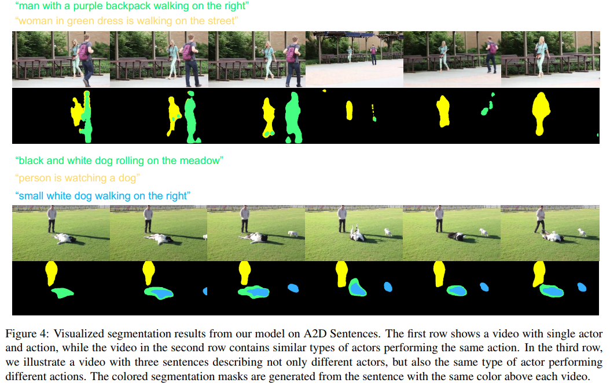

非常少见的用NLP做video segmentetion的文章。文章定义了一个新的任务：给出一个句子，根据该句子分割视频中的 actor 及其 action。与现有演员和动作对的固定词汇中进行细分的工作不同，文章从自然语言输入句中推断出细分，并提出了一种完全卷积模型并针对视频优化编码器 - 解码器架构，用于像素级演员和动作分段。在两个包含超过7,500种自然语言描述的扩展的演员和动作数据集上实验，证明了模型的泛化能力。

**[Fast and Accurate Online Video Object Segmentation via Tracking Parts, CVPR'18](http://openaccess.thecvf.com/content_cvpr_2018/papers/Cheng_Fast_and_Accurate_CVPR_2018_paper.pdf)**

[【Project Page】](https://github.com/JingchunCheng/FAVOS)
[【Blog(Chinese)】](https://blog.csdn.net/weixin_39347054/article/details/83414251)

**Abstract**

Online video object segmentation is a challenging task as it entails to process the image sequence timely and accurately. To segment a target object through the video, numerous CNN-based methods have been developed by heavily finetuning on the object mask in the first frame, which is time-consuming for online applications. In this paper, we propose a fast and accurate video object segmentation algorithm that can immediately start the segmentation process once receiving the images. We first utilize a part-based tracking method to deal with challenging factors such as large deformation, occlusion, and cluttered background. Based on the tracked bounding boxes of parts, we construct a region-of-interest segmentation network to generate part masks. Finally, a similarity-based scoring function is adopted to refine these object parts by comparing them to the visual information in the first frame. Our method performs favorably against state-of-the-art algorithms in accuracy on the DAVIS benchmark dataset, while achieving much faster runtime performance.

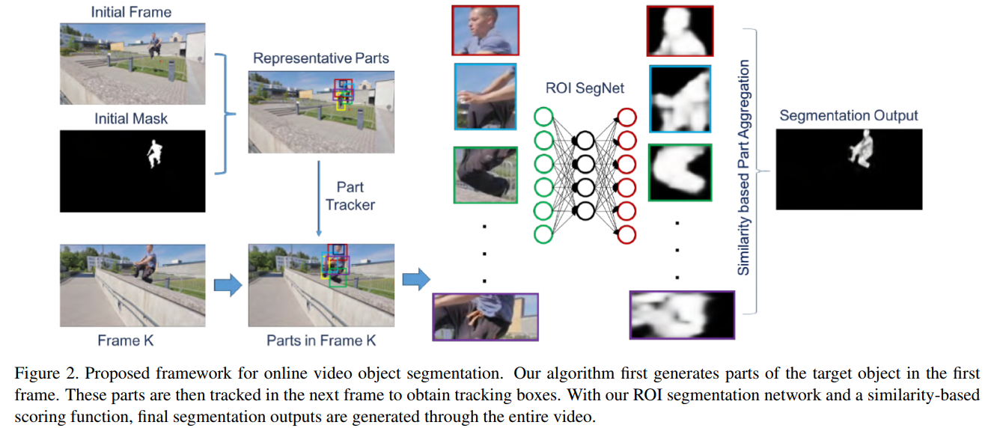

在线视频对象分割是一项具有挑战性的任务，因为它需要及时准确地处理图像序列。为了通过视频分割目标对象，许多基于CNN的方法通过对第一帧中的对象掩模进行大量微调来分割视频中的目标对象，但是对于在线应用是不现实的。文章提出了一种快速准确的视频对象分割算法，可以在接收到图像后立即启动分割过程。首先利用基于部件的跟踪方法来处理诸如大变形，遮挡和杂乱背景等挑战性因素。文章基于跟踪的部分边界框，构建了一个感兴趣区域分割网络以生成部分掩模。最后，采用基于相似度的评分函数，通过将这些对象部分与第一帧中的视觉信息进行比较来细化这些对象部分。文章的方法在DAVIS基准数据集上的准确性方面优于最先进的算法，同时实现更快的运行性能。

**[Semantic Video Segmentation by Gated Recurrent Flow Propagation, CVPR'18](https://arxiv.org/abs/1612.08871)**

[【Project Page】](https://github.com/D-Nilsson/GRFP)

**Abstract**

Semantic video segmentation is challenging due to the sheer amount of data that needs to be processed and labeled in order to construct accurate models. In this paper we present a deep, end-to-end trainable methodology to video segmentation that is capable of leveraging information present in unlabeled data in order to improve semantic estimates. Our model combines a convolutional architecture and a spatio-temporal transformer recurrent layer that are able to temporally propagate labeling information by means of optical flow, adaptively gated based on its locally estimated uncertainty. The flow, the recognition and the gated temporal propagation modules can be trained jointly, end-to-end. The temporal, gated recurrent flow propagation component of our model can be plugged into any static semantic segmentation architecture and turn it into a weakly supervised video processing one. Our extensive experiments in the challenging CityScapes and Camvid datasets, and based on multiple deep architectures, indicate that the resulting model can leverage unlabeled temporal frames, next to a labeled one, in order to improve both the video segmentation accuracy and the consistency of its temporal labeling, at no additional annotation cost and with little extra computation.

语义视频分割具有挑战性，因为需要处理和标记大量数据才能构建准确的模型。本文提出了一种深入的端到端可训练的视频分割方法，该方法能够利用未标记数据中存在的信息来改进语义估计。模型结合卷积结构和时空变换器复现层，它们能够通过光流在时间上传播标记信息，并根据其局部估计的不确定性自适应地进行门控。复现层可以联合、端到端地训练流、识别和门控时间传播模块。模型的时间门控递归流传播组件可以插入任何静态语义分段架构，并将其转换为弱监督视频处理架构。模型在具有挑战性的CityScapes和Camvid数据集中基于多个深层体系结构进行了大量实验，表明所得到的模型可以利用在标记时间帧旁边的未标记时间帧来提高视频分割的准确性和时间的一致性标签，并且没有额外的注释成本和额外的计算。

**[Reinforcement Cutting-Agent Learning for Video Object Segmentation, CVPR'18](http://openaccess.thecvf.com/content_cvpr_2018/papers_backup/Han_Reinforcement_Cutting-Agent_Learning_CVPR_2018_paper.pdf)**

**Abstract**

Video object segmentation is a fundamental yet challenging task in computer vision community. In this paper, we formulate this problem as a Markov Decision Process, where agents are learned to segment object regions under a deep reinforcement learning framework. Essentially, learning agents for segmentation is nontrivial as segmentation is a nearly continuous decision-making process, where the number of the involved agents (pixels or superpixels) and action steps from the seed (super)pixels to the whole object mask might be incredibly huge. To overcome this difficulty, this paper simplifies the learning of segmentation agents to the learning of a cutting-agent, which only has a limited number of action units and can converge in just a few action steps. The basic assumption is that object segmentation mainly relies on the interaction between object regions and their context. Thus, with an optimal object (box) region and context (box) region, we can obtain the desirable segmentation mask through further inference. Based on this assumption, we establish a novel reinforcement cutting-agent learning framework, where the cutting　agent consists of a cutting-policy network and a cutting　execution network. The former learns policies for deciding optimal object-context box pair, while the latter executes the cutting function based on the inferred object-context box pair. With the collaborative interaction between the two networks, our method can achieve the outperforming VOS performance on two public benchmarks, which demonstrates the rationality of our assumption as well as the effectiveness of the proposed learning framework.

视频对象分割是计算机视觉社区中一项具有挑战性的基本任务。文章将此问题表述为马尔可夫决策过程，并在深度强化学习框架下学习agents来划分对象区域。从本质上讲，learning agents对于分割任务非常重要，因为分割是一个几乎连续的决策过程，其中涉及的agents（像素或超像素）的数量从seed (super)像素到整个对象掩模的变化非常巨大。为了克服这个困难，本文简化了agents分割的学习，而是学习cutting-agent，cutting-agent仅具有有限数量的动作单元，并且可以仅在几个动作步骤中收敛。基本假设是对象分割主要依赖于对象区域与其上下文之间的交互，因此利用最佳对象（框）区域和上下文（框）区域，模型可以通过进一步推断获得期望的分割掩模。基于这一假设，文章建立了一个新的强化cutting　agent学习框架，其中cutting　agent包括切割策略网络和切割执行网络。前者学习用于决定最佳对象 - 上下文框对的策略，而后者基于推断的对象 - 上下文框对执行切割功能。通过两个网络之间的协作交互，模型可以在两个公共基准上实现优于VOS的性能，这证明了假设的合理性以及所提出的学习框架的有效性。

**[Deep Spatio-Temporal Random Fields for Efficient Video Segmentation, CVPR'18](https://arxiv.org/abs/1807.03148)**

**Abstract**

In this work we introduce a time- and memory-efficient method for structured prediction that couples neuron decisions across both space at time. We show that we are able to perform exact and efficient inference on a densely connected spatio-temporal graph by capitalizing on recent advances on deep Gaussian Conditional Random Fields (GCRFs). Our method, called VideoGCRF is (a) efficient, (b) has a unique global minimum, and (c) can be trained end-to-end alongside contemporary deep networks for video understanding. We experiment with multiple connectivity patterns in the temporal domain, and present empirical improvements over strong baselines on the tasks of both semantic and instance segmentation of videos.

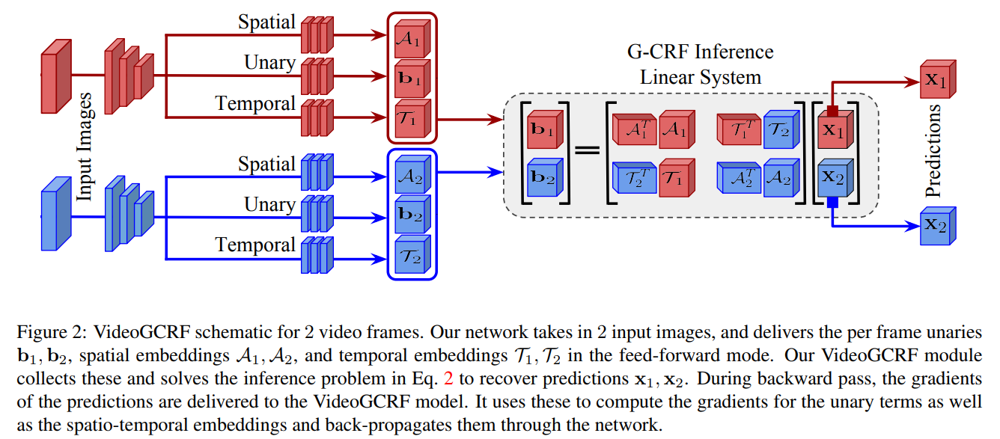

文章引入了一种时间和记忆效率高的结构化预测方法，可以在两个空间内将神经元决策耦合在一起。 深度高斯条件随机场（GCRF）的最新进展证明能够在密集连接的时空图上进行精确有效的推理。 文中提到的VideoGCRF的方法是（a）有效，（b）具有独特的全局最小值，（c）可以与深度网络一起进行端到端训练，以便进行视频理解。 模型在时域中尝试多种连接模式，并对视频的语义和实例分割任务的强基线进行经验改进。

## 参考

[【cnblogs】应用于语义分割问题的深度学习技术综述](https://blog.csdn.net/bailing910/article/details/82625918)

[【知乎】CVPR 2018 | 弱监督语义分割简评](https://zhuanlan.zhihu.com/p/42058498)

[【知乎】视频语义分割介绍](https://zhuanlan.zhihu.com/p/52014957)

[【CSDN】CVPR2018-Segmentation相关论文整理](https://blog.csdn.net/qq_16761599/article/details/80727466)

[【GitHub】Awesome Semantic Segmentation](https://github.com/mrgloom/awesome-semantic-segmentation)
