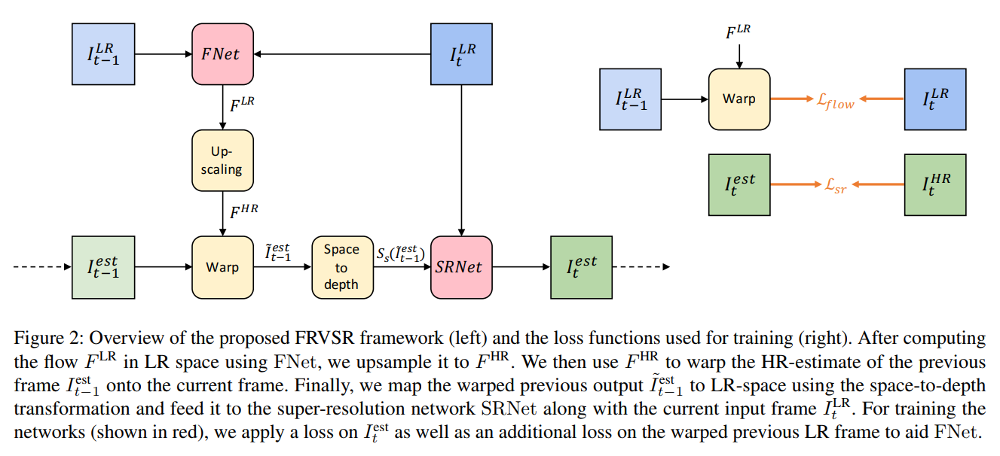
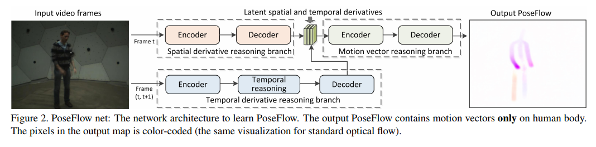
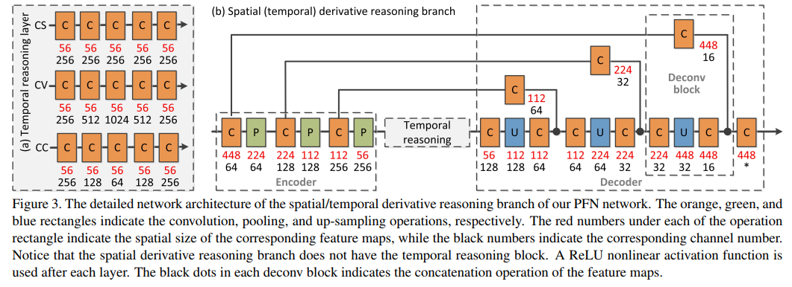
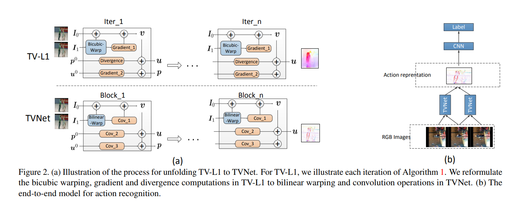

# Video flow & depth & super-resolution

## 介绍

图像超分辨率就是提高图像的空间分辨率，例如将一幅图片的分辨率由352x288扩大到704x576，方便用户在大尺寸的显示设备上观看;在数字成像技术，视频编码通信技术，深空卫星遥感技术，目标识别分析技术和医学影像分析技术等方面，视频图像超分辨率技术都能够应对显示设备分辨率大于图像源分辨率的问题。

超分辨率技术可以分为以下两种：

1. 只参考当前低分辨率图像，不依赖其他相关图像的超分辨率技术，称之为单幅图像的超分辨率（single image super resolution），也可以称之为图像插值（image interpolation）；

2. 参考多幅图像或多个视频帧的超分辨率技术，称之为多帧视频/多图的超分辨率（multi-frame super resolution）。

这两类技术中，一般来讲后者相比于前者具有更多的可参考信息，并具有更好的高分辨率视频图像的重建质量，但是其更高的计算复杂度也限制了其应用。

## 论文

**[Frame-Recurrent Video Super-Resolution, CVPR'18](https://arxiv.org/abs/1801.04590)**

[【项目地址】](https://github.com/msmsajjadi/frvsr)
[【参考博客】](https://blog.csdn.net/qq_33590958/article/details/89654853)

**Abstract**

Recent advances in video super-resolution have shown that convolutional neural networks combined with motion compensation are able to merge information from multiple low-resolution (LR) frames to generate high-quality images. Current state-of-the-art methods process a batch of LR frames to generate a single high-resolution (HR) frame and run this scheme in a sliding window fashion over the entire video, effectively treating the problem as a large number of separate multi-frame super-resolution tasks. This approach has two main weaknesses: 1) Each input frame is processed and warped multiple times, increasing the computational cost, and 2) each output frame is estimated independently conditioned on the input frames, limiting the system's ability to produce temporally consistent results. 
In this work, we propose an end-to-end trainable frame-recurrent video super-resolution framework that uses the previously inferred HR estimate to super-resolve the subsequent frame. This naturally encourages temporally consistent results and reduces the computational cost by warping only one image in each step. Furthermore, due to its recurrent nature, the proposed method has the ability to assimilate a large number of previous frames without increased computational demands. Extensive evaluations and comparisons with previous methods validate the strengths of our approach and demonstrate that the proposed framework is able to significantly outperform the current state of the art.

视频超分辨率的最新进展表明，与运动补偿相结合的卷积神经网络能够合并来自多个低分辨率（LR）帧的信息以生成高质量图像。当前最先进的方法处理一批LR帧以生成单个高分辨率（HR）帧并在整个视频上以滑动窗口方式运行，有效地将问题视为大量独立的多帧超分辨率任务。这种方法有两个主要缺点：1）每个输入帧被多次处理和扭曲，增加了计算成本; 2）每个输出帧独立地根据输入帧进行估计，限制了系统产生时间上一致结果的能力。

作者提出在生成下一帧图像时，考虑之前生成的HR图像，将其也输入网络，这样不仅能产生时间连续的结果，也降低了计算复杂度。

**[PoseFlow: A Deep Motion Representation for Understanding Human Behaviors in Videos, CVPR'18](http://openaccess.thecvf.com/content_cvpr_2018/CameraReady/3170.pdf)**

**Abstract**

Motion of the human body is the critical cue for understanding and characterizing human behavior in videos. Most existing approaches explore the motion cue using optical flows. However, optical flow usually contains motion on both the interested human bodies and the undesired background. This “noisy” motion representation makes it very challenging for pose estimation and action recognition in real scenarios. To address this issue, this paper presents a novel deep motion representation, called PoseFlow, which reveals human motion in videos while suppressing background and motion blur, and being robust to occlusion. For learning PoseFlow with mild computational cost, we propose a functionally structured spatial-temporal deep network, PoseFlow Net (PFN), to jointly solve the skeleton localization and matching problems of PoseFlow. Comprehensive experiments show that PFN outperforms the stateof-the-art deep flow estimation models in generating PoseFlow. Moreover, PoseFlow demonstrates its potential on improving two challenging tasks in human video analysis: pose estimation and action recognition.

大多数现有方法使用光流来探索人体运动。然而，光流通常包含人体和背景上的运动，这种“嘈杂”的运动表示增大在真实场景中对姿势估计和动作识别的难度。为了解决这个问题，本文提出PoseFlow，它可以在视频中显示人体运动，同时抑制背景和运动模糊，并且对遮挡具有鲁棒性。为了学习具有较低计算成本的PoseFlow，文章提出一个时空深度网络PoseFlow Net（PFN），以共同解决PoseFlow的骨架定位和匹配问题。

**[LEGO: Learning Edge with Geometry all at Once by Watching Videos, CVPR'18](https://arxiv.org/abs/1803.05648)**

[【项目地址】](https://github.com/zhenheny/LEGO)

[【参考博客】](https://zhuanlan.zhihu.com/p/50729039)

**Abstract**

Learning to estimate 3D geometry in a single image by watching unlabeled videos via deep convolutional network is attracting significant attention. In this paper, we introduce a "3D as-smooth-as-possible (3D-ASAP)" prior inside the pipeline, which enables joint estimation of edges and 3D scene, yielding results with significant improvement in accuracy for fine detailed structures. Specifically, we define the 3D-ASAP prior by requiring that any two points recovered in 3D from an image should lie on an existing planar surface if no other cues provided. We design an unsupervised framework that Learns Edges and Geometry (depth, normal) all at Once (LEGO). The predicted edges are embedded into depth and surface normal smoothness terms, where pixels without edges in-between are constrained to satisfy the prior. In our framework, the predicted depths, normals and edges are forced to be consistent all the time. We conduct experiments on KITTI to evaluate our estimated geometry and CityScapes to perform edge evaluation. We show that in all of the tasks, i.e.depth, normal and edge, our algorithm vastly outperforms other state-of-the-art (SOTA) algorithms, demonstrating the benefits of our approach.

这篇文章在[Unsupervised Learning of Depth and Ego-Motion](https://people.eecs.berkeley.edu/~tinghuiz/projects/SfMLearner/cvpr17_sfm_final.pdf)框架的基础上，基于 3D - ASAP假设，添加了$L_D$和$L_N$两个loss function。 为了求$L_D$和$L_N$，文章使用了 Edge Net 来学习图像的边缘。为了避免奇异解，使用了 regulation term $L_e$。最后，为了提高精度，添加了 fly-out mask, 用于衡量那些由于相机移动而不在画面内的像素。

**[Learning Depth from Monocular Videos using Direct Methods, CVPR'18](https://arxiv.org/abs/1712.00175)**

[【项目地址】](https://github.com/MightyChaos/LKVOLearner)
[【参考博客】](https://blog.csdn.net/yueleileili/article/details/82946910)

**Abstract**

The ability to predict depth from a single image - using recent advances in CNNs - is of increasing interest to the vision community. Unsupervised strategies to learning are particularly appealing as they can utilize much larger and varied monocular video datasets during learning without the need for ground truth depth or stereo. In previous works, separate pose and depth CNN predictors had to be determined such that their joint outputs minimized the photometric error. Inspired by recent advances in direct visual odometry (DVO), we argue that the depth CNN predictor can be learned without a pose CNN predictor. Further, we demonstrate empirically that incorporation of a differentiable implementation of DVO, along with a novel depth normalization strategy - substantially improves performance over state of the art that use monocular videos for training.

使用非监督的策略从单张图片中学习深度图非常的具有吸引力，因为它可以利用大量且种类丰富的单目视屏数据库，无需ground truth 和双目数据。在之前的工作中，姿态和深度的神经网络共同输出减小photometric error。 根据直接视觉测距法(direct visual odometry, DVO)的发展，作者认为深度预测神经网路(depth CNN predictor)可以无需姿态预测器(depth CNN predicotr) 进行训练。作者融合了可以求导的DVO策略，以及深度归一化的策略以提高单目视频训练。

**[End-to-End Learning of Motion Representation for Video Understanding](https://arxiv.org/abs/1804.00413)**

[【项目地址】](https://github.com/LijieFan/tvnet)
[【参考博客】](https://blog.csdn.net/weixin_42164269/article/details/80651752)

**Abstract**

Despite the recent success of end-to-end learned representations, hand-crafted optical flow features are still widely used in video analysis tasks. To fill this gap, we propose TVNet, a novel end-to-end trainable neural network, to learn optical-flow-like features from data. TVNet subsumes a specific optical flow solver, the TV-L1 method, and is initialized by unfolding its optimization iterations as neural layers. TVNet can therefore be used directly without any extra learning. Moreover, it can be naturally concatenated with other task-specific networks to formulate an end-to-end architecture, thus making our method more efficient than current multi-stage approaches by avoiding the need to pre-compute and store features on disk. Finally, the parameters of the TVNet can be further fine-tuned by end-to-end training. This enables TVNet to learn richer and task-specific patterns beyond exact optical flow. Extensive experiments on two action recognition benchmarks verify the effectiveness of the proposed approach. Our TVNet achieves better accuracies than all compared methods, while being competitive with the fastest counterpart in terms of features extraction time.

尽管端到端学习的表示最近取得了成功，但手工制作的光流特征仍然被广泛应用于视频分析任务中。为了填补这一空白，文章提出了TVNet，一个新颖的端到端可训练神经网络，从数据中学习光流的特征。TVNet包含了一个特定的光流解算器，即TV-L1方法，并通过将其优化迭代展开为神经层来初始化。因此，TVNet可以直接使用，无需任何额外的学习。此外，它可以与其他特定于任务的网络连接起来形成端到端结构，从而使模型比当前的多阶段方法更有效，避免了预先计算和存储特征。最后，TVNet的参数可以通过端到端培训进一步微调,这使TVNet能够学习更精确的光学流程以外的更丰富和任务特定的模式。

**[Unsupervised Learning of Depth and Ego-Motion from Monocular Video Using 3D Geometric Constraints](https://arxiv.org/abs/1802.05522)**

**Abstract**

We present a novel approach for unsupervised learning of depth and ego-motion from monocular video. Unsupervised learning removes the need for separate supervisory signals (depth or ego-motion ground truth, or multi-view video). Prior work in unsupervised depth learning uses pixel-wise or gradient-based losses, which only consider pixels in small local neighborhoods. Our main contribution is to explicitly consider the inferred 3D geometry of the scene, enforcing consistency of the estimated 3D point clouds and ego-motion across consecutive frames. This is a challenging task and is solved by a novel (approximate) backpropagation algorithm for aligning 3D structures. 

We combine this novel 3D-based loss with 2D losses based on photometric quality of frame reconstructions using estimated depth and ego-motion from adjacent frames. We also incorporate validity masks to avoid penalizing areas in which no useful information exists. 

We test our algorithm on the KITTI dataset and on a video dataset captured on an uncalibrated mobile phone camera. Our proposed approach consistently improves depth estimates on both datasets, and outperforms the state-of-the-art for both depth and ego-motion. Because we only require a simple video, learning depth and ego-motion on large and varied datasets becomes possible. We demonstrate this by training on the low quality uncalibrated video dataset and evaluating on KITTI, ranking among top performing prior methods which are trained on KITTI itself.

文章提出了一种新颖的方法，用于从单眼视频中进行深度和自我运动的无监督学习，无监督学习消除了对单独监督信号（深度或自我运动地面实况或多视图视频）的需要。先前工作使用基于像素或基于梯度的损失，其仅考虑小局部邻域中的像素。文章的主要贡献是明确考虑场景的3D几何结构，强制估计3D点云的一致性和跨连续帧的自我运动。这项任务用近似反向传播算法来解决。

文章使用来自相邻帧的估计深度和自我运动，基于帧重建的光度质量将这种新颖的基于3D的损失与2D损失相结合。文章还采用了有效性掩码，以避免惩罚不存在有用信息的区域。

## 参考

[【CSDN】super resolution 论文阅读简略笔记](https://blog.csdn.net/Zealoe/article/details/78550444)

[【CSDN】深度学习（二十二）——ESPCN, FSRCNN, VESPCN, SRGAN, DemosaicNet, MemNet, RDN, ShuffleSeg](https://blog.csdn.net/antkillerfarm/article/details/79956241)

[【CSDN】CVPR2019中关于超分辨率算法的16篇论文](https://blog.csdn.net/leviopku/article/details/90634994)

[【GitHub】Video-Super-Resolution](https://github.com/flyywh/Video-Super-Resolution)

[【GitHub】Mind Mapping for Depth Estimation](https://github.com/sxfduter/monocular-depth-estimation)

[【知乎】CVPR2018 人体姿态相关](https://zhuanlan.zhihu.com/p/38328177)

[【知乎】深度学习在图像超分辨率重建中的应用](https://zhuanlan.zhihu.com/p/25532538)