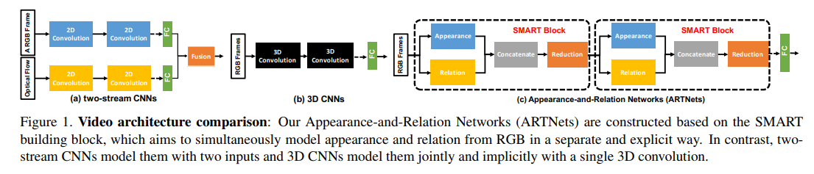
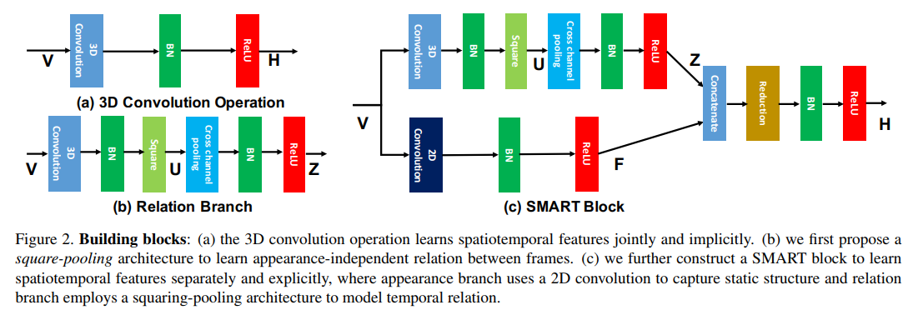
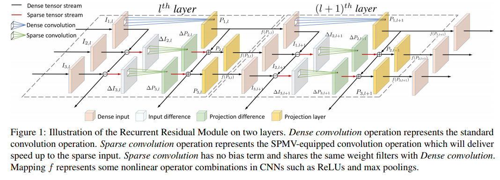
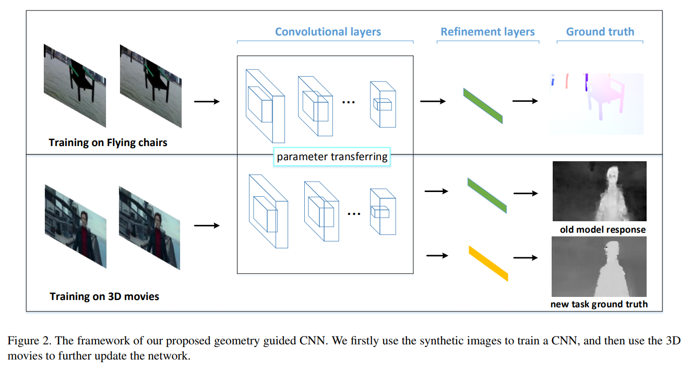
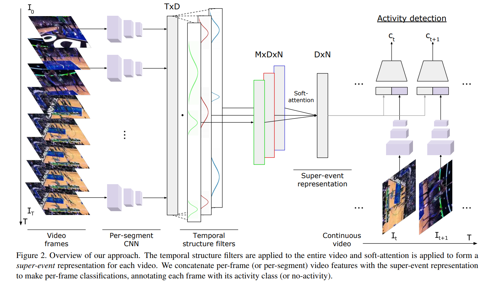
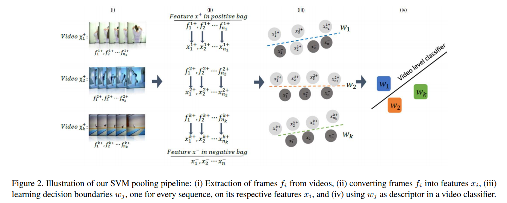

# Video classification & recognition

## 介绍

视频分类主流方法:

1. 2-stream，结合光流和RGB，RGB支路可以是2D CNN 也可以是I3D
2. 3D CNN，卷积核多出时序上的维度，spatial-temporal 建模，变形是时空分离的伪3d、(2+1)D等
3. 时序信息用RNN建模
4. 传统方法，先进行密集跟踪点采样（角点提取/背景去除），对密集采样点进行光流计算获取一定帧长的轨迹，沿着轨迹进行一些如SIFT/HOG的特征提取，NIPS2018有一篇轨迹卷积将以上过程NN化。

## 论文

**[Appearance-and-Relation Networks for Video Classification, CVPR'18](https://arxiv.org/abs/1711.09125)**

[【Project Page】](https://github.com/wanglimin/ARTNet)
[【参考笔记】](https://zhuanlan.zhihu.com/p/32197854)

**Abstract**

Spatiotemporal feature learning in videos is a fundamental problem in computer vision. This paper presents a new architecture, termed as Appearance-and-Relation Network (ARTNet), to learn video representation in an end-to-end manner. ARTNets are constructed by stacking multiple generic building blocks, called as SMART, whose goal is to simultaneously model appearance and relation from RGB input in a separate and explicit manner. Specifically, SMART blocks decouple the spatiotemporal learning module into an appearance branch for spatial modeling and a relation branch for temporal modeling. The appearance branch is implemented based on the linear combination of pixels or filter responses in each frame, while the relation branch is designed based on the multiplicative interactions between pixels or filter responses across multiple frames. We perform experiments on three action recognition benchmarks: Kinetics, UCF101, and HMDB51, demonstrating that SMART blocks obtain an evident improvement over 3D convolutions for spatiotemporal feature learning. Under the same training setting, ARTNets achieve superior performance on these three datasets to the existing state-of-the-art methods.

视频中的时空特征学习是计算机视觉中的基本问题。本文介绍了一种外观和关系网络（ARTNet），以端到端的方式学习视频表示。 ARTNets通过堆叠多个通用构建块（称为SMART）构建，其目标是以单独和显式的方式同时模拟RGB输入的外观和关系。具体而言，SMART块将时空学习模块分离为用于空间建模的外观分支和用于时间建模的关系分支。外观分支基于每个帧中的像素或滤波器响应的线性组合来实现，而关系分支是基于像素之间的乘法交互或跨多个帧的滤波器响应来设计的。模型在三个动作识别基准上进行实验：Kinetics，UCF101和HMDB51，证明SMART模块在时空特征学习方面获得了明显的3D卷积改进。

**[Recurrent Residual Module for Fast Inference in Videos, CVPR'18](https://arxiv.org/abs/1802.09723)**

**Abstract**

Deep convolutional neural networks (CNNs) have made impressive progress in many video recognition tasks such as video pose estimation and video object detection. However, CNN inference on video is computationally expensive due to processing dense frames individually. In this work, we propose a framework called Recurrent Residual Module (RRM) to accelerate the CNN inference for video recognition tasks. This framework has a novel design of using the similarity of the intermediate feature maps of two consecutive frames, to largely reduce the redundant computation. One unique property of the proposed method compared to previous work is that feature maps of each frame are precisely computed. The experiments show that, while maintaining the similar recognition performance, our RRM yields averagely 2x acceleration on the commonly used CNNs such as AlexNet, ResNet, deep compression model (thus 8-12x faster than the original dense models using the efficient inference engine), and impressively 9x acceleration on some binary networks such as XNOR-Nets (thus 500x faster than the original model). We further verify the effectiveness of the RRM on speeding up CNNs for video pose estimation and video object detection.

论文提出一个框架称为递归残差模块 (RRM)，以加快CNN推理的视频识别任务。该框架采用两个连续帧的中间特征映射的相似性设计，大大减少了冗余计算。与以前的工作相比，论文所提出方法的特殊性质之一是精确计算每个帧的特征映射。

**[Memory Based Online Learning of Deep Representations from Video Streams, CVPR'18](https://arxiv.org/abs/1711.07368)**

**Abstract**

We present a novel online unsupervised method for face identity learning from video streams. The method exploits deep face descriptors together with a memory based learning mechanism that takes advantage of the temporal coherence of visual data. Specifically, we introduce a discriminative feature matching solution based on Reverse Nearest Neighbour and a feature forgetting strategy that detect redundant features and discard them appropriately while time progresses. It is shown that the proposed learning procedure is asymptotically stable and can be effectively used in relevant applications like multiple face identification and tracking from unconstrained video streams. Experimental results show that the proposed method achieves comparable results in the task of multiple face tracking and better performance in face identification with offline approaches exploiting future information. Code will be publicly available.

论文提出一种在线无监督方法用于从视频流中进行面部身份学习。该方法利用深度描述符和基于记忆的学习机制，并利用视觉数据的时间一致性。文章引入了一种基于反向最近邻的判别特征匹配解决方案和一种特征遗忘策略，该策略可以检测冗余特征并在时间推移时适当地丢弃它们。 结果表明，所提出的学习过程是渐近稳定的，可以有效地用于相关应用，如多面部识别和无约束视频流的跟踪。

**[Geometry Guided Convolutional Neural Networks for Self-Supervised Video Representation Learning, CVPR'18](https://cseweb.ucsd.edu/~haosu/papers/cvpr18_geometry_predictive_learning.pdf)**

**Abstract**

It is often laborious and costly to manually annotate videos for training high-quality video recognition models, so there has been some work and interest in exploring alternative, cheap, and yet often noisy and indirect training signals for learning the video representations. However, these signals are still coarse, supplying supervision at the whole video frame level, and subtle, sometimes enforcing the learning agent to solve problems that are even hard for humans. In this paper, we instead explore geometry, a grand new type of auxiliary supervision for the self-supervised learning of video representations. In particular, we extract pixel-wise geometry information as flow fields and disparity maps from synthetic imagery and real 3D movies, respectively. Although the geometry and highlevel semantics are seemingly distant topics, surprisingly, we find that the convolutional neural networks pre-trained by the geometry cues can be effectively adapted to semantic video understanding tasks. In addition, we also find that a progressive training strategy can foster a better neural network for the video recognition task than blindly pooling the distinct sources of geometry cues together. Extensive results on video dynamic scene recognition and action recognition tasks show that our geometry guided networks significantly outperform the competing methods that are trained with other types of labeling-free supervision signals.

文章从几何角度提出一种用于视频表示的自我监督学习的新型辅助监督，作者分别从合成图像和真实3D电影中提取像素的几何信息作为流场和视差图。虽然几何和高级语义看似无关，但是由几何线索预先训练的卷积神经网络可以有效地适应语义视频理解任务。此外，作者发现渐进式训练策略可以为视频识别任务创建更好的神经网络，而不是盲目地将几何线索的不同来源汇集在一起​​。视频动态场景识别和动作识别任务的广泛结果表明，文章提出的几何引导网络明显优于使用其他类型的无标记监控信号进行训练的竞争方法。

**[Learning Latent Super-Events to Detect Multiple Activities in Videos, CVPR'18](http://openaccess.thecvf.com/content_cvpr_2018/papers/Piergiovanni_Learning_Latent_Super-Events_CVPR_2018_paper.pdf)**

[【Project Page】](https://github.com/piergiaj/super-events-cvpr18)

**Abstract**

In this paper, we introduce the concept of learning latent super-events from activity videos, and present how it benefits activity detection in continuous videos. We define a super-event as a set of multiple events occurring together in videos with a particular temporal organization; it is the opposite concept of sub-events. Real-world videos contain multiple activities and are rarely segmented (e.g., surveillance videos), and learning latent super-events allows the model to capture how the events are temporally related in videos. We design temporal structure filters that enable the model to focus on particular sub-intervals of the videos, and use them together with a soft attention mechanism to learn representations of latent super-events. Super-event representations are combined with per-frame or per-segment CNNs to provide frame-level annotations. Our approach is designed to be fully differentiable, enabling end-to-end learning of latent super-event representations jointly with the activity detector using them. Our experiments with multiple public video datasets confirm that the proposed concept of latent super-event learning significantly benefits activity detection, advancing the state-of-the-arts.

在视频中学习潜在的超级事件来做多活动检测。这篇文章关注于更细粒度的检测，用的数据集是MUTITHUMOS，在THUMOS的基础上加了一些数据，平均每段视频内的活动更多。目前的方法基本都更关注候选段的决策，而忽略了整段视频的时序结构和上下文信息，连续的视频中有很多上下文信息都可以帮助做更好的动作检测。所以文章提出了一个超级事件的概念，与子事件相对应，一个超级事件包含一系列的子事件，是相互关联的子事件的集合。题目名为潜在的超级事件，是因为这些超级事件和子事件的定义是无需标注的。文章还提出了一个时间结构过滤器来学习每类的软注意力权重从而得到超级事件表现，用它来逐帧分类。首先将整段视频输入网络，对每帧或每个局部段落学习一个特征，这里用到了RNN还用到全卷积的网络来对每帧学习一个类别分数，然后把这些特征输入到M个时间结构过滤器里，时间结构过滤器由若干个柯西分布组成，它可以让模型知道哪些时间间隔和帧级检测相关。

**[Compressed Video Action Recognition, CVPR'18](http://openaccess.thecvf.com/content_cvpr_2018/papers/Wu_Compressed_Video_Action_CVPR_2018_paper.pdf)**

[【Project Page】](https://github.com/chaoyuaw/pytorch-coviar)
[【Blog(Chinese)1】](https://blog.csdn.net/perfects110/article/details/84329491)
[【Blog(Chinese)2】](https://blog.csdn.net/Dongjiuqing/article/details/84678962)

**Abstract**

Training robust deep video representations has proven to be much more challenging than learning deep image representations. This is in part due to the enormous size of raw video streams and the high temporal redundancy; the true and interesting signal is often drowned in too much irrelevant data. Motivated by that the superfluous information can be reduced by up to two orders of magnitude by video compression (using H.264, HEVC, etc.), we propose to train a deep network directly on the compressed video. 

This representation has a higher information density, and we found the training to be easier. In addition, the signals in a compressed video provide free, albeit noisy, motion information. We propose novel techniques to use them effectively. Our approach is about 4.6 times faster than Res3D and 2.7 times faster than ResNet-152. On the task of action recognition, our approach outperforms all the other methods on the UCF-101, HMDB-51, and Charades dataset.

训练一个稳定的视频表示比学习深度图像表示更加具有挑战性。由于原始视频的尺寸巨大，时间信息大量冗余，那些真正有用的信号通常被大量的无关数据淹没，通过视频压缩可以将信息量减少多达两个数量级。文章提出直接在神经网络上训练压缩的视频。这种表示的特征有更高的信息密度，训练起来更加简单。在动作识别的任务上，文中的方法优于UCF-101，HMDB-51和Charades数据集上的所有其他方法。

**[Video Representation Learning Using Discriminative Pooling, CVPR'18](http://openaccess.thecvf.com/content_cvpr_2018/papers/Wang_Video_Representation_Learning_CVPR_2018_paper.pdf)**

[【Project Page】](https://github.com/3xwangDot/SVMP)

**Abstract**

Popular deep models for action recognition in videos generate independent predictions for short clips, which are then pooled heuristically to assign an action label to the full video segment. As not all frames may characterize the underlying action---indeed, many are common across multiple actions---pooling schemes that impose equal importance on all frames might be unfavorable. In an attempt to tackle this problem, we propose discriminative pooling, based on the notion that among the deep features generated on all short clips, there is at least one that characterizes the action. To this end, we learn a (nonlinear) hyperplane that separates this unknown, yet discriminative, feature from the rest. Applying multiple instance learning in a large-margin setup, we use the parameters of this separating hyperplane as a descriptor for the full video segment. Since these parameters are directly related to the support vectors in a max-margin framework, they serve as robust representations for pooling of the features. We formulate a joint objective and an efficient solver that learns these hyperplanes per video and the corresponding action classifiers over the hyperplanes. Our pooling scheme is end-to-end trainable within a deep framework. We report results from experiments on three benchmark datasets spanning a variety of challenges and demonstrate state-of-the-art performance across these tasks.

用于视频中动作识别的深度模型通常生成针对短片的独立预测，然后通过启发式方法将其分配给完整视频片段。由于并非所有框架都可以表征基础行动，对所有框架施加同等重要性的方案是不利的。文章提出判别性池化，基于这样一种观念，即在所有短片段中生成的深层特征中，至少有一个表征该动作。模型学习了一种（非线性）超平面，它将这种未知但有辨别力的特征与其余特征区分开来；在大边距设置中应用多实例学习，使用该分离超平面的参数作为完整视频片段的描述符。作者制定一个联合目标和一个有效的求解器，可以在每个视频中学习这些超平面，并在超平面上学习相应的动作分类器；最终的方案是在深层框架内端到端的可训练方案。

**[Optical Flow Guided Feature: A Fast and Robust Motion Representation for Video Action Recognition, CVPR'18](https://arxiv.org/abs/1711.11152)**

[【Project Page】](https://github.com/kevin-ssy/Optical-Flow-Guided-Feature)

**Abstract**

Motion representation plays a vital role in human action recognition in videos. In this study, we introduce a novel compact motion representation for video action recognition, named Optical Flow guided Feature (OFF), which enables the network to distill temporal information through a fast and robust approach. The OFF is derived from the definition of optical flow and is orthogonal to the optical flow. The derivation also provides theoretical support for using the difference between two frames. By directly calculating pixel-wise spatiotemporal gradients of the deep feature maps, the OFF could be embedded in any existing CNN based video action recognition framework with only a slight additional cost. It enables the CNN to extract spatiotemporal information, especially the temporal information between frames simultaneously. This simple but powerful idea is validated by experimental results. The network with OFF fed only by RGB inputs achieves a competitive accuracy of 93.3% on UCF-101, which is comparable with the result obtained by two streams (RGB and optical flow), but is 15 times faster in speed. Experimental results also show that OFF is complementary to other motion modalities such as optical flow. When the proposed method is plugged into the state-of-the-art video action recognition framework, it has 96:0% and 74:2% accuracy on UCF-101 and HMDB-51 respectively. The code for this project is available at this https URL.

文章提出了一个叫做光流引导的特征（Optical Flow guided Feature，OFF）。时间信息是视频行为识别的关键，而光流可以很好的表征时间信息，其在视频分析领域已经被很多工作证明是一个很有用的特征。但是目前的双流网络Two-Stream在训练时仍然比较麻烦，因为需要单独对视频提取光流图，然后送到网络的另一至进行训练；而且如果数据集很大的话，光流图和RGB图像合起来得有原视频数据大小的好几倍，也十分消耗硬盘空间。因此思考如何利用单流网络同时利用RGB特征以及类似光流的特征去进行训练是一个值得思考的问题。本文提出的光流引导特征（OFF），它使网络能够通过快速和稳健的方法提取时间信息。 OFF由光流的定义导出，并与光流正交。该特征由水平和垂直方向上的特征图的空间梯度以及从不同帧的特征图之间的差异获得的时间梯度组成，OFF操作是CNN特征上的像素级运算，而且所有操作都是可导的，因此整个过程是可以端到端训练的，而且可以应用到仅有RGB输入的网络中去同时有效提取空间和时间特征。

**[NeuralNetwork-Viterbi: A Framework for Weakly Supervised Video Learning, CVPR'18 Spotlight](https://arxiv.org/abs/1805.06875)**

[【Project Page】](https://github.com/alexanderrichard/NeuralNetwork-Viterbi)

**Abstract**

Video learning is an important task in computer vision and has experienced increasing interest over the recent years. Since even a small amount of videos easily comprises several million frames, methods that do not rely on a frame-level annotation are of special importance. In this work, we propose a novel learning algorithm with a Viterbi-based loss that allows for online and incremental learning of weakly annotated video data. We moreover show that explicit context and length modeling leads to huge improvements in video segmentation and labeling tasks andinclude these models into our framework. On several action segmentation benchmarks, we obtain an improvement of up to 10% compared to current state-of-the-art methods.

由于即使少量视频也容易包含数百万帧，因此不依赖帧级标注的方法特别重要。在这项工作中，作者提出了一种基于 Viterbi 损失的新型学习算法，允许在线和增量学习弱标注视频数据。此外显式的上下文和长度建模可以帮助视频分割和标签任务方面取得巨大提升。在几个行为分割基准数据集上，与当前最先进的方法相比，作者的方法获得了高达10％的提高。

**[Temporal Deformable Residual Networks for Action Segmentation in Videos, CVPR'18](http://openaccess.thecvf.com/content_cvpr_2018/papers/Lei_Temporal_Deformable_Residual_CVPR_2018_paper.pdf)**

**Abstract**

This paper is about temporal segmentation of human actions in videos. We introduce a new model – temporal deformable residual network (TDRN) – aimed at analyzing video intervals at multiple temporal scales for labeling video frames. Our TDRN computes two parallel temporal streams: i) Residual stream that analyzes video information at its full temporal resolution, and ii) Pooling/unpooling stream that captures long-range video information at different scales. The former facilitates local, fine-scale action segmentation, and the latter uses multiscale context for improving accuracy of frame classification. These two streams are computed by a set of temporal residual modules with deformable convolutions, and fused by temporal residuals at the full video resolution. Our evaluation on the University of Dundee 50 Salads, Georgia Tech Egocentric Activities, and JHU-ISI Gesture and Skill Assessment Working Set demonstrates that TDRN outperforms the state of the art in frame-wise segmentation accuracy, segmental edit score, and segmental overlap F1 score.

本文是关于视频中人类行为的时间分割。文章引入了一种新的模型 - 时间可变形残差网络（TDRN） - 旨在分析多个时间尺度的视频间隔，以标记视频帧。TDRN计算两个并行时间流：i）以完整时间分辨率分析视频信息的剩余流，以及ii）以不同比例捕获远程视频信息的池/解组流。前者促进局部的精细尺度动作分割，后者使用多尺度上下文来提高帧分类的准确性。这两个流由具有可变形卷积的一组时间残余模块计算，并且在完整视频分辨率下由时间残差融合。

## 参考

[【知乎】简评 | Video Action Recognition 的近期进展](https://zhuanlan.zhihu.com/p/59915784)

[【知乎】Video Analysis相关领域解读之Action Recognition(行为识别)](https://zhuanlan.zhihu.com/p/26460437)

[【CSDN】3D CNN框架结构各层计算](https://blog.csdn.net/auto1993/article/details/70948249)

[【CSDN】Temporal Action Detection (时序动作检测)综述](https://blog.csdn.net/qq_33278461/article/details/80720104)
