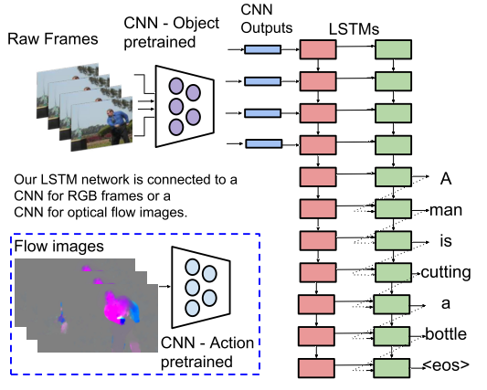
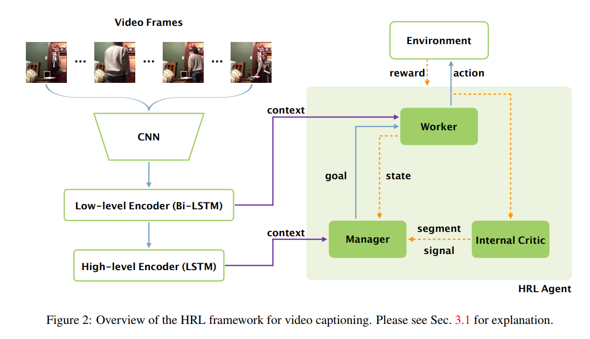
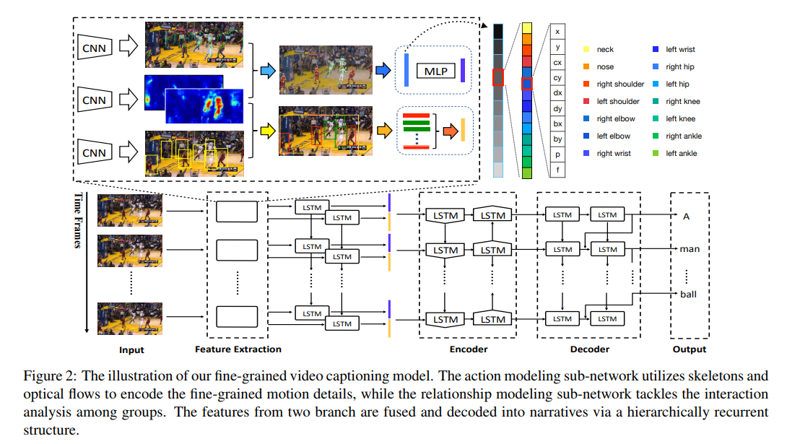
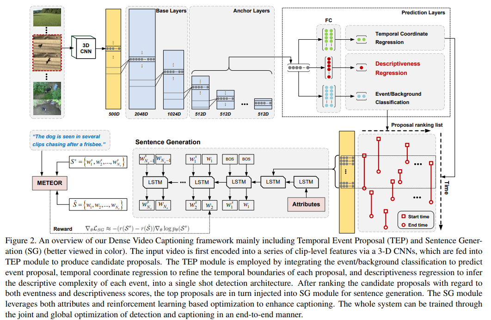
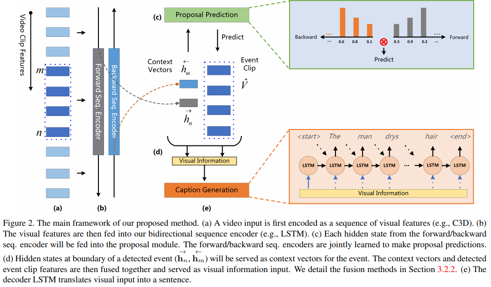
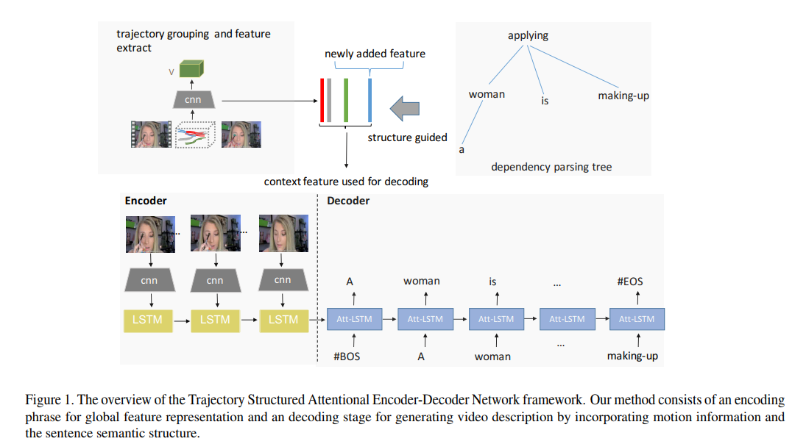
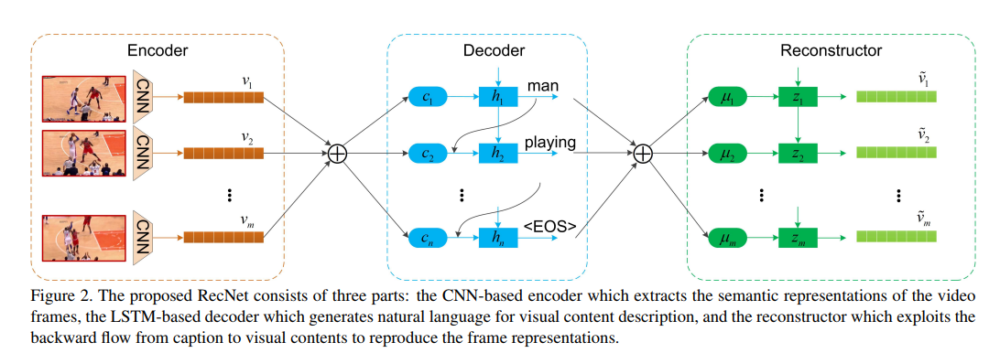

# Video caption

## 介绍

video captioning的任务是给视频生成文字描述，和image captioning（图片生成文字描述）有点像，区别主要在于视频还包含了时序的信息。

video captioning任务可以理解为视频图像序列到文本序列的seq2seq任务。在近年的方法中，大部分文章都使用了LSTM来构造encoder-decoder结构，即使用lstm encoder来编码视频图像序列的特征，再用lstm decoder解码出文本信息。这样的video captioning模型结构最早在ICCV2015的”Sequence to Sequence – Video to Text”一文中提出，如下图所示。

基于上图中的结构，构造一个encoder-decoder结构的模型主要包括几个关键点：

1. 输入特征：即如何提取视频中的特征信息，在很多篇文章中都使用了多模态的特征。主要包括如下几种：

    1)基于视频图像的信息：包括简单的用CNN（VGGNet, ResNet等）提取图像(spatial)特征，用action recognition的模型(如C3D)提取视频动态(spatial+temporal)特征

    2)基于声音的特征：对声音进行编码，包括BOAW（Bag-of-Audio-Words)和FV(Fisher Vector)等

    3)先验特征：比如视频的类别，这种特征能提供很强的先验信息

    4)基于文本的特征：此处基于文本的特征是指先从视频中提取一些文本的描述，再將这些描述作为特征，来进行video captioning。这类特征我看到过两类，一类是先对单帧视频进行image captioning,将image captioning的结果作为video captioning的输入特征，另外一类是做video tagging，将得到的标签作为特征。

2. encoder-decoder构造：虽然大部分工作都是用lstm做encoder-decoder，但各个方法的具体配置还是存在着一定的差异。

3. 输出词汇的表达：主要包括两类，一类是使用Word2Vec这种词向量表示，另外就是直接使用词袋表示。

4. 其它部分：比如训练策略，多任务训练之类的。

## 论文

**[Video Captioning via Hierarchical Reinforcement Learning, CVPR'18](https://arxiv.org/abs/1711.11135)**

[【Blog(Chinese)】](https://cloud.tencent.com/developer/article/1092810)

**Abstract**

Video captioning is the task of automatically generating a textual description of the actions in a video. Although previous work (e.g. sequence-to-sequence model) has shown promising results in abstracting a coarse description of a short video, it is still very challenging to caption a video containing multiple fine-grained actions with a detailed description. This paper aims to address the challenge by proposing a novel hierarchical reinforcement learning framework for video captioning, where a high-level Manager module learns to design sub-goals and a low-level Worker module recognizes the primitive actions to fulfill the sub-goal. With this compositional framework to reinforce video captioning at different levels, our approach significantly outperforms all the baseline methods on a newly introduced large-scale dataset for fine-grained video captioning. Furthermore, our non-ensemble model has already achieved the state-of-the-art results on the widely-used MSR-VTT dataset.

首次提出分层强化学习方法来加强不同等级的视频描述，通过分层深度强化学习，在文本生成上可以做到语言表达更加连贯，语义更加丰富，语法更加结构化。在MSR－VTT数据集上达到了的最佳结果，并且提出了新的Charades Caption数据集。文章中指出，未来将计划注意力机制（Attention），以提升提出的层次强化学习（HRL）框架。作者相信，提出的方法的结果可以通过使用不同类型的特征，如C3D特征，光流等进一步改善。同时，作者将在其他相似的序列生成任务（如视频/文档摘要）中探索提出的HRL框架。

**[Fine-grained Video Captioning for Sports Narrative, CVPR'18](http://openaccess.thecvf.com/content_cvpr_2018/papers/Yu_Fine-Grained_Video_Captioning_CVPR_2018_paper.pdf)**

[【Blog(Chinese)】](https://zhuanlan.zhihu.com/p/38292295)

**Abstract**

Despite recent emergence of video caption methods, how to generate fine-grained video descriptions (i.e., long and detailed commentary about individual movements of multiple subjects as well as their frequent interactions) is far from being solved, which however has great applications such as automatic sports narrative. To this end, this work makes the following contributions. First, to facilitate this novel research of fine-grained video caption, we collected a novel dataset called Fine-grained Sports Narrative dataset (FSN) that contains 2K sports videos with ground-truth narratives from YouTube.com. Second, we develop a novel performance evaluation metric named Fine-grained Captioning Evaluation (FCE) to cope with this novel task. Considered as an extension of the widely used METEOR, it measures not only the linguistic performance but also whether the action details and their temporal orders are correctly described. Third, we propose a new framework for finegrained sports narrative task. This network features three branches: 1) a spatio-temporal entity localization and role discovering sub-network; 2) a fine-grained action modeling sub-network for local skeleton motion description; and 3) a group relationship modeling sub-network to model interactions between players. We further fuse the features and decode them into long narratives by a hierarchically recurrent structure. Extensive experiments on the FSN dataset demonstrates the validity of the proposed framework for fine-grained video caption.

在诸如篮球、足球比赛视频这样包含多个互动个体的视频中，细粒度视频描述的本质是将视频中多个时空事件映射到多个相互关联的句子上。这项任务面临两个挑战。第一，团队中有大量关系复杂的主体（前锋，后卫）以及迅速变化的攻守态势和位置。要精确地定位每个个体的位置并确定他们的角色和作用是十分困难的。第二，一些重要动作和个体之间的互动可能是十分细微的，传统粗粒度的检测无法发现这些动作。这就需要对人体的宏观运动、骨骼运动以及个体间的互动精准建模。

为了解决这些问题，研究者建立了按层级分组的循环结构模型，实现对时空中实体的定位和动作与互动行为的细粒度建模。这个网络结构由三部分组成：

1. 时空实体定位与角色挖掘子网络：确定运动员的位置和角色。

2. 细粒度的动作建模子网络：描述快速运动的骨骼和变换的位置。

3. 一组关系建模子网络：对运动员之间的关系建模。

最后，模型利用两个 LSTM 网络将上述三个子网络的特征融合在一起，生成特征向量。再利用一个双向的编码解码器基于该特征向量生成自然语言的描述。

**[Jointly Localizing and Describing Events for Dense Video Captioning, CVPR'18](https://arxiv.org/abs/1804.08274)**

**Abstract**

Automatically describing a video with natural language is regarded as a fundamental challenge in computer vision. The problem nevertheless is not trivial especially when a video contains multiple events to be worthy of mention, which often happens in real videos. A valid question is how to temporally localize and then describe events, which is known as "dense video captioning." In this paper, we present a novel framework for dense video captioning that unifies the localization of temporal event proposals and sentence generation of each proposal, by jointly training them in an end-to-end manner. To combine these two worlds, we integrate a new design, namely descriptiveness regression, into a single shot detection structure to infer the descriptive complexity of each detected proposal via sentence generation. This in turn adjusts the temporal locations of each event proposal. Our model differs from existing dense video captioning methods since we propose a joint and global optimization of detection and captioning, and the framework uniquely capitalizes on an attribute-augmented video captioning architecture. Extensive experiments are conducted on ActivityNet Captions dataset and our framework shows clear improvements when compared to the state-of-the-art techniques. More remarkably, we obtain a new record: METEOR of 12.96% on ActivityNet Captions official test set.

作者提出一个新的密集视频字幕框架，通过以端到端的方式联合训练，从而本地化每个句子生成。文章将描述性回归整合到单个镜头检测结构中，通过句子生成来推断描述复杂性，然后反过来调整每个句子的时间位置。与现有的密集视频字幕方法不同，模型提出了检测和字幕的联合和全局优化，并且该框架独特地利用属性增强的视频字幕体系结构。

**[Bidirectional Attentive Fusion with Context Gating for Dense Video Captioning, CVPR'18](http://openaccess.thecvf.com/content_cvpr_2018/papers/Wang_Bidirectional_Attentive_Fusion_CVPR_2018_paper.pdf)**

[【Project Page】](https://github.com/JaywongWang/DenseVideoCaptioning)
[【Blog(Chinese)】](https://zhuanlan.zhihu.com/p/50924797)

**Abstract**

Dense video captioning is a newly emerging task that aims at both localizing and describing all events in a video. We identify and tackle two challenges on this task, namely, (1) how to utilize both past and future contexts for accurate event proposal predictions, and (2) how to construct informative input to the decoder for generating natural event descriptions. First, previous works predominantly generate temporal event proposals in the forward direction, which neglects future video context. We propose a bidirectional proposal method that effectively exploits both past and future contexts to make proposal predictions. Second, different events ending at (nearly) the same time are indistinguishable in the previous works, resulting in the same captions. We solve this problem by representing each event with an attentive fusion of hidden states from the proposal module and video contents (e.g., C3D features). We further propose a novel context gating mechanism to balance the contributions from the current event and its surrounding contexts dynamically. We empirically show that our attentively fused event representation is superior to the proposal hidden states or video contents alone. By coupling proposal and captioning modules into one unified framework, our model outperforms the state-of-the-arts on the ActivityNet Captions dataset with a relative gain of over 100% (Meteor score increases from 4.82 to 9.65).

dense captioning不同于video captioning, 是在video captioning的基础上加入了action location任务。video captioning仅仅要求对给定的视频生成一句或者一段描述，而这样可能错过视频中的很多事件。为了能够捕捉到视频中的每个事件，2016年李飞飞团队在论文《Dense-Captioning Events in Videos》中提出了dense captioning任务。这个任务包括两项任务：temporal action location 和 video captioning。任务的整个流程是：先利用action location的方法，对每个视频片段生成可能包含动作的多个proposal，然后再对每个候选的proposal生成caption。

本文针对dense captioning任务。在利用已经发生的事情进行caption的同时，同时进一步利用未来的事情。此外，以前的方法都是利用decoder的ht直接产生caption,本文提出把video的特征和ht融合在一起输入后面的caption模型。但是由于每段video的proposal数目不等，如果直接利用所有proposal的mean放进模型，效果也不好，所以作者又进一步提出了融合方法。

**[Interpretable Video Captioning via Trajectory Structured Localization, CVPR'18](http://openaccess.thecvf.com/content_cvpr_2018/papers/Wu_Interpretable_Video_Captioning_CVPR_2018_paper.pdf)**

**Abstract**

Automatically describing open-domain videos with natural language are attracting increasing interest in the field of artificial intelligence. Most existing methods simply borrow ideas from image captioning and obtain a compact video representation from an ensemble of global image feature before feeding to an RNN decoder which outputs a sentence of variable length. However, it is not only arduous for the generator to focus on specific salient objects at different time given the global video representation, it is more formidable to capture the fine-grained motion information and the relation between moving instances for more subtle linguistic descriptions. In this paper, we propose a Trajectory Structured Attentional Encoder-Decoder (TSA-ED) neural network framework for more elaborate video captioning which works by integrating local spatial-temporal representation at trajectory level through structured attention mechanism. Our proposed method is based on a LSTM-based encoder-decoder framework, which incorporates an attention modeling scheme to adaptively learn the correlation between sentence structure and the moving objects in videos, and consequently generates more accurate and meticulous statement description in the decoding stage. Experimental results demonstrate that the feature representation and structured attention mechanism based on the trajectory cluster can efficiently obtain the local motion information in the video to help generate a more fine-grained video description, and achieve the state-of-the-art performance on the well-known Charades and MSVD datasets.

使用自然语言自动描述开放域视频的现有方法主要从图像字幕中借用思想，并馈送到输出可变长度句子的RNN解码器。然而，在给定全局视频表示的情况下，生成器很难在不同时间聚焦于特定显着对象，并且难以捕获细粒度运动信息和移动实例之间的关系以获得更微妙的语言描述。在本文中，作者提出了一种轨迹结构化注意编码器 - 解码器（TSA-ED）神经网络框架，用于更精细的视频字幕，通过结构化注意机制在轨迹水平上整合局部时空表示。提出的方法基于基于LSTM的编码器 - 解码器框架，其结合了注意建模方案以自适应地学习句子结构与视频中的运动对象之间的相关性，并因此在解码阶段生成更准确和细致的语句描述。实验结果表明，基于轨迹聚类的特征表示和结构化注意机制可以有效地获取视频中的局部运动信息，有助于生成更细粒度的视频描述。

**[End-to-End Dense Video Captioning with Masked Transformer, CVPR'18](https://arxiv.org/pdf/1804.00819.pdf)**

[【Project Page】](https://github.com/salesforce/densecap)

**Abstract**

Dense video captioning aims to generate text descriptions for all events in an untrimmed video. This involves both detecting and describing events. Therefore, all previous methods on dense video captioning tackle this problem by building two models, i.e. an event proposal and a captioning model, for these two sub-problems. The models are either trained separately or in alternation. This prevents direct influence of the language description to the event proposal, which is important for generating accurate descriptions. To address this problem, we propose an end-to-end transformer model for dense video captioning. The encoder encodes the video into appropriate representations. The proposal decoder decodes from the encoding with different anchors to form video event proposals. The captioning decoder employs a masking network to restrict its attention to the proposal event over the encoding feature. This masking network converts the event proposal to a differentiable mask, which ensures the consistency between the proposal and captioning during training. In addition, our model employs a self-attention mechanism, which enables the use of efficient non-recurrent structure during encoding and leads to performance improvements. We demonstrate the effectiveness of this end-to-end model on ActivityNet Captions and YouCookII datasets, where we achieved 10.12 and 6.58 METEOR score, respectively.

之前针对 dense video captioning 的文章都是构建两个模型：event proposal + captioning model，分别训练或者交替训练。本文提出一个 end-to-end 的模型，在 encoder 部分利用 self-attention，decoder 部分包括基于 ProcNets 进行改进的 Proposal Decoder 和 Captioning Decoder。

文章的亮点在于将 Attention is all you need 中的 self-attention 和 multi-head attention 用到 captioning 任务中，并且采用相似的策略设计了 differential proposal mask 模块，使得 captioning decoder 可以只注意到当前要描述的 event，以及模型可以做 end-to-end 训练。

**[Reconstruction Network for Video Captioning, CVPR'18](https://arxiv.org/abs/1803.11438)**

[【Project Page(Unofficial)】](https://github.com/hobincar/reconstruction-network-for-video-captioning)
[【Blog(Chinese)】](https://zhuanlan.zhihu.com/p/50784504)

**Abstract**

In this paper, the problem of describing visual contents of a video sequence with natural language is addressed. Unlike previous video captioning work mainly exploiting the cues of video contents to make a language description, we propose a reconstruction network (RecNet) with a novel encoder-decoder-reconstructor architecture, which leverages both the forward (video to sentence) and backward (sentence to video) flows for video captioning. Specifically, the encoder-decoder makes use of the forward flow to produce the sentence description based on the encoded video semantic features. Two types of reconstructors are customized to employ the backward flow and reproduce the video features based on the hidden state sequence generated by the decoder. The generation loss yielded by the encoder-decoder and the reconstruction loss introduced by the reconstructor are jointly drawn into training the proposed RecNet in an end-to-end fashion. Experimental results on benchmark datasets demonstrate that the proposed reconstructor can boost the encoder-decoder models and leads to significant gains in video caption accuracy.

文章针对video captioning任务，利用重建video视觉特征的方法，来促进对视频语义的学习，从而为给定的video生成更好的caption。本文依旧利用常用的方法，一个encoder-decoder结构，从视频特征生成文本描述。encoder-decoder都是采用LSTM模型。文本的新意就是在encoder-docder上面又加了一个reconstructor,利用decoder的状态ht去重建video的视频特征。对于重建视频特征，文章提出了两个结构，一个是重建视频的总体特征，一个是重建每个time step的局部特征。视频特征重建依旧是用lstm。

**[Multimodal Memory Modelling for Video Captioning, CVPR'18](https://arxiv.org/abs/1611.05592)**

**Abstract**

Video captioning which automatically translates video clips into natural language sentences is a very important task in computer vision. By virtue of recent deep learning technologies, e.g., convolutional neural networks (CNNs) and recurrent neural networks (RNNs), video captioning has made great progress. However, learning an effective mapping from visual sequence space to language space is still a challenging problem. In this paper, we propose a Multimodal Memory Model (M3) to describe videos, which builds a visual and textual shared memory to model the long-term visual-textual dependency and further guide global visual attention on described targets. Specifically, the proposed M3 attaches an external memory to store and retrieve both visual and textual contents by interacting with video and sentence with multiple read and write operations. First, text representation in the Long Short-Term Memory (LSTM) based text decoder is written into the memory, and the memory contents will be read out to guide an attention to select related visual targets. Then, the selected visual information is written into the memory, which will be further read out to the text decoder. To evaluate the proposed model, we perform experiments on two publicly benchmark datasets: MSVD and MSR-VTT. The experimental results demonstrate that our method outperforms the state-of-theart methods in terms of BLEU and METEOR.

将视频片段自动翻译成自然语言句子的视频字幕是计算机视觉中非常重要的任务。借助于近来的深度学习技术，例如卷积神经网络（CNN）和递归神经网络（RNN），视频字幕已经取得了很大进展。但是，从视觉序列空间到语言空间学习有效的映射仍然是一个具有挑战性的问题。在本文中，我们提出了一个多模态记忆模型（M3）来描述视频，它建立了一个视觉和文本的共享记忆模型的长期视觉文本的依赖，并进一步引导全球视觉注意力描述的目标。具体而言，所提出的M3附加外部存储器以通过与多个读取和写入操作与视频和句子交互来存储和检索视觉和文本内容。首先，基于长短期记忆（LSTM）的文本解码器中的文本表示被写入存储器，并且读出存储器内容以引导注意力来选择相关的可视目标。然后，所选择的视觉信息被写入到存储器中，该信息将被进一步读出到文本解码器。为了评估所提出的模型，我们在两个公开基准数据集上进行实验：MSVD和MSR-VTT。实验结果表明，我们的方法在BLEU和METEOR方面优于现有的方法。

## 参考

[【知乎】Video Analysis 相关领域介绍之Video Captioning(视频to文字描述)](https://zhuanlan.zhihu.com/p/26730181)
