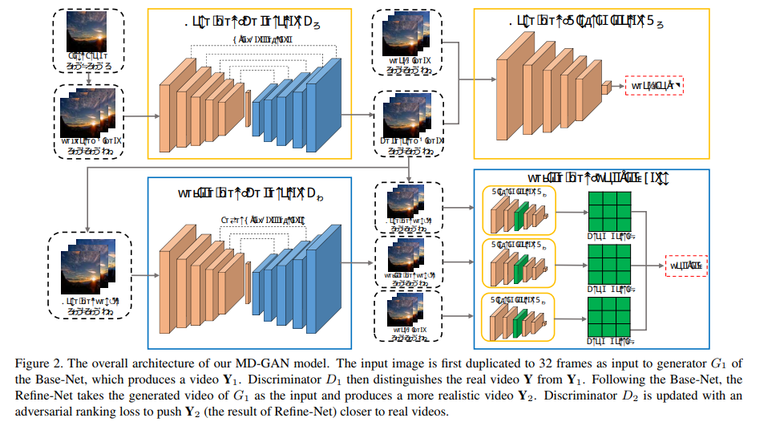
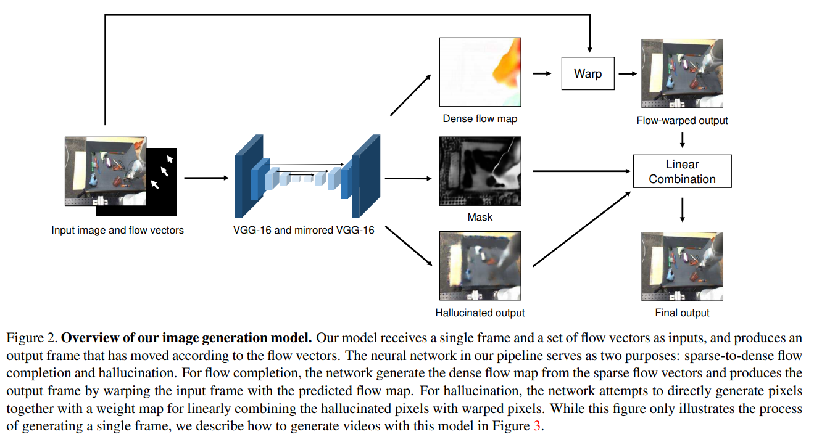

# Video generation (GAN)

## 介绍

利用GAN进行视频的生成。

## 论文

**[MoCoGAN: Decomposing Motion and Content for Video Generation, CVPR'18](http://openaccess.thecvf.com/content_cvpr_2018/papers/Tulyakov_MoCoGAN_Decomposing_Motion_CVPR_2018_paper.pdf)**

**[【项目地址】](https://github.com/sergeytulyakov/mocogan)**

**Abstract**

Visual signals in a video can be divided into content and motion. While content specifies which objects are in the video, motion describes their dynamics. Based on this prior, we propose the Motion and Content decomposed Generative Adversarial Network (MoCoGAN) framework for video generation. The proposed framework generates a video by mapping a sequence of random vectors to a sequence of video frames. Each random vector consists of a content part and a motion part. While the content part is kept fixed, the motion part is realized as a stochastic process. To learn motion and content decomposition in an unsupervised manner, we introduce a novel adversarial learning scheme utilizing both image and video discriminators. Extensive experimental results on several challenging datasets with qualitative and quantitative comparison to the state-of-the-art approaches, verify effectiveness of the proposed framework. In addition, we show that MoCoGAN allows one to generate videos with same content but different motion as well as videos with different content and same motion.

视频中的视觉信号可以分为内容和动作。内容指定了视频中的哪些对象，动作描述了它们的动态。文章提出了用于视频生成的运动和内容分解的生成对抗网络（MoCoGAN）框架。所提出的框架通过将一系列随机向量映射到视频帧序列来生成视频，每个随机向量由内容部分和运动部分组成。当内容部分保持固定时，运动部分被实现为随机过程。为了以无人监督的方式学习运动和内容分解，文章引入了一种利用图像和视频鉴别器的新颖的对抗性学习方案。在几个具有挑战性的数据集上进行广泛的实验结果，与现有技术方法进行定性和定量比较，验证了拟议框架的有效性。此外，文章还展示了MoCoGAN允许用户生成具有相同内容但运动不同的视频以及具有不同内容和相同动作的视频。

**[Learning to Generate Time-Lapse Videos Using Multi-Stage Dynamic Generative Adversarial Networks, CVPR'18](https://arxiv.org/abs/1709.07592)**

**Abstract**

Taking a photo outside, can we predict the immediate future, e.g., how would the cloud move in the sky? We address this problem by presenting a generative adversarial network (GAN) based two-stage approach to generating realistic time-lapse videos of high resolution. Given the first frame, our model learns to generate long-term future frames. The first stage generates videos of realistic contents for each frame. The second stage refines the generated video from the first stage by enforcing it to be closer to real videos with regard to motion dynamics. To further encourage vivid motion in the final generated video, Gram matrix is employed to model the motion more precisely. We build a large scale time-lapse dataset, and test our approach on this new dataset. Using our model, we are able to generate realistic videos of up to 128×128 resolution for 32 frames. Quantitative and qualitative experiment results have demonstrated the superiority of our model over the state-of-the-art models.

文章通过呈现基于生成对抗网络（GAN）的两阶段方法来生成高分辨率的逼真的延时视频。给定第一帧，模型将学习生成长期的未来帧:第一阶段为每个帧生成逼真内容的视频；第二阶段通过强制使其更接近关于运动动态的真实视频来细化来自第一阶段的生成视频。为了进一步鼓励最终生成的视频中的生动运动，使用Gram矩阵来更精确地对运动进行建模。作者构建了一个大规模的时移数据集，并测试了模型效果。

**[Controllable Video Generation with Sparse Trajectories, CVPR'18](http://openaccess.thecvf.com/content_cvpr_2018/papers/Hao_Controllable_Video_Generation_CVPR_2018_paper.pdf)**

**[【项目地址】](https://github.com/zekunhao1995/ControllableVideoGen)**

**Abstract**

Video generation and manipulation is an important yet challenging task in computer vision. Existing methods usually lack ways to explicitly control the synthesized motion. In this work, we present a conditional video generation model that allows detailed control over the motion of the generated video. Given the first frame and sparse motion trajectories specified by users, our model can synthesize a video with corresponding appearance and motion. We propose to combine the advantage of copying pixels from the given frame and hallucinating the lightness difference from scratch which help generate sharp video while keeping the model robust to occlusion and lightness change. We also propose a training paradigm that calculate trajectories from video clips, which eliminated the need of annotated training data. Experiments on several standard benchmarks demonstrate that our approach can generate realistic videos comparable to state-of-the-art video generation and video prediction methods while the motion of the generated videos can correspond well with user input.

视频生成的现有方法通常缺乏明确控制合成运动的方法。这项工作提出了一个条件视频生成模型，允许详细控制生成视频的运动。给定用户指定的第一帧和稀疏运动轨迹，模型可以合成具有相应外观和运动的视频。模型结合来自给定帧的像素和亮度差异，有助于生成清晰视频的同时保持模型对遮挡和亮度变化的鲁棒性。模型还提出了一种训练范例，用于计算视频剪辑的轨迹，从而消除了对带注释的训练数据的需求。几个标准基准测试的实验表明，模型可以生成相当逼真的视频，同时生成视频的运动可以很好地与用户输入相对应。

