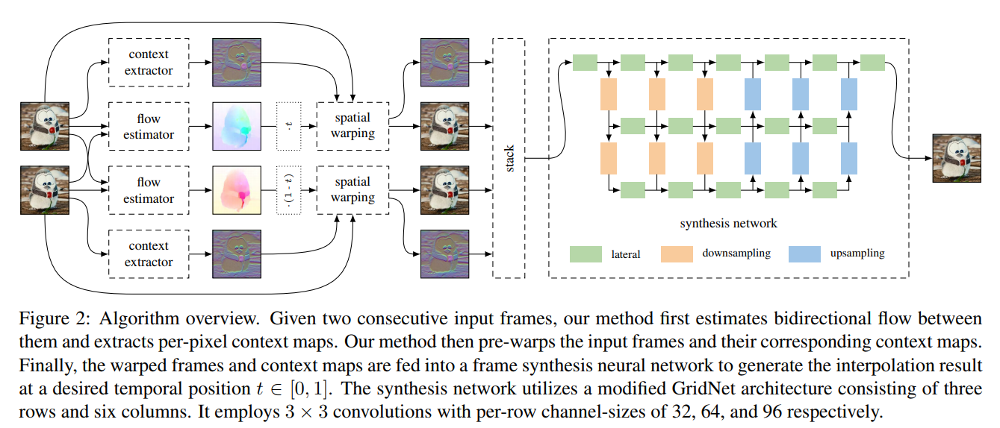

# Video frame interpolation

## 介绍

给定两个连续的帧，视频插值旨在生成中间帧，以形成空间和时间相干的视频序列。

## 论文

**[Super SloMo: High Quality Estimation of Multiple Intermediate Frames for Video Interpolation, CVPR'18](https://arxiv.org/abs/1712.00080)**

[【项目地址】](https://people.cs.umass.edu/~hzjiang/projects/superslomo/)
[【项目地址(非官方复现)】](https://github.com/TheFairBear/Super-SlowMo)
[【参考博客】](https://zhuanlan.zhihu.com/p/69538032)

**Abstract**

Given two consecutive frames, video interpolation aims at generating intermediate frame(s) to form both spatially and temporally coherent video sequences. While most existing methods focus on single-frame interpolation, we propose an end-to-end convolutional neural network for variable-length multi-frame video interpolation, where the motion interpretation and occlusion reasoning are jointly modeled. We start by computing bi-directional optical flow between the input images using a U-Net architecture. These flows are then linearly combined at each time step to approximate the intermediate bi-directional optical flows. These approximate flows, however, only work well in locally smooth regions and produce artifacts around motion boundaries. To address this shortcoming, we employ another U-Net to refine the approximated flow and also predict soft visibility maps. Finally, the two input images are warped and linearly fused to form each intermediate frame. By applying the visibility maps to the warped images before fusion, we exclude the contribution of occluded pixels to the interpolated intermediate frame to avoid artifacts. Since none of our learned network parameters are time-dependent, our approach is able to produce as many intermediate frames as needed. We use 1,132 video clips with 240-fps, containing 300K individual video frames, to train our network. Experimental results on several datasets, predicting different numbers of interpolated frames, demonstrate that our approach performs consistently better than existing methods.

给定两个连续帧，视频内插旨在生成中间帧以形成空间和时间相干的视频序列。虽然大多数现有方法都集中在单帧插值上，但文章提出了一种用于可变长度多帧视频插值的端到端卷积神经网络，其中运动解释和遮挡推理是联合建模的。文章首先使用U-Net架构计算输入图像之间的双向光流,然后在每个时间步长线性地组合这些流以近似中间双向光流。然而，这些近似流仅在局部平滑区域中很好地工作并且在运动边界周围产生伪影。为了解决这个缺点，文章使用另一个U-Net来改进近似流量并预测软可见性图。最后，两个输入图像被扭曲并线性融合以形成每个中间帧。通过在融合之前将可见性图应用于变形图像，文章排除了被遮挡像素对内插中间帧的贡献以避免伪像。由于文章所学习的网络参数都不依赖于时间，因此能够根据需要生成尽可能多的中间帧。

**[PhaseNet for Video Frame Interpolation, CVPR'18](https://arxiv.org/abs/1804.00884)**

**Abstract**

Most approaches for video frame interpolation require accurate dense correspondences to synthesize an in-between frame. Therefore, they do not perform well in challenging scenarios with e.g. lighting changes or motion blur. Recent deep learning approaches that rely on kernels to represent motion can only alleviate these problems to some extent. In those cases, methods that use a per-pixel phase-based motion representation have been shown to work well. However, they are only applicable for a limited amount of motion. We propose a new approach, PhaseNet, that is designed to robustly handle challenging scenarios while also coping with larger motion. Our approach consists of a neural network decoder that directly estimates the phase decomposition of the intermediate frame. We show that this is superior to the hand-crafted heuristics previously used in phase-based methods and also compares favorably to recent deep learning based approaches for video frame interpolation on challenging datasets.

用于视频帧插值的大多数方法需要精确对应以合成中间帧,因此它们在照明变化或运动模糊等具有挑战性的情况下表现不佳，深度学习方法只能在一定程度上缓解这些问题。在这些情况下，使用基于逐像素相位的运动表示的方法已被证明可以很好地工作，但是它们仅适用于有限的运动量。文章提出PhaseNet旨在稳健地处理具有挑战性的场景，同时还能应对更大的运动。文章的方法包括一个神经网络解码器，它直接估计中间帧的相位分解。

**[Context-aware Synthesis for Video Frame Interpolation, CVPR'18](https://arxiv.org/abs/1803.10967)**

**Abstract**

Video frame interpolation algorithms typically estimate optical flow or its variations and then use it to guide the synthesis of an intermediate frame between two consecutive original frames. To handle challenges like occlusion, bidirectional flow between the two input frames is often estimated and used to warp and blend the input frames. However, how to effectively blend the two warped frames still remains a challenging problem. This paper presents a context-aware synthesis approach that warps not only the input frames but also their pixel-wise contextual information and uses them to interpolate a high-quality intermediate frame. Specifically, we first use a pre-trained neural network to extract per-pixel contextual information for input frames. We then employ a state-of-the-art optical flow algorithm to estimate bidirectional flow between them and pre-warp both input frames and their context maps. Finally, unlike common approaches that blend the pre-warped frames, our method feeds them and their context maps to a video frame synthesis neural network to produce the interpolated frame in a context-aware fashion. Our neural network is fully convolutional and is trained end to end. Our experiments show that our method can handle challenging scenarios such as occlusion and large motion and outperforms representative state-of-the-art approaches.

视频帧插值算法通常估计光流或其变化，然后使用它来指导两个连续原始帧之间的中间帧的合成。为了处理诸如遮挡之类的挑战，通常估计两个输入帧之间的双向流并用于扭曲和混合输入帧。然而，如何有效地混合两个扭曲的框架仍然是一个具有挑战性的问题。本文介绍了一种上下文感知合成方法，它不仅可以对输入帧进行扭曲，还可以对像素方式的上下文信息进行扭曲，并使用它们来内插高质量的中间帧。具体而言，首先使用预先训练的神经网络来提取输入帧的每像素上下文信息。然后，采用最先进的光流算法来估计它们之间的双向流，并预先扭曲输入帧及其上下文映射。最后，与混合预扭曲帧的常见方法不同，文章提出的方法将它们及其上下文映射馈送到视频帧合成神经网络，以以上下文感知方式产生内插帧。

## 参考

[【GitHub】Video-Enhancement](https://github.com/yulunzhang/video-enhancement)